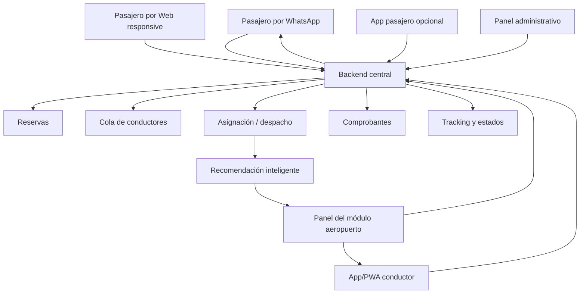

# Ordenamiento del chat: Taxi Green, flujo aeropuerto, WhatsApp, web y app móvil

> Documento ordenado a partir del archivo `PROBLEMA.txt`.
>
> Objetivo: separar claramente **lo que el usuario envió** —principalmente transcripciones de reunión— de las **respuestas de ChatGPT**, limpiando la redacción y conservando la esencia para que el contenido sea fácil de revisar, compartir y usar en una propuesta.

---

## 1. Resumen ejecutivo

La conversación gira alrededor de cómo aterrizar una demo para Taxi Green. La idea inicial parecía estar orientada a una **app móvil tipo taxi**, pero las transcripciones de la reunión cambian el enfoque hacia algo más realista:

> **No construir una app tipo Uber. Construir una plataforma omnicanal de reservas y despacho para Taxi Green.**

La operación real de Taxi Green tiene tres elementos centrales:

1. **Reservas programadas** desde casa, oficina u hotel hacia el aeropuerto.
2. **Operación física en el módulo del aeropuerto**, donde el pasajero puede llegar con reserva previa o comprar el servicio en el momento.
3. **Cola de conductores**, donde la asignación no funciona como Uber, sino por turno operativo, tipo de unidad y disponibilidad.

Además, aparece una observación clave de Raúl: para un pasajero ocasional, obligarlo a descargar una app puede ser una barrera. Por eso, el enfoque más fuerte sería:

```text
WhatsApp / Web responsive
        ↓
Backend central de reservas y despacho
        ↓
Panel del módulo aeropuerto
Panel administrativo
Cola de conductores
Asignación de unidad
Tracking
Comprobantes
App/PWA para conductor
App móvil opcional para usuarios frecuentes
```

La app móvil **sí entra**, pero no como canal obligatorio para todos los pasajeros. En una primera fase, el pasajero debería poder reservar por **WhatsApp o web**, sin instalar nada. La app puede quedar para conductores, clientes corporativos, usuarios frecuentes o una fase posterior.

---

## 2. Interacción 1: flujo real del aeropuerto y cola de conductores

### 2.1. Lo que envió el usuario: transcripción limpia

En la reunión se explica que la demo debe considerar dos flujos principales.

#### Flujo 1: casa/oficina → aeropuerto

El cliente reserva una movilidad para que lo recojan en su casa, oficina u otro punto, y lo lleven al aeropuerto Jorge Chávez.

#### Flujo 2: aeropuerto → destino

El cliente llega al aeropuerto desde alguna parte del Perú o del mundo. Puede haber hecho una reserva previamente, puede hacerla desde el avión o puede solicitar el servicio directamente al llegar al aeropuerto.

Raúl explica que, en la operación real, cuando un pasajero llega al módulo de Taxi Green y compra un servicio, el personal del módulo registra o valida el servicio, emite un comprobante y avisa al conductor que está en cola.

El flujo real sería así:

```text
Pasajero llega al módulo
↓
Compra o confirma el servicio
↓
El módulo registra la venta o emite comprobante
↓
El personal avisa al conductor que está en cola
↓
El conductor llega
↓
El personal presenta al conductor al pasajero
↓
El conductor atiende al pasajero y su equipaje
↓
El módulo continúa atendiendo al siguiente cliente
```

La frase clave de Raúl es:

> “Avisan al conductor que está en cola, porque es así, en cola.”

Eso define el corazón operativo de este flujo.

---

### 2.2. Respuesta de ChatGPT ordenada

La respuesta principal fue que esta transcripción cambia la forma de plantear la demo.

El flujo del aeropuerto **no debe modelarse como Uber**, donde cualquier conductor cercano acepta un viaje. En Taxi Green, el modelo real parece ser más operativo:

```text
Módulo físico
+ venta o validación del servicio
+ cola de conductores
+ asignación rápida
+ presentación formal del conductor
+ continuidad del servicio
```

Esto significa que la demo no debe centrarse solo en “pedir un taxi”, sino en **digitalizar el proceso operativo real del módulo del aeropuerto**.

---

### 2.3. Corrección importante a la demo

Antes se podía estar pensando algo así:

```text
Pasajero reserva
↓
Supervisor escanea QR
↓
Supervisor asigna conductor disponible
```

Pero después de la explicación de Raúl, el flujo debería ser:

```text
Pasajero llega al aeropuerto con reserva o compra el servicio en módulo
↓
Operador del módulo registra o valida el servicio
↓
Sistema muestra la cola de conductores
↓
Sistema asigna o recomienda el conductor correspondiente
↓
Operador presenta el conductor al pasajero
↓
Conductor continúa el servicio
↓
Módulo queda libre para atender al siguiente pasajero
```

El cambio central es este:

| Antes | Mejor planteado ahora |
|---|---|
| Supervisor escanea QR | Operador de módulo valida o registra servicio |
| Conductor disponible | Conductor en cola de aeropuerto |
| Asignación manual genérica | Asignación por cola, reglas y tipo de unidad |
| Flujo solo con reserva previa | También venta directa en módulo |
| Demo tipo app de taxi | Demo de operación aeroportuaria digitalizada |

---

### 2.4. El segundo flujo debe dividirse en dos variantes

Al inicio parecía que había solo dos flujos:

1. Casa/oficina → aeropuerto.
2. Aeropuerto → destino con reserva previa.

Pero la reunión agrega un caso muy real:

> El cliente llega al módulo y compra el servicio ahí mismo.

Entonces el flujo de aeropuerto debe dividirse en dos variantes.

#### Variante 2A: aeropuerto → destino con reserva previa

```text
Cliente ya tiene reserva
↓
Llega al módulo
↓
Muestra QR, código o datos de reserva
↓
Operador valida la reserva
↓
Sistema consulta cola de conductores
↓
Se asigna conductor en cola
↓
Conductor atiende al pasajero
```

#### Variante 2B: aeropuerto → destino sin reserva previa

```text
Cliente llega al módulo
↓
Pide taxi
↓
Operador registra destino y tipo de unidad
↓
Sistema calcula tarifa
↓
Cliente paga o se registra comprobante
↓
Sistema asigna conductor en cola
↓
Conductor atiende al pasajero
```

Esta segunda variante es muy potente para la demo porque representa exactamente una operación física ya existente.

---

### 2.5. Rol recomendado: operador de módulo o despachador de aeropuerto

La respuesta también sugirió no abusar del término “supervisor”.

El rol correcto sería:

- **Operador de módulo**
- **Despachador de aeropuerto**
- **Personal del módulo**

Porque esa persona no solo supervisa. También:

- atiende al pasajero,
- registra o valida la venta,
- entrega o adjunta comprobante,
- avisa al conductor,
- presenta el conductor al pasajero,
- mantiene fluida la cola,
- resuelve confusiones en el punto físico.

---

### 2.6. Pantalla clave para la demo

La pantalla más importante no sería necesariamente la app del pasajero, sino el **panel del módulo aeropuerto**.

Ejemplo de pantalla:

```text
Módulo Aeropuerto - Puerta 1

Nuevo servicio:
Pasajero: José Ramírez
Destino: Miraflores
Tipo de unidad: Camioneta
Maletas: 3
Comprobante: Boleta

Cola de conductores:
1. Luis Torres - Camioneta BTW-431 - Disponible
2. Miguel Rojas - Sedán ABC-218 - Disponible
3. Carlos Pérez - Van FGH-902 - Disponible

Acciones:
[Asignar siguiente conductor]
[Asignar recomendado]
[Registrar entrega al conductor]
```

---

### 2.7. Frase sugerida para reunión

> “Lo que explica Raúl confirma que la demo debe centrarse en operación, no solo en app. El corazón del sistema no es pedir un taxi; es digitalizar el módulo de Taxi Green: venta o validación de servicio, cola de conductores, asignación por turno, presentación del conductor y trazabilidad del viaje. Si reflejamos eso, la demo se siente real para ellos. Si hacemos un flujo tipo Uber, se va a sentir ajeno a su operación.”

---

## 3. Interacción 2: idea de reemplazar al supervisor con inteligencia artificial

### 3.1. Lo que envió el usuario

El usuario preguntó si tenía sentido la idea de reemplazar al supervisor con inteligencia artificial para que el sistema asigne el vehículo de acuerdo con la posición GPS u otros criterios.

---

### 3.2. Respuesta de ChatGPT ordenada

La respuesta fue que la idea tiene sentido, pero debe plantearse con cuidado.

No conviene decir:

> “La inteligencia artificial reemplazará al supervisor.”

Es mejor decir:

> “La inteligencia artificial funcionará como un copiloto de despacho que recomienda el conductor más adecuado, mientras el operador del módulo mantiene la decisión final.”

Esto suena más serio, más seguro y más realista.

---

### 3.3. Por qué no reemplazar totalmente al operador

En el aeropuerto, el operador o personal del módulo no solo asigna un vehículo. También cumple funciones humanas y operativas:

- recibe al pasajero,
- valida que sea la persona correcta,
- revisa equipaje,
- orienta al pasajero,
- coordina físicamente con el conductor,
- resuelve reclamos o confusiones,
- da confianza,
- representa a Taxi Green,
- atiende casos especiales como adulto mayor, pasajero extranjero, familia, maletas grandes, retrasos o molestias.

Por eso, en una primera versión, la inteligencia artificial no debería reemplazarlo. Debería ayudarlo.

---

### 3.4. Qué sí puede hacer la inteligencia artificial o lógica inteligente

El sistema puede recomendar el conductor o la unidad usando criterios como:

1. Posición GPS del conductor.
2. Orden en la cola del aeropuerto.
3. Tipo de vehículo requerido.
4. Capacidad de pasajeros.
5. Cantidad de maletas.
6. Estado del conductor.
7. Tiempo estimado de llegada al módulo.
8. Calificación del conductor.
9. Idioma o perfil del pasajero, si aplica.
10. Historial de asignaciones para mantener justicia.
11. Restricciones del servicio corporativo.
12. Prioridad del cliente.

Pero no necesariamente se necesita inteligencia artificial generativa desde el inicio. Muchas veces basta con:

- reglas de negocio,
- algoritmo de puntuación,
- ranking de conductores recomendados.

Ejemplo:

```text
Puntaje del conductor =
  posición en cola
+ cercanía GPS
+ compatibilidad del vehículo
+ capacidad disponible
+ calificación
- penalización por retrasos
```

---

### 3.5. GPS solo no basta

Un error sería asignar siempre al conductor más cercano por GPS.

En Taxi Green la cola importa. Si un conductor está primero en cola, no necesariamente debe perder el viaje frente a otro que está más cerca, porque eso rompería la lógica de turnos.

Por eso, la recomendación debería mezclar:

```text
cola + GPS + tipo de unidad + capacidad + disponibilidad + reglas del negocio
```

No solo:

```text
el más cercano gana
```

---

### 3.6. Tres niveles de automatización

#### Fase 1: asignación manual asistida

```text
Operador ve la cola
↓
Operador elige conductor
↓
Sistema registra y notifica
```

Es lo mínimo para una demo.

#### Fase 2: recomendación inteligente

```text
Sistema recomienda conductor
↓
Operador confirma
↓
Sistema registra, notifica y audita
```

Es la mejor opción para una demo vendible.

#### Fase 3: asignación automática

```text
Sistema asigna automáticamente si se cumplen reglas claras
↓
Operador solo supervisa excepciones
```

Esto debería quedar para un MVP avanzado o para una etapa posterior con datos reales.

---

### 3.7. Cómo mostrarlo en la demo

Ejemplo de recomendación:

```text
Servicio nuevo:
Pasajero: Ana López
Destino: Miraflores
Unidad requerida: Camioneta
Pasajeros: 3
Maletas: 4

Recomendación inteligente:
1. Luis Ramírez - BTW-431 - Camioneta - 92/100
   Motivo: primero en cola, vehículo compatible, a 1 minuto del módulo

2. Miguel Torres - ABC-782 - Sedán - 71/100
   Motivo: cerca, pero menor capacidad de maletas

3. Jorge Díaz - VAN-204 - Van - 68/100
   Motivo: compatible, pero más lejos

Acciones:
[Asignar recomendado]
[Ver otra opción]
[Asignar manualmente]
```

---

### 3.8. Impacto técnico

Habría que incluir un módulo de backend, por ejemplo:

```text
Módulo de asignación inteligente
```

Responsabilidades:

- leer cola de conductores,
- leer posiciones GPS,
- verificar tipo de unidad,
- verificar capacidad,
- calcular puntaje,
- ordenar candidatos,
- explicar la recomendación,
- permitir corrección manual,
- registrar auditoría.

Entidades posibles:

```text
airport_driver_queue
driver_positions
dispatch_recommendations
dispatch_assignment_logs
```

Ejemplo de respuesta del backend:

```json
{
  "recommendedDriverId": "driver_123",
  "recommendedUnitId": "unit_456",
  "score": 92,
  "reasons": [
    "Primero en cola compatible",
    "Unidad tipo camioneta requerida",
    "A 1 minuto del módulo",
    "Capacidad suficiente para 4 maletas"
  ]
}
```

---

### 3.9. Frase sugerida para reunión

> “Sí podemos meter inteligencia artificial o lógica inteligente, pero no como reemplazo total del supervisor. En la operación real del aeropuerto, el operador cumple una función de confianza y control físico. Lo correcto es plantearlo como un copiloto de despacho: el sistema recomienda el conductor óptimo usando GPS, cola, tipo de unidad, capacidad y reglas de negocio; el operador confirma o corrige.”

---

## 4. Interacción 3: objeción de Raúl sobre la app móvil y propuesta de WhatsApp/web

### 4.1. Lo que envió el usuario: transcripción limpia

Raúl plantea que, si una persona llega de viaje y quiere pedir un taxi, obligarla a descargar una app puede ser una barrera.

El flujo pesado sería:

```text
Pasajero ve publicidad
↓
Hace clic
↓
Descarga la aplicación
↓
Espera instalación
↓
Se registra
↓
Aprende el flujo
↓
Recién pide el taxi
```

Raúl sugiere que sería mucho más simple usar:

- WhatsApp,
- una página web,
- un canal conversacional.

La idea central es:

> Para el pasajero, especialmente si es ocasional, el chat o la web pueden ser más prácticos que una app descargable.

---

### 4.2. Respuesta de ChatGPT ordenada

La respuesta fue que Raúl tiene razón y que esta observación es estratégica.

El enfoque debería cambiar de:

> “Hagamos una app móvil para Taxi Green.”

A:

> “Hagamos una plataforma de reservas y despacho donde el pasajero puede entrar por WhatsApp o web, sin descargar nada.”

Esto puede ser más potente comercialmente porque reduce la fricción inicial.

---

### 4.3. La frase clave

> “WhatsApp no reemplaza el sistema; WhatsApp es la puerta de entrada al sistema.”

Esto significa que WhatsApp no debe verse como todo el producto. Es solo el canal simple por donde entra el pasajero.

Detrás deben seguir existiendo:

- backend,
- base de datos,
- reservas,
- cola de conductores,
- asignación,
- tracking,
- comprobantes,
- estados del servicio,
- notificaciones,
- panel del módulo,
- panel administrativo.

---

### 4.4. Qué se conserva y qué cambia

#### Se conserva

| Elemento | ¿Se mantiene? |
|---|---|
| Backend de reservas | Sí |
| Base de datos | Sí |
| Panel del módulo aeropuerto | Sí |
| Panel administrativo | Sí |
| Cola de conductores | Sí |
| Asignación de conductor/unidad | Sí |
| QR o código de reserva | Sí |
| Tracking | Sí |
| Comprobante | Sí |
| Estados del servicio | Sí |
| Notificaciones | Sí |

#### Cambia

| Antes | Ahora |
|---|---|
| App pasajero obligatoria | WhatsApp/web como canal principal |
| Flujo centrado en app | Flujo conversacional |
| Registro completo al inicio | Reserva rápida con datos mínimos |
| Push notification | Mensajes por WhatsApp, SMS o email |
| App como centro | Backend + panel + chat como centro |
| Flutter para pasajero desde fase 1 | Flutter opcional para fase posterior |

---

### 4.5. Flujo ideal por WhatsApp

```text
Pasajero ve publicidad, escanea QR o entra a la web
↓
Hace clic en “Reservar por WhatsApp”
↓
Bot: “Hola, soy Taxi Green. ¿Desde dónde viajas?”
↓
Pasajero elige:
1. Aeropuerto → destino
2. Casa/oficina → aeropuerto
↓
Bot pide destino, hora, pasajeros, maletas y tipo de unidad
↓
Sistema calcula tarifa
↓
Pasajero confirma
↓
Sistema genera reserva
↓
Pasajero recibe código, QR o link de seguimiento
↓
Operador del módulo ve la reserva
↓
Se asigna conductor en cola
↓
WhatsApp avisa:
“Tu conductor es Luis, placa ABC-123”
↓
Viaje queda registrado en el panel
```

---

### 4.6. Nueva recomendación de demo

#### Demo principal

```text
Reserva por WhatsApp o simulador de WhatsApp
↓
Panel del módulo aeropuerto
↓
Cola de conductores
↓
Asignación de conductor
↓
Notificación al pasajero
↓
Conductor inicia servicio
↓
Administrador ve todo en vivo
```

#### Demo secundaria

Una web responsive para reservar sin descargar app:

```text
Origen
Destino
Fecha/hora
Tipo de unidad
Pasajeros
Maletas
Botón reservar
```

#### App móvil

No desaparece, pero se reubica:

```text
Fase 2 o canal para usuarios frecuentes/corporativos/conductores
```

---

### 4.7. Frase sugerida para reunión

> “El giro no significa tirar la propuesta. Significa hacerla más práctica. La arquitectura central sigue sirviendo, pero el canal del pasajero cambia de app-first a chat-first/web-first. Eso incluso puede reducir fricción y hacer la demo más atractiva para Taxi Green.”

---

## 5. Interacción 4: ¿dónde entra la app móvil?

### 5.1. Lo que preguntó el usuario

El usuario preguntó si, con este enfoque de WhatsApp y web, todavía entra la idea de app móvil y cómo planteárselo al equipo.

---

### 5.2. Respuesta de ChatGPT ordenada

La app móvil sí entra, pero no como puerta obligatoria para todos los pasajeros.

La forma correcta de decirlo sería:

> “No estamos descartando la app móvil. Estamos cambiando el orden de prioridad. Para el pasajero ocasional, lo más práctico es WhatsApp o web porque no tiene que descargar nada. Para conductores, operadores, clientes frecuentes o corporativos, la app sí puede tener mucho sentido.”

---

### 5.3. Dónde sí tiene sentido una app móvil

#### 1. Conductores

Para conductores sí tiene mucho sentido una app o una PWA móvil, porque la usarían todos los días.

El conductor necesita:

- recibir servicios asignados,
- ver datos del pasajero,
- ver destino,
- cambiar estado del viaje,
- enviar ubicación GPS,
- entrar o salir de la cola del aeropuerto,
- confirmar que recibió al pasajero,
- iniciar y finalizar el servicio.

#### 2. Clientes corporativos frecuentes

Puede tener sentido para:

- ejecutivos,
- empresas con convenio,
- clientes VIP,
- asistentes administrativos,
- personal que reserva movilidad para terceros.

#### 3. Pasajeros frecuentes

La app podría ofrecer beneficios como:

- guardar datos personales,
- guardar direcciones frecuentes,
- ver historial,
- descargar comprobantes,
- repetir reservas,
- acceder a beneficios o membresías.

#### 4. Fase posterior

La app móvil puede entrar después de validar los canales más simples.

Propuesta de fases:

| Fase | Canal principal |
|---|---|
| Fase 1 | WhatsApp + web + panel interno |
| Fase 2 | App/PWA para conductor |
| Fase 3 | App pasajero para frecuentes/corporativos |

---

### 5.4. Cómo reformular la propuesta

En vez de decir:

> “Vamos a hacer una app móvil de Taxi Green.”

Conviene decir:

> “Vamos a construir una plataforma omnicanal de reservas y despacho para Taxi Green.”

Canales recomendados:

| Usuario | Canal principal recomendado |
|---|---|
| Pasajero ocasional | WhatsApp / web |
| Pasajero frecuente | Web / app opcional |
| Cliente corporativo | Portal web / app |
| Conductor | App móvil o PWA |
| Operador del módulo | Panel web en tablet |
| Administrador | Panel web |

---

### 5.5. Frase sugerida para responder a Raúl

> “Raúl, estoy de acuerdo con tu punto. Para un pasajero que no usa Taxi Green todos los días, obligarlo a descargar una app puede ser una fricción. Entonces podemos replantear la solución como una plataforma omnicanal. El pasajero ocasional podría reservar por WhatsApp o web sin descargar nada. Pero la app móvil todavía puede entrar para usuarios recurrentes, clientes corporativos, conductores o una segunda fase. Es decir, no sería app-first, sino chat-first y web-first, con app como canal complementario.”

---

### 5.6. Versión corta para reunión

> “Creo que la app sí entra, pero no como obligación para el pasajero ocasional. El enfoque más fuerte sería omnicanal: WhatsApp y web para reservar rápido sin descarga; panel web para el módulo y administración; y app móvil para conductores o clientes frecuentes. Así no perdemos la visión de app, pero reducimos la fricción inicial y hacemos la solución más práctica.”

---

## 6. Propuesta consolidada

### 6.1. Nombre conceptual

**Plataforma omnicanal de reservas y despacho para Taxi Green**

No se vende como “una app de taxi”, sino como un sistema que digitaliza la operación real:

```text
Reservas
+ módulo físico
+ cola de conductores
+ asignación operativa
+ comprobantes
+ trazabilidad
+ canales digitales sin fricción
```

---

### 6.2. Arquitectura conceptual



---

### 6.3. Actores del sistema

| Actor | Qué necesita | Canal recomendado |
|---|---|---|
| Pasajero ocasional | Reservar rápido sin instalar nada | WhatsApp / web |
| Pasajero frecuente | Repetir reservas, historial, comprobantes | Web / app opcional |
| Cliente corporativo | Gestionar reservas para terceros | Portal web |
| Operador de módulo | Validar, vender, asignar, entregar pasajero | Panel web/tablet |
| Conductor | Recibir viajes, ubicación, estados, cola | App móvil o PWA |
| Administrador | Ver operación, reportes, conductores, ventas | Panel web |

---

### 6.4. Demo recomendada

#### Demo principal: aeropuerto → destino con cliente walk-in

Esta debería ser la demo más fuerte porque representa la operación real del aeropuerto.

```text
Cliente llega al módulo
↓
Operador registra destino
↓
Sistema calcula tarifa
↓
Se genera comprobante simulado
↓
Sistema muestra cola de conductores
↓
Sistema recomienda o asigna el siguiente conductor
↓
Conductor recibe notificación
↓
Pantalla muestra conductor y placa asignada
↓
Operador entrega pasajero al conductor
↓
Conductor inicia viaje
↓
Administrador ve todo en vivo
```

#### Demo secundaria: casa/oficina → aeropuerto con reserva previa

```text
Pasajero reserva por WhatsApp o web
↓
Sistema registra servicio
↓
Operador/admin ve la reserva
↓
Sistema asigna conductor/unidad
↓
Conductor recoge pasajero
↓
Viaje hacia el aeropuerto
↓
Servicio queda trazado
```

#### Demo complementaria: reserva por WhatsApp

```text
Pasajero escribe por WhatsApp
↓
Bot o flujo guiado solicita datos mínimos
↓
Sistema calcula tarifa
↓
Pasajero confirma
↓
Se genera reserva
↓
Pasajero recibe QR o link
↓
Operador ve la reserva en panel
```

---

## 7. Pantallas mínimas para una demo convincente

### 7.1. Panel del módulo aeropuerto

Debe permitir:

- registrar venta rápida,
- buscar reserva previa,
- validar QR o código,
- ver cola de conductores,
- ver tipo de unidad,
- asignar siguiente conductor,
- ver recomendación inteligente,
- marcar pasajero entregado al conductor.

### 7.2. Panel administrativo

Debe permitir:

- ver reservas activas,
- ver servicios en curso,
- ver conductores,
- ver unidades,
- ver estados del servicio,
- consultar histórico básico,
- revisar métricas simples.

### 7.3. App o PWA del conductor

Debe permitir:

- marcar “estoy en aeropuerto”,
- entrar a cola,
- ver posición en cola,
- recibir servicio asignado,
- confirmar recepción del pasajero,
- iniciar viaje,
- finalizar viaje,
- enviar ubicación.

### 7.4. Web o WhatsApp para pasajero

Debe permitir:

- elegir tipo de viaje,
- ingresar origen y destino,
- seleccionar fecha y hora,
- indicar maletas y pasajeros,
- recibir tarifa,
- confirmar reserva,
- recibir código, QR o link.

---

## 8. Modelo técnico base

### 8.1. Entidades principales

```text
users
drivers
vehicles
reservations
airport_driver_queue
driver_positions
dispatch_assignments
dispatch_recommendations
payments
receipts
service_status_logs
```

### 8.2. Estados posibles de conductor en aeropuerto

```text
EN_COLA
ASIGNADO
ATENDIENDO
FUERA_DE_COLA
DESCANSO
```

### 8.3. Estados posibles del servicio

```text
PENDIENTE
VALIDADO
ASIGNADO
PASAJERO_ENTREGADO
EN_CURSO
FINALIZADO
CANCELADO
```

---

## 9. No decir vs decir mejor

| No decir | Decir mejor |
|---|---|
| “Vamos a hacer una app tipo Uber” | “Vamos a digitalizar la operación real de Taxi Green” |
| “El pasajero debe descargar la app” | “El pasajero puede reservar por WhatsApp o web sin instalar nada” |
| “La IA reemplazará al supervisor” | “El sistema actuará como copiloto de despacho” |
| “Asignamos al conductor más cercano” | “Asignamos según cola, GPS, tipo de unidad, capacidad y reglas de negocio” |
| “Supervisor” | “Operador de módulo” o “despachador de aeropuerto” |
| “WhatsApp reemplaza la plataforma” | “WhatsApp es la puerta de entrada al sistema” |
| “La app desaparece” | “La app cambia de rol: conductor, recurrentes, corporativos o fase posterior” |

---

## 10. Mensaje final recomendado para el equipo

> “Lo que se conversó nos ayuda a aterrizar mejor la demo. Taxi Green no necesita copiar Uber. Su operación real tiene algo distinto: módulo físico en aeropuerto, cola de conductores, comprobante, personal que atiende y entrega al pasajero, y servicios programados hacia o desde el aeropuerto.
>
> Por eso, la propuesta debería plantearse como una plataforma omnicanal de reservas y despacho. El pasajero ocasional puede entrar por WhatsApp o web sin descargar nada. El operador del módulo gestiona la venta o validación, ve la cola de conductores y asigna el servicio. El conductor recibe la asignación desde una app o PWA. Y el administrador ve todo en tiempo real.
>
> La app móvil sí puede entrar, pero no como obligación para todos los pasajeros. Puede ser para conductores, clientes frecuentes o empresas. Así reducimos fricción, respetamos la operación real y hacemos una demo más vendible.”

---

## 11. Conclusión

La conversación no elimina la idea de app móvil, pero sí cambia su prioridad.

La dirección más sólida sería:

```text
Primero: plataforma de reservas y despacho
Luego: WhatsApp y web como canales principales para pasajeros
En paralelo: panel de módulo y panel administrativo
Después: app/PWA para conductores
Finalmente: app pasajero para frecuentes o corporativos
```

La frase central para defender la propuesta es:

> **“No obliguemos al pasajero a descargar Taxi Green. Llevemos Taxi Green al canal donde el pasajero ya está: WhatsApp y web. La app puede venir después, cuando haya recurrencia.”**

