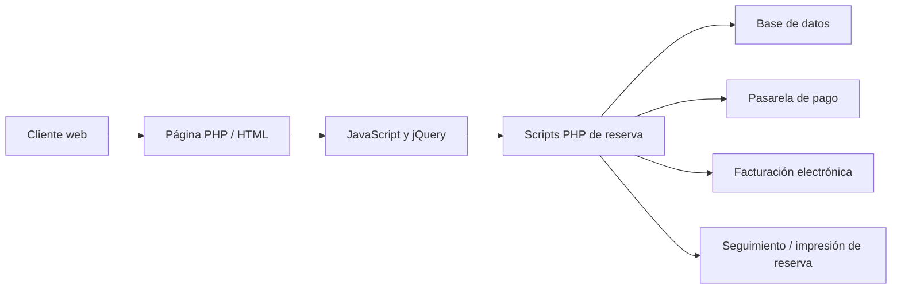
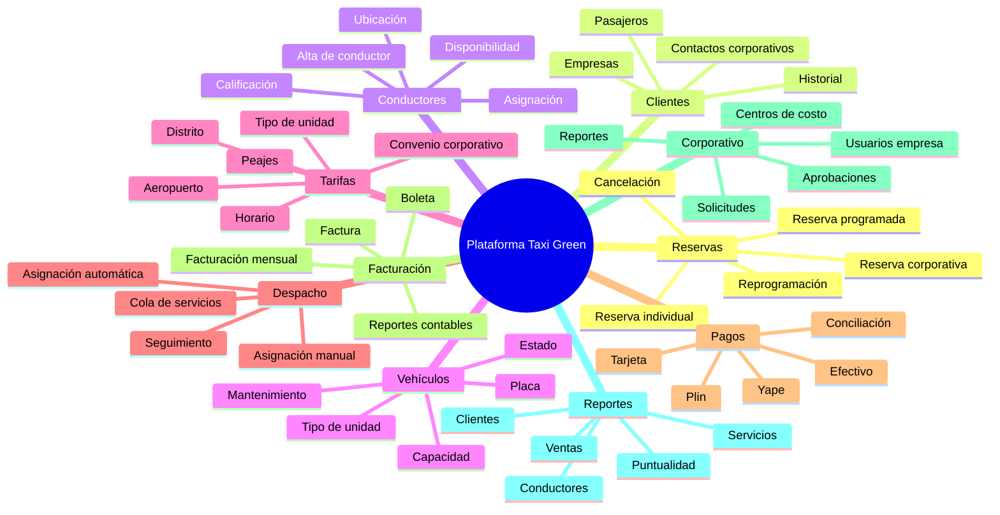
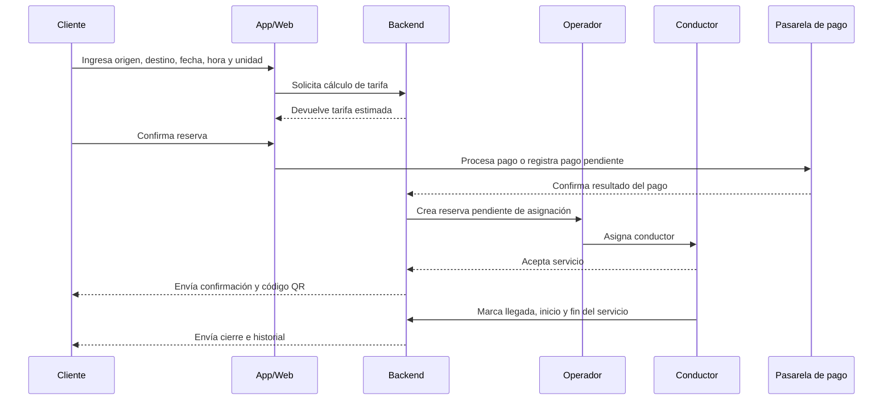
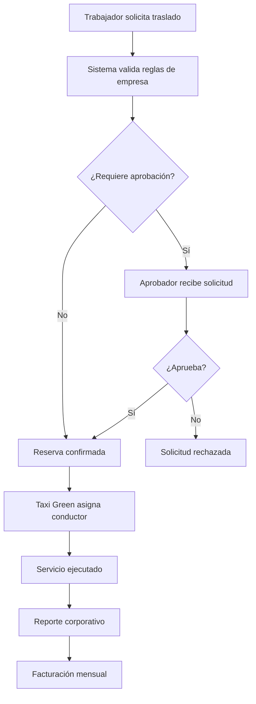

# Reporte de análisis del sistema web de Taxi Green

**URL revisada:** <https://taxigreen.com.pe/green/index.php>  
**Objetivo del análisis:** evaluar el sistema actual de Taxi Green a nivel de software, producto y negocio para decidir si conviene desarrollar una app móvil a medida, modernizar el sistema actual o construir una plataforma tipo **SaaS** para empresas de transporte ejecutivo, remisse, turismo o transporte corporativo.

---

## 1. Resumen ejecutivo

Taxi Green opera en un mercado donde la confianza, la puntualidad, la seguridad y la capacidad de atender servicios programados son más importantes que la lógica típica de una app de taxi instantáneo como Uber o inDrive.

La oportunidad principal no parece ser solamente “hacer una app móvil”, sino convertir la operación actual en una **plataforma digital de reservas, despacho, pagos, facturación, control corporativo y reportes**.

La conclusión más importante es esta:

> **No conviene empezar directamente con un SaaS completo ni solo con una app móvil aislada. Lo más recomendable es construir primero un núcleo moderno de reservas y operación para Taxi Green, validarlo internamente y luego convertirlo progresivamente en una plataforma SaaS para otras empresas de transporte.**

La app móvil debe verse como una capa visible para el cliente y el conductor, pero el verdadero valor del producto estará en el backend, el panel administrativo, el portal corporativo, el módulo de aprobación de servicios, la asignación de conductores, la facturación y la trazabilidad.

---

## 2. Alcance y limitaciones del análisis

### 2.1. Alcance cubierto

Este reporte cubre:

- Carga y revisión general de la URL pública.
- Identificación de tecnologías visibles o probables.
- Detección de pantallas, formularios, rutas y mensajes visibles.
- Investigación pública del modelo de negocio de Taxi Green.
- Inferencia de módulos funcionales probables.
- Identificación de roles de usuario.
- Propuesta de flujos principales de negocio.
- Evaluación de oportunidades para app móvil.
- Evaluación de oportunidades para SaaS.
- Comparación entre app a medida, modernización y SaaS.
- Riesgos técnicos, comerciales y operativos.
- Preguntas clave antes de cotizar.
- MVP recomendado.

### 2.2. Limitaciones

Este análisis se basa en información pública y visible desde el frontend. No incluye:

- Acceso al panel administrativo interno.
- Acceso a la base de datos.
- Acceso al código fuente del backend.
- Pruebas reales de pago.
- Pruebas reales de reserva completada.
- Entrevistas con operadores, conductores o gerencia.
- Validación documental de contratos corporativos.

Por eso, algunas partes están marcadas como **hipótesis razonables** y deben validarse con Taxi Green antes de estimar costo, plazo o arquitectura final.

---

## 3. Evidencia observada

### 3.1. Carga de la URL

La URL pública revisada fue:

```text
https://taxigreen.com.pe/green/index.php
```

Se pudo inspeccionar contenido público del sitio. Sin embargo, se recomienda revisar técnicamente:

- Certificado SSL.
- Redirección correcta de HTTP a HTTPS.
- Configuración de seguridad del dominio.
- Posibles recursos mixtos, es decir, contenido HTTP cargado dentro de una página HTTPS.
- Disponibilidad real desde distintos navegadores y dispositivos.

Esto es importante porque una plataforma de reservas y pagos necesita transmitir seguridad desde el primer contacto.

### 3.2. Pantallas y elementos visibles

En la web pública se identifican elementos relacionados con:

- Reserva de taxi hacia el aeropuerto.
- Selección de tipo de unidad.
- Selección de fecha y hora.
- Ingreso de dirección de origen.
- Destino orientado al Aeropuerto Internacional Jorge Chávez.
- Botones para iniciar reserva o validación.
- Sección de servicios.
- Sección de contacto.
- Sección de seguimiento de reservas o facturas.
- Enlaces a facturación electrónica.
- Medios de pago electrónicos.

### 3.3. Servicios visibles en la propuesta comercial

Según la información pública revisada, Taxi Green comunica servicios como:

- Taxi al aeropuerto.
- Transporte ejecutivo.
- Transporte corporativo.
- Traslados grupales en vans y camionetas.
- Taxi por horas.
- City tours.
- Servicios para familias, empresas, turismo y ejecutivos.

### 3.4. Canal corporativo

El sitio y perfiles públicos muestran señales claras de un enfoque corporativo:

- Convenios empresariales.
- Atención prioritaria.
- Facturación mensual.
- Contactos para ventas corporativas.
- Servicios para trabajadores, clientes y ejecutivos.

Esto confirma que la oportunidad no debe pensarse solo como una app de taxi para usuarios finales, sino como una plataforma para **movilidad corporativa programada**.

---

## 4. Información pública del negocio

### 4.1. Posicionamiento observado

Taxi Green se posiciona como una empresa de transporte terrestre enfocada en:

- Traslados desde y hacia el aeropuerto.
- Servicios corporativos.
- Seguridad y puntualidad.
- Servicio 24/7.
- Conductores profesionales.
- Flota moderna.
- Atención a viajeros nacionales e internacionales.

### 4.2. Señales de volumen operativo

En fuentes públicas se observan mensajes comerciales que mencionan cifras como:

- Más de 25 años de experiencia.
- Más de 800 000 viajes.
- Más de 350 conductores.
- Más de 80 000 clientes.

Estas cifras deben verificarse con la empresa antes de usarse en una propuesta formal, pero son una señal de que existe una operación suficientemente grande como para justificar un sistema más robusto.

### 4.3. Modelo de negocio probable

El modelo actual parece combinar:

1. **Reservas individuales:** clientes particulares que solicitan taxi al aeropuerto o desde el aeropuerto.
2. **Servicios corporativos:** empresas que contratan traslados para trabajadores, clientes o ejecutivos.
3. **Servicios programados:** reservas con fecha y hora, no necesariamente viajes inmediatos.
4. **Servicios por tipo de vehículo:** sedán, camioneta, van o servicio premium.
5. **Facturación mensual corporativa:** consolidación de servicios para empresas.
6. **Atención por canales tradicionales:** web, WhatsApp, teléfono, correo y posiblemente operadores internos.

---

## 5. Tecnología visible o probable

### 5.1. Tecnología visible en frontend

Se observan indicios de uso de:

| Componente | Evidencia o uso probable | Comentario |
|---|---|---|
| PHP | Rutas con extensión `.php`, por ejemplo `index.php` y `seguimiento.php`. | Probable backend tradicional o monolítico. |
| HTML, CSS y JavaScript | La web está construida con páginas renderizadas clásicas. | No parece una aplicación moderna de una sola página. |
| jQuery | Se observan funciones JavaScript asociadas a validaciones y envíos AJAX. | Tecnología común en sistemas web antiguos o tradicionales. |
| Bootstrap | Estilos y estructura visual compatibles con Bootstrap. | Ayuda al diseño responsive, pero no reemplaza una arquitectura moderna. |
| Leaflet | Uso probable para mapas, geocodificación y coordenadas. | Útil para capturar origen/destino, pero requiere buena integración con tarifas y despacho. |
| SweetAlert2 | Alertas visuales para mensajes del sistema. | Se usa para mejorar la experiencia frente a alertas básicas. |
| Google Tag Manager / Analytics | Herramientas de medición y marketing. | Permite rastrear comportamiento, campañas y conversiones. |
| Pasarelas de pago | Se observan referencias comerciales a OpenPay, Izipay, Visa, Mastercard, Yape y Plin. | Debe validarse el nivel real de integración. |

### 5.2. Tecnología probable en backend

No se puede confirmar sin acceso al servidor, pero por la estructura visible es razonable inferir:

- Backend en PHP.
- Base de datos relacional, probablemente MySQL o MariaDB.
- Scripts PHP separados para reservas, impresión, seguimiento y pagos.
- Integración con un dominio o servicio externo para transacciones y comprobantes.
- Lógica de validación parcialmente ubicada en el cliente, es decir, en JavaScript.

### 5.3. Observaciones técnicas importantes

| Punto | Observación | Riesgo |
|---|---|---|
| Validaciones en frontend | Parte de la validación parece realizarse en JavaScript. | Riesgo si el backend no vuelve a validar todos los datos. |
| Código tradicional | La estructura sugiere una aplicación web clásica. | Puede dificultar escalabilidad, pruebas automáticas y mantenimiento. |
| Pagos | Hay señales de pagos electrónicos. | Se debe revisar cumplimiento de seguridad y trazabilidad de pagos. |
| Facturación | Existen enlaces a facturación electrónica. | La integración contable y tributaria puede ser crítica. |
| Seguridad | El sistema maneja datos personales, documentos, reservas y pagos. | Requiere revisión de protección de datos, cifrado y control de accesos. |

---

## 6. Rutas, pantallas y formularios detectados

### 6.1. Rutas visibles o inferidas

| Ruta o recurso | Tipo | Función probable |
|---|---|---|
| `/green/index.php` | Página principal | Reserva pública, información comercial y acceso a servicios. |
| `/green/contact-us.html` | Página de contacto | Datos de contacto, correos, llamada a reserva y atención comercial. |
| `/green/seguimiento.php` | Página funcional | Consulta de reservas o facturas por documento. |
| Factura electrónica en dominio externo | Servicio relacionado | Emisión o consulta de comprobantes electrónicos. |
| Recursos JavaScript y CSS | Archivos estáticos | Lógica de validación, diseño, mapas, alertas y comportamiento visual. |

### 6.2. Formularios visibles o probables

| Formulario | Campos probables | Objetivo |
|---|---|---|
| Reserva pública | Tipo de vehículo, fecha, hora, origen, destino, datos del pasajero, documento, celular, correo. | Crear una reserva de traslado. |
| Seguimiento | Tipo de documento y número de documento. | Consultar reservas o facturas asociadas. |
| Contacto | Nombre, correo, mensaje o datos comerciales. | Solicitar información o atención. |
| Convenio empresarial | Empresa, rubro, contacto, correo, teléfono. | Captar clientes corporativos. |
| Pago | Monto, reserva, correo, medio de pago. | Procesar pago electrónico. |

### 6.3. Mensajes y validaciones observables o esperables

El sistema parece usar mensajes de validación como:

- Fecha no válida.
- Hora no válida.
- Calle no válida.
- Coordenada no válida.
- Celular no válido.
- DNI no válido.
- Pasajero no válido.
- Tarifa no válida.
- Error en registro de reserva.

Esto indica que el sistema ya posee reglas mínimas de validación, pero sería necesario revisar si esas reglas también existen en backend.

---

## 7. Hipótesis técnicas

### 7.1. Hipótesis de arquitectura actual

El sistema actual probablemente funciona así:



### 7.2. Lectura técnica

El sistema parece tener una estructura funcional, pero no necesariamente preparada para escalar como plataforma SaaS. Para convertirlo en un producto comercializable a otras empresas, se necesitaría separar claramente:

- Frontend público.
- API de negocio.
- Panel administrativo.
- App de cliente.
- App de conductor.
- Portal corporativo.
- Motor de tarifas.
- Módulo de pagos.
- Módulo de facturación.
- Módulo multiempresa.

### 7.3. Punto crítico

El mayor riesgo no es diseñar una app bonita. El mayor riesgo es construir una app encima de un backend antiguo o poco flexible.

Por eso, antes de cotizar una app móvil, se debe auditar:

- Base de datos.
- Código backend.
- Proceso real de reserva.
- Proceso de despacho.
- Proceso de asignación de conductores.
- Proceso de pago y facturación.
- Proceso corporativo.

---

## 8. Mapa funcional propuesto

### 8.1. Módulos principales



### 8.2. Módulos mínimos para una primera versión seria

| Prioridad | Módulo | Razón |
|---|---|---|
| Alta | Reservas | Es el corazón del negocio. |
| Alta | Tarifas | Sin tarifa confiable no hay conversión ni control financiero. |
| Alta | Panel operativo | La empresa necesita gestionar servicios, no solo recibir solicitudes. |
| Alta | Conductores y vehículos | Es necesario asignar servicios y controlar disponibilidad. |
| Alta | Pagos | Permite cerrar la reserva y reducir fricción. |
| Alta | Portal corporativo básico | Diferencia a Taxi Green de apps de taxi masivas. |
| Media | App de conductor | Mejora operación, pero puede iniciar con versión simple. |
| Media | Reportes | Necesario para empresas y gerencia. |
| Media | Facturación automática avanzada | Puede iniciar semi-automatizada si ya existe un proveedor externo. |
| Baja inicial | Algoritmos complejos de asignación | Primero validar operación; luego optimizar. |

---

## 9. Roles probables del sistema

| Rol | Qué necesita hacer | Pantallas o módulos requeridos |
|---|---|---|
| Cliente individual | Reservar, pagar, ver estado, recibir confirmación, consultar historial. | App móvil, web pública, seguimiento. |
| Cliente corporativo solicitante | Solicitar traslado para sí mismo o para un tercero. | Portal corporativo o app. |
| Aprobador corporativo | Aprobar, rechazar o modificar solicitudes de trabajadores. | Panel corporativo de aprobaciones. |
| Administrador de empresa cliente | Gestionar usuarios, centros de costo, reglas y reportes. | Portal corporativo avanzado. |
| Operador Taxi Green | Ver reservas, confirmar servicios, asignar conductor, resolver cambios. | Panel operativo. |
| Despachador | Gestionar disponibilidad y asignación de unidades. | Tablero de despacho. |
| Conductor | Recibir servicio, aceptar, navegar, marcar llegada, iniciar y finalizar viaje. | App de conductor. |
| Administrador Taxi Green | Configurar tarifas, usuarios, vehículos, conductores, empresas y reportes. | Backoffice administrativo. |
| Finanzas / facturación | Conciliar pagos, emitir facturas, revisar deudas y cortes mensuales. | Módulo financiero. |
| Soporte | Atender incidencias, reclamos, cambios y cancelaciones. | CRM o módulo de atención. |

---

## 10. Flujos principales de negocio

### 10.1. Flujo de reserva individual



### 10.2. Flujo de reserva corporativa con aprobación



### 10.3. Flujo de despacho operativo

1. El sistema recibe reservas individuales y corporativas.
2. Las reservas entran a una cola operativa.
3. El operador revisa fecha, hora, origen, destino, tipo de unidad y pago.
4. El sistema sugiere conductores disponibles.
5. El despachador asigna o reasigna conductor.
6. El conductor acepta el servicio.
7. El cliente recibe confirmación.
8. El conductor reporta llegada, inicio y fin.
9. El sistema genera cierre, reporte y comprobante.

### 10.4. Flujo de facturación corporativa

1. Cada servicio queda asociado a una empresa, usuario y centro de costo.
2. El sistema consolida servicios por periodo.
3. Finanzas revisa servicios, anulaciones y ajustes.
4. Se emite factura mensual.
5. La empresa descarga reporte y detalle.
6. Se registra pago y conciliación.

---

## 11. Entidades de datos probables

| Entidad | Campos principales | Comentario |
|---|---|---|
| Usuario | id, nombre, documento, celular, correo, contraseña, rol, estado. | Puede ser pasajero, operador, aprobador o administrador. |
| Empresa | id, razón social, RUC, contacto, correo, teléfono, dirección fiscal, estado. | Cliente corporativo o empresa transportista si se vuelve SaaS. |
| Centro de costo | id, empresa, nombre, código, responsable, presupuesto. | Útil para empresas con áreas internas. |
| Reserva | id, código, cliente, empresa, origen, destino, fecha, hora, unidad, estado, tarifa. | Entidad central del sistema. |
| Servicio | id, reserva, conductor, vehículo, inicio, fin, estado operativo. | Representa la ejecución real del traslado. |
| Conductor | id, nombre, documento, licencia, teléfono, estado, ubicación, calificación. | Necesario para despacho y trazabilidad. |
| Vehículo | id, placa, tipo, capacidad, marca, modelo, año, estado. | Permite asignación por tipo de unidad. |
| Tarifa | id, origen, destino, distrito, tipo de unidad, monto base, peajes, vigencia. | Debe soportar tarifas públicas y corporativas. |
| Pago | id, reserva, método, monto, estado, pasarela, transacción, fecha. | Para tarjeta, Yape, Plin, efectivo o crédito corporativo. |
| Comprobante | id, reserva, tipo, serie, número, cliente, monto, estado SUNAT. | Boleta o factura. |
| Aprobación | id, solicitud, aprobador, estado, comentario, fecha. | Clave para flujo corporativo. |
| Reporte | id, tipo, filtros, usuario, fecha, archivo generado. | Para gerencia y clientes corporativos. |
| Incidencia | id, reserva, tipo, descripción, responsable, estado. | Para soporte y reclamos. |

---

## 12. Oportunidades para app móvil

### 12.1. App para cliente individual

Funciones recomendadas:

- Registro e inicio de sesión.
- Reserva de traslado al aeropuerto.
- Reserva desde aeropuerto hacia domicilio, hotel u oficina.
- Selección de tipo de vehículo.
- Fecha y hora programada.
- Cálculo de tarifa antes de confirmar.
- Pago con tarjeta, Yape, Plin o crédito corporativo.
- Confirmación con código QR.
- Estado de reserva.
- Datos del conductor y vehículo.
- Seguimiento del conductor en mapa.
- Historial de servicios.
- Descarga de comprobantes.
- Soporte por chat o WhatsApp.

### 12.2. App para conductor

Funciones recomendadas:

- Inicio de sesión del conductor.
- Estado disponible / no disponible.
- Recepción de servicios asignados.
- Aceptar o rechazar servicio según reglas.
- Ver datos de pasajero, origen, destino y horario.
- Navegación con Google Maps o Waze.
- Marcar llegada al punto de recojo.
- Escanear QR o validar código de reserva.
- Iniciar servicio.
- Finalizar servicio.
- Reportar incidencia.
- Ver historial de servicios.

### 12.3. App o portal para cliente corporativo

Funciones recomendadas:

- Solicitar traslado para trabajador, cliente o ejecutivo.
- Seleccionar centro de costo.
- Enviar solicitud a aprobación.
- Ver estado de solicitudes.
- Consultar historial.
- Descargar reportes.
- Validar servicios ejecutados.

---

## 13. Oportunidades para SaaS

### 13.1. Qué sería el SaaS

El SaaS sería una plataforma que Taxi Green podría vender a otras empresas de transporte ejecutivo, remisse, turismo o movilidad corporativa.

No sería solo una app de taxi. Sería un sistema completo para operar una empresa de transporte programado.

### 13.2. Módulos SaaS comercializables

| Módulo SaaS | Valor para otras empresas |
|---|---|
| Reservas web y móvil | Digitaliza la captación de servicios. |
| Panel de despacho | Ordena la operación diaria. |
| App de conductor | Mejora trazabilidad y control. |
| Portal corporativo | Permite vender a empresas. |
| Aprobaciones | Diferencia fuerte frente a taxis tradicionales. |
| Tarifario configurable | Cada empresa puede manejar precios propios. |
| Facturación y reportes | Resuelve un dolor real de clientes empresariales. |
| Multiempresa | Permite vender el mismo software a varios operadores. |
| Marca blanca | Cada empresa puede usar su propia marca. |
| Analítica | Ayuda a gerencia a controlar flota, ingresos y demanda. |

### 13.3. Segmentos posibles

- Empresas de taxi al aeropuerto.
- Empresas de remisse.
- Empresas de transporte ejecutivo.
- Agencias de turismo.
- Hoteles con servicio tercerizado de movilidad.
- Empresas de vans para eventos.
- Empresas de transporte corporativo.
- Operadores de traslados para clínicas, universidades o instituciones.

### 13.4. Modelos de cobro SaaS posibles

| Modelo | Cómo funciona | Comentario |
|---|---|---|
| Suscripción mensual por empresa | La empresa paga una cuota fija mensual. | Simple de vender, pero debe cubrir soporte. |
| Suscripción por conductor activo | Se cobra según cantidad de conductores. | Escala con el tamaño del cliente. |
| Suscripción por vehículo activo | Similar al modelo por conductor. | Útil si la flota es el principal indicador operativo. |
| Comisión por servicio | Se cobra un porcentaje o monto fijo por viaje. | Alinea ingresos al uso, pero requiere confianza y trazabilidad. |
| Plan mixto | Cuota base + comisión por servicio. | Puede ser el modelo más equilibrado. |
| Marca blanca premium | Se cobra extra por personalización visual y dominio propio. | Bueno para clientes con marca fuerte. |

---

## 14. Evaluación: app a medida vs modernización vs SaaS

### 14.1. Lectura rápida

| Alternativa | Recomendación | Por qué |
|---|---|---|
| Solo app móvil a medida | No recomendable como primer paso aislado. | La app no resuelve por sí sola reservas, despacho, facturación, aprobaciones ni operación interna. |
| Modernizar sistema actual | Recomendable como base inicial. | Permite ordenar backend, datos, pagos, reservas y operación antes de escalar. |
| SaaS desde cero | No recomendable como primera entrega completa. | Tiene alto riesgo técnico y comercial si no se valida primero en Taxi Green. |
| MVP híbrido | Recomendación principal. | Moderniza el núcleo, lanza app y portal básico, y prepara el camino al SaaS. |

### 14.2. Alternativa 1: app móvil a medida

#### Ventajas

- Mejora la experiencia del cliente final.
- Permite reservas más rápidas desde celular.
- Permite notificaciones push.
- Permite seguimiento del conductor en mapa.
- Permite pago dentro de la app.
- Mejora la percepción de marca.
- Puede reducir dependencia de llamadas, WhatsApp y atención manual.
- Puede competir mejor contra aplicaciones modernas de movilidad.

#### Desventajas

- Si se construye encima del backend actual sin modernizarlo, puede generar más deuda técnica.
- La app no resuelve por sí sola el despacho, la facturación, la asignación de conductores ni el control corporativo.
- Requiere mantenimiento constante en Android e iOS.
- Requiere soporte, analítica, gestión de errores y actualizaciones.
- Puede ser costosa si se hacen dos apps nativas separadas.
- Si no hay buen producto ni marketing, los usuarios podrían seguir reservando por WhatsApp.

#### Comentario estratégico

Una app móvil es valiosa, pero no debe ser el centro del proyecto. Debe ser una capa conectada a un backend robusto. Si el presupuesto es limitado, conviene usar una tecnología multiplataforma como React Native o Flutter y concentrar el esfuerzo en la lógica de reservas, pagos, estados y trazabilidad.

#### Cuándo elegir esta opción

Elegir esta opción si Taxi Green quiere priorizar experiencia de cliente, reservas individuales y posicionamiento de marca, pero siempre acompañada de una modernización mínima del backend.

---

### 14.3. Alternativa 2: modernizar el sistema actual

#### Ventajas

- Aprovecha conocimiento operativo existente.
- Reduce riesgos de romper la operación actual.
- Permite migrar por etapas.
- Permite ordenar base de datos, reservas, pagos y facturación.
- Facilita crear una API para app móvil y portal corporativo.
- Puede tener menor costo inicial que reconstruir todo desde cero.
- Permite conservar integraciones existentes que sí funcionen.
- Es la mejor base para escalar luego hacia SaaS.

#### Desventajas

- Puede arrastrar limitaciones del sistema antiguo.
- Requiere auditoría técnica para saber qué conservar y qué reemplazar.
- Si se hace solo como “parche”, no resolverá el problema de fondo.
- Puede ser difícil si el código actual no está documentado.
- Puede generar resistencia interna si los operadores están acostumbrados al flujo actual.
- No genera por sí sola una nueva línea de negocio SaaS si no se diseña con visión de producto.

#### Comentario estratégico

Esta es la opción más sensata como primera fase. No significa “maquillar la web”, sino crear una base moderna: API, base de datos limpia, roles, estados de reserva, pagos, facturación, panel operativo y trazabilidad.

#### Cuándo elegir esta opción

Elegir esta opción si Taxi Green quiere reducir riesgo, ordenar su operación y preparar el terreno para una app móvil y un futuro SaaS.

---

### 14.4. Alternativa 3: construir un SaaS

#### Ventajas

- Puede crear una nueva línea de ingresos recurrentes.
- Permite vender el sistema a otras empresas de transporte.
- Escala el conocimiento operativo de Taxi Green como producto.
- Diferencia la oferta frente a una simple empresa de taxi.
- Puede incluir módulos de alto valor: aprobaciones, facturación, reportes y portal corporativo.
- Permite construir una plataforma multiempresa y marca blanca.
- Puede atraer clientes de transporte ejecutivo, turismo, remisse y movilidad corporativa.

#### Desventajas

- Es la alternativa más compleja.
- Requiere arquitectura multiempresa, es decir, que varias compañías usen la misma plataforma sin mezclar datos.
- Requiere soporte técnico, onboarding, documentación y capacitación.
- Requiere estrategia comercial, marketing, pricing y atención posventa.
- Requiere seguridad avanzada y cumplimiento normativo.
- Puede distraer a Taxi Green de su operación principal si no se gestiona bien.
- Puede fracasar si se construye sin validar demanda real de otras empresas.

#### Comentario estratégico

El SaaS es una oportunidad atractiva, pero no debe venderse como promesa antes de tener un caso interno sólido. Primero se debe construir una versión que funcione para Taxi Green, medir resultados y luego paquetizarla para terceros.

#### Cuándo elegir esta opción

Elegir esta opción si la gerencia está dispuesta a invertir no solo en desarrollo, sino también en producto, ventas, soporte, documentación, seguridad, infraestructura y crecimiento comercial.

---

### 14.5. Matriz comparativa completa

| Criterio | App a medida | Modernización | SaaS |
|---|---|---|---|
| Objetivo principal | Mejorar experiencia del cliente. | Ordenar y fortalecer operación actual. | Crear nueva línea de negocio. |
| Riesgo técnico | Medio. | Medio. | Alto. |
| Riesgo comercial | Medio. | Bajo a medio. | Alto. |
| Costo inicial | Medio a alto. | Medio. | Alto. |
| Tiempo de salida | Medio. | Medio. | Largo si se hace completo. |
| Impacto en operación interna | Limitado si no hay panel. | Alto. | Alto, pero requiere madurez. |
| Valor para cliente final | Alto. | Medio indirecto. | Depende del tipo de cliente. |
| Valor para empresas corporativas | Medio. | Alto si incluye portal. | Muy alto si está bien diseñado. |
| Escalabilidad | Depende del backend. | Buena si se diseña bien. | Muy alta, pero más compleja. |
| Recomendación | No iniciar sola. | Iniciar aquí. | Segunda etapa después del MVP. |

---

## 15. Riesgos técnicos, comerciales y operativos

### 15.1. Riesgos técnicos

| Riesgo | Impacto | Mitigación |
|---|---|---|
| Backend antiguo o difícil de mantener. | Alto. | Auditoría técnica y creación progresiva de API moderna. |
| Validaciones solo en frontend. | Alto. | Validar todo nuevamente en backend. |
| Integraciones de pago mal documentadas. | Alto. | Revisar contratos, APIs, logs y procesos de conciliación. |
| Datos desordenados o duplicados. | Medio/alto. | Limpieza y modelo de datos antes de migrar. |
| Falta de trazabilidad de estados. | Alto. | Definir ciclo de vida de reserva y servicio. |
| Problemas de seguridad. | Alto. | Autenticación robusta, roles, cifrado y auditoría. |
| App sin soporte operativo. | Alto. | Construir panel operativo antes o junto con la app. |

### 15.2. Riesgos comerciales

| Riesgo | Impacto | Mitigación |
|---|---|---|
| Confundir app con SaaS. | Alto. | Separar claramente producto interno, app y plataforma SaaS. |
| No validar demanda SaaS. | Alto. | Entrevistar empresas de transporte antes de construir todo. |
| Precio mal definido. | Medio/alto. | Probar planes por conductor, vehículo o servicio. |
| Clientes siguen usando WhatsApp. | Medio. | Integrar WhatsApp como canal, no eliminarlo de golpe. |
| Competencia con apps grandes. | Alto. | Enfocarse en transporte programado y corporativo, no taxi instantáneo masivo. |

### 15.3. Riesgos operativos

| Riesgo | Impacto | Mitigación |
|---|---|---|
| Conductores no adoptan la app. | Alto. | Capacitación, interfaz simple y beneficios claros. |
| Operadores rechazan el cambio. | Medio/alto. | Implementar por etapas y mantener flujo manual de contingencia. |
| Fallas en servicios críticos. | Alto. | Soporte, monitoreo, backups y planes de contingencia. |
| Mal manejo de cambios o cancelaciones. | Medio. | Definir reglas claras y estados del servicio. |
| Facturación mensual incorrecta. | Alto. | Conciliación y validación antes de emitir comprobantes. |

---

## 16. MVP recomendado

### 16.1. Recomendación principal

Construir un **MVP híbrido** compuesto por:

1. Backend moderno de reservas.
2. Panel operativo para Taxi Green.
3. App móvil para cliente.
4. App o vista móvil para conductor.
5. Portal corporativo básico.
6. Integración inicial de pagos.
7. Reportes mínimos.

Este MVP debe resolver primero la operación de Taxi Green. Luego, si funciona, se convierte en SaaS.

### 16.2. MVP por fases

#### Fase 0: Diagnóstico técnico y operativo

Duración estimada: 2 a 4 semanas.

Entregables:

- Mapa real de procesos.
- Auditoría del sistema actual.
- Modelo de datos actual.
- Inventario de integraciones.
- Flujo real de reservas.
- Flujo real de pagos.
- Flujo real de facturación.
- Priorización funcional.

#### Fase 1: Núcleo de reservas y panel operativo

Duración estimada: 8 a 12 semanas.

Entregables:

- API de reservas.
- Registro de clientes.
- Registro de conductores.
- Registro de vehículos.
- Gestión de tarifas básica.
- Panel de reservas.
- Estados de servicio.
- Asignación manual de conductor.
- Notificaciones básicas.

#### Fase 2: App de cliente y conductor

Duración estimada: 8 a 12 semanas.

Entregables:

- App cliente para reserva.
- Cálculo de tarifa.
- Confirmación con QR.
- Historial de servicios.
- App conductor simple.
- Estados: asignado, en camino, llegó, iniciado, finalizado.
- Ubicación en mapa.

#### Fase 3: Portal corporativo

Duración estimada: 8 a 10 semanas.

Entregables:

- Registro de empresas.
- Usuarios por empresa.
- Solicitud de traslado.
- Aprobación de solicitudes.
- Centros de costo.
- Reporte mensual.
- Facturación consolidada inicial.

#### Fase 4: Preparación SaaS

Duración estimada: 10 a 16 semanas adicionales.

Entregables:

- Multiempresa.
- Planes de suscripción.
- Personalización de marca.
- Seguridad avanzada.
- Onboarding de clientes.
- Panel de administración SaaS.
- Métricas de uso.
- Documentación y soporte.

---

## 17. Stack tecnológico sugerido

### 17.1. Opción recomendada para MVP

| Capa | Tecnología sugerida | Motivo |
|---|---|---|
| App móvil | React Native o Flutter | Permite Android e iOS con una sola base de código. |
| Frontend web | React, Next.js o Vue | Paneles modernos, rápidos y escalables. |
| Backend | Laravel, NestJS, Django o Spring Boot | API sólida para reservas, pagos, usuarios y reportes. |
| Base de datos | PostgreSQL o MySQL | Modelo relacional adecuado para reservas, pagos y facturación. |
| Mapas | Google Maps, Mapbox o Leaflet según costo y precisión | Geocodificación, rutas y seguimiento. |
| Notificaciones | Firebase Cloud Messaging | Notificaciones a app móvil. |
| Pagos | Izipay, OpenPay, Niubiz, Yape/Plin según disponibilidad API | Debe validarse comercial y técnicamente. |
| Infraestructura | AWS, Google Cloud, Azure o proveedor local confiable | Escalabilidad, backups y monitoreo. |

### 17.2. Recomendación práctica

Si el objetivo es rapidez y costo controlado:

- **React Native** para app móvil.
- **Laravel** o **NestJS** para backend.
- **PostgreSQL** para base de datos.
- **React** para panel administrativo.
- **Firebase** para notificaciones.
- Integración gradual con facturación y pagos existentes.

---

## 18. Preguntas clave antes de cotizar

### 18.1. Preguntas de negocio

1. ¿El objetivo principal es mejorar Taxi Green o crear un producto vendible a terceros?
2. ¿Qué problema duele más hoy: reservas, despacho, pagos, facturación, control corporativo o reportes?
3. ¿Cuántas reservas reciben por día y por mes?
4. ¿Qué porcentaje llega por web, WhatsApp, teléfono, app o clientes corporativos?
5. ¿Cuántos clientes corporativos activos tienen?
6. ¿Cuánto representa el negocio corporativo frente al negocio individual?
7. ¿Qué empresas competidoras consideran referencia?
8. ¿Quieren competir con Uber o diferenciarse en transporte programado y corporativo?

### 18.2. Preguntas operativas

1. ¿Cómo se asigna actualmente un conductor?
2. ¿La asignación es manual, automática o mixta?
3. ¿Los conductores son empleados, afiliados o terceros?
4. ¿Cada conductor tiene un vehículo fijo?
5. ¿Cómo se controla disponibilidad?
6. ¿Cómo se manejan retrasos, cancelaciones y cambios?
7. ¿Qué sucede si un cliente no aparece?
8. ¿Qué sucede si un conductor cancela?
9. ¿Hay turnos operativos 24/7?
10. ¿Cuántos operadores usan el sistema?

### 18.3. Preguntas técnicas

1. ¿Quién desarrolló el sistema actual?
2. ¿Tienen acceso al código fuente?
3. ¿Tienen documentación técnica?
4. ¿Qué base de datos usan?
5. ¿Dónde está alojado el sistema?
6. ¿Existen backups automáticos?
7. ¿Qué pasarelas de pago están realmente integradas?
8. ¿Qué sistema usan para facturación electrónica?
9. ¿Existe API interna?
10. ¿Existe app móvil en producción? Si existe, ¿con qué tecnología fue hecha?

### 18.4. Preguntas corporativas

1. ¿Cómo solicita hoy un servicio una empresa cliente?
2. ¿Quién aprueba los servicios?
3. ¿Hay centros de costo?
4. ¿Hay tarifas especiales por empresa?
5. ¿La facturación es mensual, semanal o por servicio?
6. ¿Los reportes se hacen manualmente en Excel?
7. ¿Qué información exige el cliente corporativo en el reporte?
8. ¿Qué nivel de servicio esperan las empresas?

### 18.5. Preguntas legales y de seguridad

1. ¿Qué datos personales almacenan?
2. ¿Tienen política de privacidad actualizada?
3. ¿Cómo protegen documentos, teléfonos y correos?
4. ¿Quién puede ver datos de clientes y empresas?
5. ¿Qué requisitos tributarios tiene la facturación?
6. ¿Qué pasa si hay reclamo por servicio, pago o factura?
7. ¿Necesitan auditoría de acciones por usuario?

### 18.6. Preguntas para validar SaaS

1. ¿Ya tienen empresas interesadas en comprar el software?
2. ¿Qué tipo de empresa sería el primer cliente SaaS?
3. ¿Quieren venderlo con marca Taxi Green o como marca independiente?
4. ¿El SaaS sería para Perú solamente o para Latinoamérica?
5. ¿El cliente SaaS tendría su propia base de conductores?
6. ¿Cada empresa manejaría sus propias tarifas?
7. ¿Qué soporte esperan ofrecer?
8. ¿Quién vendería, capacitaría y daría soporte?
9. ¿Qué precio mensual sería aceptable para el mercado?
10. ¿Están dispuestos a invertir en producto durante 12 meses o más?

---

## 19. Recomendación final

La estrategia más sólida es avanzar en este orden:

1. **Auditar el sistema actual.**
2. **Modernizar el núcleo de reservas y operación.**
3. **Construir app móvil para cliente y conductor.**
4. **Crear portal corporativo básico.**
5. **Validar con Taxi Green y uno o dos clientes corporativos.**
6. **Medir resultados reales.**
7. **Recién después convertirlo en SaaS multiempresa.**

La app móvil es importante, pero no debe ser el único entregable. El verdadero producto debe ser una plataforma de movilidad corporativa programada.

---

## 20. Decisión recomendada

### Decisión sugerida

> **Construir un MVP híbrido: modernización del backend + panel operativo + app cliente/conductor + portal corporativo básico.**

### Razón

Esta ruta permite resolver el problema real de Taxi Green, reducir riesgo técnico, mejorar la experiencia del cliente, ordenar la operación interna y validar si existe oportunidad real para convertirlo en SaaS.

### Qué no se recomienda

No se recomienda iniciar con:

- Una app aislada sin backend moderno.
- Un SaaS completo sin validación previa.
- Una simple mejora visual de la web actual.
- Una copia genérica de Uber.

### Enfoque correcto

El enfoque correcto no es “hacer otro Uber”. El enfoque correcto es construir una plataforma especializada en:

- Reservas programadas.
- Traslados al aeropuerto.
- Transporte ejecutivo.
- Transporte corporativo.
- Aprobaciones empresariales.
- Facturación mensual.
- Validación de servicio por QR.
- Reportes para empresas.
- Control operativo de conductores y vehículos.

---

## 21. Fuentes públicas revisadas

> Estas fuentes deben validarse nuevamente antes de presentar una propuesta comercial final, porque la información pública puede cambiar.

1. Sitio principal de Taxi Green: <https://taxigreen.com.pe/green/index.php>
2. Página de contacto de Taxi Green: <https://taxigreen.com.pe/green/contact-us.html>
3. Página promocional Taxi Green: <https://taxigreen.org.pe/>
4. Perfil de Taxi Green en LinkedIn: <https://www.linkedin.com/company/taxi-green-oficial>
5. Perfil de Taxi Green en Tripadvisor: <https://www.tripadvisor.com.pe/Attraction_Review-g294316-d11899039-Reviews-Taxi_Green-Lima_Lima_Region.html>
