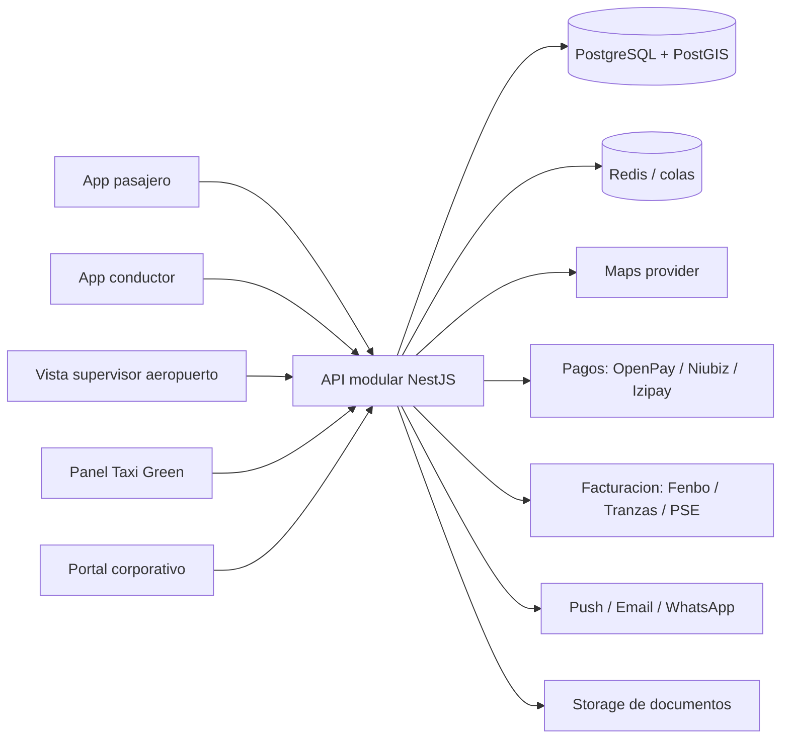
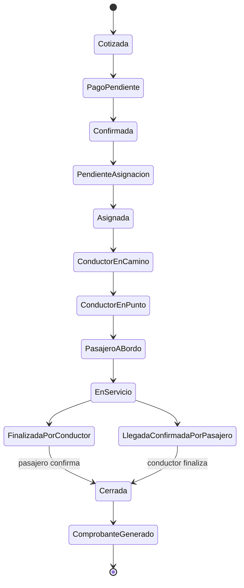
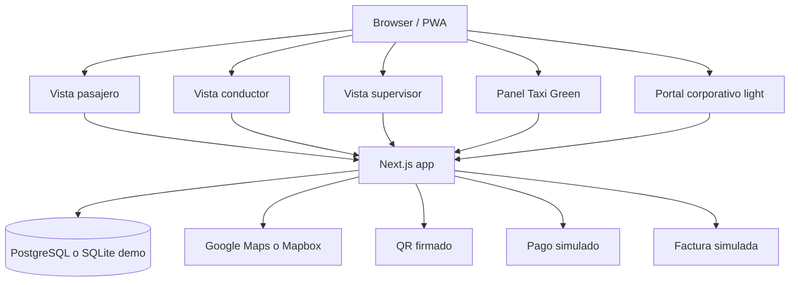
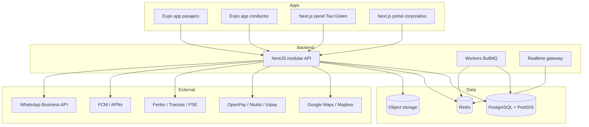

# Demo comercial Taxi Green - Masterplan estrategico y tecnico

## 1. Tesis ejecutiva

La demo que conviene construir no es una app de taxi. Es la version digital del servicio aeroportuario de Taxi Green: reserva programada, confianza operativa, QR, asignacion de conductor y unidad, trazabilidad, cierre validado por pasajero y conductor, comprobante y control administrativo.

Taxi Green ya tiene lo dificil: marca, trayectoria, flota afiliada, modulo fisico en el aeropuerto, confianza historica y canal corporativo. Lo que no tiene bien resuelto es la capa digital moderna que ordene la operacion y haga visible esa confianza para el pasajero, el conductor, el supervisor de aeropuerto y el administrador.

La demo debe decir, sin decirlo de forma grandilocuente:

> Taxi Green no compite por ser otro Uber. Compite por ser la forma mas confiable, trazable y ordenada de mover pasajeros hacia y desde el aeropuerto.

La pieza estrella debe ser una reserva aeroportuaria programada con "boarding pass" Taxi Green: codigo de reserva, QR, datos del viaje, comprobante, estado operativo y validacion del servicio. Esa tarjeta es el objeto narrativo que conecta pasajero, conductor, supervisor, administrador y futuro corporativo.

## 2. Fuentes usadas y criterio de lectura

Fuentes leidas:

- `contexto/taxigreen/taxi_green_principal.md`
- `contexto/taxigreen/transcripcion_demo.txt`
- `contexto/taxigreen/taxi_green_secundario.md`
- `contexto/Qorinti/Reporte_Tecnico_Qorinti.pdf`
- `contexto/Qorinti/Reporte_Contexto_Qorinti.pdf`
- `contexto/taxigreen/primeras_ideas.pdf`

Archivos no leidos por instruccion expresa:

- `PLAN_DE_SOFTWARE.md`
- `PROPUESTA_DEMO.md`

Criterio aplicado:

- El analisis principal de Taxi Green define la realidad del negocio y del sistema actual.
- La transcripcion define la expectativa de demo y el flujo que el cliente espera ver.
- Qorinti se usa solo como cantera de patrones funcionales: estados, aprobaciones, conductor, vehiculo, panel admin, historial.
- Primeras ideas se usa como brujula de futuro SaaS, especialmente QR, voucher corporativo, trazabilidad y facturacion, sin convertir la demo inicial en un monstruo.

### 2.1 Lectura estrategica del sistema actual

La realidad actual de Taxi Green muestra una empresa con operacion real, marca reconocible y activos comerciales fuertes, pero con una capa digital fragmentada:

- Un sistema operativo web en PHP clasico bajo `/green/`, con jQuery, Bootstrap, Leaflet, OpenPay y formularios modales.
- Una vitrina WordPress bajo `/t/`, mas moderna visualmente, pero cuyo flujo de reservas funciona mas como contacto comercial que como reserva transaccional.
- Integracion visible con pagos y medios locales: OpenPay, Izipay, Niubiz, Visa, Mastercard, Yape y Plin.
- Facturacion y seguimiento apoyados en Tranzas/Fenbo Digital.
- Canales humanos fuertes: call center, WhatsApp, correo y modulo fisico en el aeropuerto.
- Promesa de app movil, pero con senales de debilidad o discontinuidad.
- Servicios diversos anunciados, aunque el flujo digital mas tangible esta centrado en aeropuerto.

La oportunidad no es "ponerle app" a la web. La oportunidad es convertir lo que hoy esta repartido entre web, WhatsApp, telefono, modulo y facturacion externa en una experiencia trazable y presentable.

Taxi Green ya vende confianza. La demo debe hacer que esa confianza se vea.

### 2.2 Lectura de la voz del cliente

La transcripcion no pide una plataforma enorme. Pide un ciclo visible de reserva:

- Login simple.
- GPS y destino.
- Horario de recojo.
- Tipo de vehiculo.
- Precio.
- Boleta o factura.
- Pago simulado.
- Confirmacion.
- Numero de reserva.
- QR.
- Mis reservas.
- Administrador que ve la reserva.
- Asignacion de conductor y unidad por separado.
- Conductor notificado.
- Pasajero notificado.
- Ubicacion/ETA.
- Inicio de servicio.
- Compartir viaje por seguridad.
- Cierre por conductor y pasajero.
- Comprobante.

Tambien pide un segundo flujo para llegada al aeropuerto:

- Origen aeropuerto.
- Destino ciudad.
- Datos de vuelo.
- QR.
- Supervisor o modulo valida.
- Asignacion en aeropuerto.

La decision correcta es no tomar cada frase como una especificacion rigida, sino como senal de lo que debe sentirse en la demo: control, trazabilidad y reserva programada.

## 3. Lo que realmente se debe vender

La venta no debe ser:

- "Hicimos una app de taxi."
- "Tenemos mapas como Uber."
- "Tenemos microservicios y MongoDB."
- "Copiamos un marketplace con ofertas de conductores."

La venta debe ser:

- "Digitalizamos el traslado aeroportuario programado de Taxi Green."
- "El pasajero sabe que su reserva existe, quien lo recoge, en que unidad y que comprobante recibira."
- "El operador ve todo el ciclo de vida de la reserva."
- "El conductor recibe una asignacion clara, no un mensaje suelto."
- "El supervisor de aeropuerto puede validar al pasajero con QR."
- "La empresa puede auditar el servicio, cerrar el viaje y facturar con menos friccion."

El concepto recomendado para nombrar internamente la demo:

> Taxi Green Control Tower

No necesariamente debe ser el nombre comercial final, pero sirve para orientar producto y presentacion: no es una pantalla bonita, es una torre de control para reservas aeroportuarias.

## 4. Por que esta demo enamoraria al cliente

Porque ataca exactamente el punto donde Taxi Green tiene mas valor y mas dolor.

Taxi Green no necesita demostrar que puede pedir un taxi cualquiera. Necesita demostrar que puede ordenar un servicio sensible: un pasajero con vuelo, horario, equipaje, documento, pago, boleta o factura, conductor asignado, placa, llegada, inicio, fin, validacion y comprobante.

La demo enamora si el cliente siente cuatro cosas:

1. "Esto entiende nuestro aeropuerto."
2. "Esto reduce llamadas, WhatsApp y Excel."
3. "Esto le da tranquilidad al pasajero."
4. "Esto me prepara para vender mejor a empresas."

La magia no esta en el mapa. El mapa es necesario, pero no diferencial. La magia esta en convertir una reserva dispersa en una tarjeta operativa viva: creada, pagada, asignada, validada, atendida, cerrada y facturada.

## 5. Decision principal de alcance

Construir una demo funcional enfocada en un solo dominio:

> Reserva aeroportuaria programada de Taxi Green, en ambos sentidos: "Voy al aeropuerto" y "Salgo del aeropuerto".

El flujo protagonista debe ser "Voy al aeropuerto" porque:

- Es el flujo mas claro para una reserva desde casa, oficina u hotel.
- Permite demostrar GPS, origen real, destino aeropuerto, ruta, kilometros, ETA y tarifa.
- Calza con la exigencia de la transcripcion: mapa, calculo de distancia, horario, tipo de vehiculo, precio, pago, reserva, mis reservas, QR, asignacion y cierre.
- Se puede recorrer de punta a punta sin depender de una escena fisica del aeropuerto.

El segundo flujo, "Salgo del aeropuerto", debe mostrarse como variante poderosa, no como segundo producto completo:

- Origen fijo: Aeropuerto Jorge Chavez.
- Destino elegido por pasajero.
- Datos de vuelo: aerolinea, numero, hora estimada, nacional/internacional.
- QR para validacion por supervisor o modulo.
- Asignacion de conductor y unidad en aeropuerto.

Esta combinacion respeta la voz del cliente y a la vez aprovecha el activo unico de Taxi Green: su operacion aeroportuaria.

## 6. La historia que debe contar la demo

La demo debe sentirse como una mini pelicula operativa, no como una coleccion de pantallas.

### Personaje 1: pasajero

Ana Torres, ejecutiva que viaja de Miraflores al Aeropuerto Jorge Chavez. Tiene vuelo de madrugada, necesita llegar a tiempo, quiere pagar antes, pedir factura a su empresa y tener certeza de quien la recogera.

### Personaje 2: operador Taxi Green

Claudia, operadora o despachadora. Ve la nueva reserva, revisa horario, destino, tarifa, tipo de unidad, pago y comprobante. Asigna conductor y unidad por separado.

### Personaje 3: conductor

Miguel, conductor afiliado. Recibe la reserva asignada, ve datos del pasajero, ruta, hora de recojo, referencia, QR, placa de la unidad, botones de estado y navegacion.

### Personaje 4: supervisor de aeropuerto

Rosa, supervisora en modulo. Solo aparece en el flujo "Salgo del aeropuerto". Escanea el QR del pasajero, valida reserva y asigna o confirma la unidad disponible.

### Personaje 5: administrador corporativo

Carla, administradora de una empresa cliente. No debe robarse la demo. Debe aparecer como remate: ve el mismo viaje asociado a RUC, centro de costo y comprobante. Esto abre la puerta SaaS sin distraer.

## 7. Guion recomendado de presentacion

Duracion ideal: 12 a 15 minutos.

### Escena 1: el dolor actual, en 60 segundos

Mostrar verbalmente, no con muchas slides:

- Hoy el cliente puede reservar, pero la experiencia es vieja y fragmentada.
- La web operativa existe, pero no comunica confianza moderna.
- El seguimiento y la factura estan mezclados.
- El pasajero no ve claramente conductor, placa, tracking ni QR.
- El operador probablemente resuelve mucho por telefono, WhatsApp o sistema interno.

Mensaje:

> No venimos a reemplazar la operacion de Taxi Green. Venimos a hacerla visible, ordenada y vendible.

### Escena 2: reserva del pasajero

Pantalla movil:

1. Login simulado.
2. Inicio con reserva activa o CTA "Nueva reserva".
3. Selector: "Voy al aeropuerto" / "Salgo del aeropuerto".
4. GPS detecta origen o permite escribirlo.
5. Destino preseleccionado: Aeropuerto Jorge Chavez.
6. Fecha y hora de recojo.
7. Tipo de vehiculo: Sedan, SUV/Camioneta, Van.
8. Pasajeros, maletas, peaje.
9. Tarifa calculada.
10. Boleta por defecto o factura con RUC.
11. Pago simulado: tarjeta, Yape, Plin, transferencia.
12. Confirmacion con codigo y QR.

Lo importante no es que haya veinte campos. Lo importante es que el usuario sienta que Taxi Green ya sabe operar viajes al aeropuerto: horario, equipaje, peajes, comprobante y reserva programada.

### Escena 3: tarjeta de reserva tipo boarding pass

Pantalla "Mis reservas":

- Codigo: `TG-2026-000184`
- QR visible.
- Estado: Confirmada, pendiente de asignacion.
- Origen, destino, fecha, hora.
- Tipo de unidad.
- Pasajeros y maletas.
- Boleta o factura.
- Monto.
- Politica de tolerancia y cancelacion resumida.

Esta pantalla es clave. Debe sentirse como una tarjeta de embarque aeroportuaria, no como un recibo seco.

### Escena 4: control operativo

Panel web Taxi Green:

- Lista de reservas por estado.
- Nueva reserva resaltada.
- Filtros: Hoy, Proximas, Pendientes de asignar, En curso, Cerradas.
- Detalle de reserva.
- Asignacion separada:
  - Conductor: Miguel Huaman.
  - Unidad: Toyota Corolla, placa ABC-123.
- Boton "Asignar y notificar".

Al asignar, deben actualizarse:

- Estado en panel admin.
- App pasajero.
- App conductor.

Aunque la demo corra en una sola maquina, ese cambio debe sentirse vivo.

### Escena 5: conductor

Vista conductor:

- Alerta de nueva reserva asignada.
- Hora de recojo.
- Origen y destino.
- Referencia.
- Pasajero.
- Botones:
  - "Ir al punto"
  - "Llegue al punto"
  - "Pasajero a bordo"
  - "Finalizar servicio"
- Boton externo "Abrir en Waze/Google Maps" simulado o real como deep link.

El conductor no debe registrarse durante la demo. Debe existir previamente. La transcripcion lo pide y ademas evita gastar tiempo en un flujo que no vende.

### Escena 6: tracking y seguridad

Pantalla pasajero:

- Conductor asignado con foto.
- Placa y vehiculo.
- Ubicacion estimada del conductor.
- ETA.
- Boton "Llamar".
- Boton "WhatsApp".
- Boton "Compartir viaje".
- Boton de ayuda o central 24/7.

Para demo, la ubicacion del conductor puede moverse con una simulacion sobre la ruta. Eso es suficiente si el mapa, distancia y ETA base funcionan de verdad.

### Escena 7: cierre validado

Al llegar al aeropuerto:

- Conductor marca "Finalizar servicio".
- Pasajero marca "Ya llegue".
- El sistema cruza ambas confirmaciones.
- Admin ve reserva cerrada.
- Se muestra comprobante simulado: boleta o factura pendiente/enviada.
- Se pide calificacion breve.

La validacion cruzada es mucho mas valiosa que un simple "viaje finalizado", porque conecta operacion, pago a conductor, calidad y facturacion.

### Escena 8: variante aeropuerto hacia ciudad

Mostrar en 2 minutos:

- Pasajero reserva desde fuera de Lima o antes de aterrizar.
- Origen fijo: Aeropuerto Jorge Chavez.
- Destino: hotel/oficina/casa.
- Datos de vuelo.
- QR.
- Supervisor escanea QR al llegar el pasajero.
- Se asigna conductor y unidad en modulo.

Esta escena es el momento "Taxi Green entiende su operacion real". No todas las apps de movilidad tienen supervisor aeroportuario, modulo fisico, vuelo y QR.

### Escena 9: remate corporativo

Portal corporativo muy breve:

- Empresa: `Andes Pharma S.A.C.`
- RUC.
- Centro de costo: Gerencia Comercial.
- Viajes del mes.
- Reserva de Ana asociada.
- Estado: Atendida.
- Comprobante: Factura simulada.
- Exportar reporte: boton simulado.

No mostrar aprobaciones complejas todavia. Mostrar solo que cada viaje ya nace con estructura corporativa. La promesa es clara: menos Excel, menos correos, mas trazabilidad.

## 8. Lo que debe ver cada actor

### Pasajero

Debe ver una experiencia premium, tranquila y concreta:

- Reserva en pocos pasos.
- Precio antes de pagar.
- Pago claro.
- Boleta/factura sin perseguir a nadie.
- QR y codigo de reserva.
- Datos del conductor y unidad.
- Tracking.
- Contacto directo.
- Historial.
- Cierre y calificacion.

El pasajero debe sentir: "mi traslado esta bajo control".

### Administrador Taxi Green

Debe ver orden operativo:

- Reservas entrantes.
- Estados claros.
- Asignacion de conductor y unidad por separado.
- Vista de pagos y comprobantes.
- Alertas de reservas proximas.
- Cierre validado por pasajero y conductor.
- Evidencia para liquidacion posterior.

El administrador debe sentir: "esto reduce caos y me deja auditar".

### Conductor

Debe ver simplicidad:

- Solo sus servicios asignados.
- Datos necesarios, sin ruido.
- Estado siguiente muy claro.
- Contacto con pasajero.
- Ruta y referencia.
- Botones grandes.

El conductor debe sentir: "no tengo que adivinar ni depender solo de mensajes sueltos".

### Supervisor de aeropuerto

Debe ver una herramienta rapida:

- Escanear QR.
- Validar pasajero.
- Ver vuelo y reserva.
- Confirmar o asignar unidad.
- Marcar pasajero recibido.

El supervisor debe sentir: "puedo operar el meet-and-greet sin buscar en papeles o chats".

### Cliente corporativo

Debe ver control sin complejidad:

- Quien viajo.
- Cuando.
- De donde a donde.
- Monto.
- Centro de costo.
- Comprobante.
- Estado de atencion.

El corporativo debe sentir: "esto lo puedo vender internamente a administracion, finanzas y gerencia".

## 9. Que se debe desarrollar de verdad

Para una demo comercial fuerte, deben funcionar realmente:

### Interfaz navegable

- Vista movil pasajero.
- Vista movil conductor.
- Vista movil supervisor, si se incluye el flujo aeropuerto.
- Panel web administrador Taxi Green.
- Mini portal corporativo.

Todo puede estar dentro de una misma aplicacion web/PWA para acelerar, siempre que visualmente cada rol se sienta distinto.

### Datos y estados

Debe existir un modelo real, aunque sea local:

- Usuarios.
- Conductores.
- Vehiculos.
- Reservas.
- Pagos simulados.
- Comprobantes simulados.
- Empresas.
- Centros de costo.
- Eventos de auditoria.

No basta con pantallas estaticas. La demo debe cambiar estados y reflejarlos en las vistas.

### Mapa, geocoding y ruta

Debe funcionar de verdad:

- Ubicacion actual del navegador, si el usuario permite GPS.
- Busqueda de direcciones.
- Coordenadas origen/destino.
- Ruta visible.
- Distancia.
- ETA.
- Precio calculado por una regla configurable.

Esta fue una exigencia explicita en la transcripcion: GPS, origen, destino, kilometraje y tiempo deben sentirse reales.

### Motor simple de tarifa

No se necesita tarifario final de Taxi Green, pero si un motor creible:

- Tarifa base por tipo de servicio.
- Multiplicador por tipo de vehiculo.
- Distancia estimada.
- Peaje opcional.
- Recargo nocturno simulado si aplica.
- Redondeo comercial.

La demo debe permitir explicar: "aqui conectamos su tarifario real por zonas o reglas cuando lo validemos".

### QR firmado

El QR debe generarse de verdad.

Debe contener un payload firmado o al menos una simulacion estructurada:

- Codigo de reserva.
- ID interno.
- Timestamp.
- Rol esperado de lectura.
- Firma HMAC.

En demo, el escaneo puede hacerse con webcam o con boton "Simular escaneo", pero la logica debe existir para demostrar seriedad.

### Asignacion conductor-unidad

Debe ser funcional:

- El administrador elige conductor.
- El administrador elige vehiculo.
- El sistema registra ambos por separado.
- Pasajero y conductor ven el cambio.

Separar conductor y unidad es importante porque en la operacion real una unidad puede ser conducida por personas distintas.

### Notificaciones visibles

Para la demo basta con notificaciones in-app:

- Toast o banner.
- Badge de nueva reserva.
- Cambio de estado.

Push real puede quedar para fase posterior, salvo que haya tiempo y dispositivo fisico.

### Cierre cruzado

Debe funcionar:

- Conductor finaliza.
- Pasajero confirma llegada.
- Admin ve ambos checks.
- Reserva pasa a cerrada.
- Comprobante pasa a "emitido simulado" o "pendiente de emision".

Este cierre es comercialmente fuerte porque conecta experiencia, operacion y finanzas.

## 10. Que se puede simular inteligentemente

Simular no significa mentir. Significa mostrar el comportamiento final sin quemar tiempo en integraciones externas que no deciden la venta.

### Pago

Simular:

- Pantalla de metodo de pago.
- Tarjeta/Yape/Plin/transferencia.
- Procesando.
- Pago aprobado.
- ID de transaccion ficticio.

No integrar OpenPay, Niubiz, Izipay, Yape o Plin en preventa. Si se integra algo real, se pierde tiempo en credenciales, sandbox y edge cases que no aumentan el cierre comercial.

### Facturacion SUNAT / Tranzas / Fenbo

Simular:

- Boleta o factura PDF.
- Estado "comprobante generado".
- Envio por correo simulado.
- Serie y numero ficticios claramente marcados como demo.

La demo debe explicar que en produccion se integraria con el proveedor actual o con un proveedor alternativo, sin construir una OSE propia.

### Email y SMS

Simular:

- Vista de notificacion enviada.
- Timeline con "correo enviado" y "SMS/WhatsApp enviado".

No hace falta enviar correos reales.

### Push notifications

Simular como notificaciones in-app. Push real con FCM/APNs se deja para implementacion real o demo extendida con dispositivo fisico.

### Ubicacion real del conductor

Se puede simular:

- Conductor moviendose sobre la ruta.
- ETA decreciente.
- Estados manuales.

La posicion del pasajero y la ruta si deben ser reales. La posicion del conductor puede ser una animacion controlada.

### Tracking de vuelo

Simular datos de vuelo:

- Aerolinea.
- Numero de vuelo.
- Hora estimada.
- Nacional/internacional.
- Estado: a tiempo, demorado, aterrizado.

Integrar flight tracking real no es necesario para cerrar la primera demo.

### Chat in-app

No construir chat real. Usar botones:

- Llamar.
- WhatsApp.
- Contactar central.

El chat puede distraer y abrir discusiones de moderacion, soporte y disponibilidad.

## 11. Stack recomendado para la demo

### Decision

Para la demo comercial, recomiendo construir una PWA responsive en Next.js con multiples vistas por rol.

No recomiendo empezar la demo con dos apps nativas ni con microservicios. Tampoco recomiendo MongoDB como base principal. La operacion de Taxi Green es transaccional y relacional: reservas, pagos, comprobantes, empresas, conductores, vehiculos, estados y auditoria. PostgreSQL encaja mejor.

### Stack de demo

| Capa | Tecnologia | Motivo |
|---|---|---|
| Runtime | Node.js LTS | Ecosistema maduro para Next, APIs y tooling moderno. |
| Aplicacion | Next.js App Router + TypeScript | Permite web, PWA, panel admin y backend ligero en una misma base para iterar rapido. |
| UI | Tailwind CSS + shadcn/ui + lucide-react | UI pulida, rapida, consistente, con iconografia profesional. |
| Animaciones | Framer Motion | Transiciones de reserva, mapa, boarding pass y estados. |
| Estado cliente | Zustand o TanStack Query | Manejo simple de estado y sincronizacion de pantallas. |
| Datos demo | PostgreSQL local o SQLite para prototipo | PostgreSQL si se quiere modelar serio; SQLite si se prioriza velocidad absoluta. |
| ORM | Prisma | Modelo claro de entidades, migraciones y seed demo. |
| Mapas | Google Maps Platform para demo premium o Mapbox si se busca menor friccion | Direcciones, rutas, ETA y distancia creibles. |
| QR | `qrcode` + firma HMAC server-side | QR verificable y explicable comercialmente. |
| Realtime demo | Polling corto, Server-Sent Events o WebSocket simple | Suficiente para mostrar cambios de estado entre roles. |
| Testing visual | Playwright | Verificar que las pantallas clave no se rompan en desktop y movil. |
| Deploy demo | Vercel + base gestionada temporal, o local con Docker | Demo compartible y con bajo costo. |

### Por que Next.js para demo

Next.js permite construir rapido una experiencia full-stack con App Router, TypeScript, componentes server/client y despliegue simple. Para preventa, esto vale mas que una arquitectura distribuida. La documentacion actual sigue empujando el App Router, data fetching en server components y creacion rapida con TypeScript, Tailwind y ESLint.

### Por que no Expo como primera demo

Expo es excelente para una app real multiplataforma, y debe considerarse para la etapa producto. Pero para la demo comercial inicial, una PWA bien diseñada permite mostrar pasajero, conductor, supervisor, admin y corporativo en un solo entorno, con menos friccion y menor costo.

Si el cliente exige ver algo instalado en celular, la PWA se puede abrir en mobile como app. Si luego se gana el proyecto, se decide si se migra o complementa con Expo.

## 12. Stack recomendado para producto real

Cuando la demo se convierta en proyecto real, el stack debe crecer con disciplina:

| Capa | Tecnologia recomendada | Comentario |
|---|---|---|
| App pasajero | Expo React Native + TypeScript | iOS, Android y posibilidad web con una base. |
| App conductor | Expo React Native + TypeScript | Estados, GPS, notificaciones, camara para QR. |
| Panel Taxi Green | Next.js + TypeScript | Backoffice operativo y gerencial. |
| Portal corporativo | Next.js + TypeScript | Reportes, centros de costo, aprobaciones futuras. |
| Backend API | NestJS + TypeScript | Modulos, DTOs, validacion, guards, OpenAPI y escalabilidad ordenada. |
| Base de datos | PostgreSQL + PostGIS | Reservas, tarifas, estados, auditoria y consultas geograficas. |
| ORM | Prisma o Drizzle | Prisma para velocidad y claridad; Drizzle si se quiere SQL mas explicito. |
| Cache/colas | Redis + BullMQ | Notificaciones, jobs, comprobantes, emails, cierre de servicios. |
| Storage | S3 compatible | Fotos de conductor, documentos, comprobantes PDF. |
| Auth | JWT/OAuth + RBAC | Roles: pasajero, conductor, operador, supervisor, corporativo, admin plataforma. |
| Notificaciones | FCM/APNs + email + WhatsApp Business API | Push real y canales alternos. |
| Pagos | Adaptador OpenPay primero | Taxi Green ya muestra OpenPay; luego Niubiz/Izipay/Yape/Plin segun contrato. |
| Facturacion | Adaptador Fenbo/Tranzas o proveedor PSE/OSE | No reinventar SUNAT. Integrar proveedor existente. |
| Observabilidad | Sentry + OpenTelemetry + logs estructurados | Operacion 24/7 necesita trazabilidad tecnica. |
| Infraestructura | Contenedores + managed Postgres | Inicio con modular monolith, no microservicios. |

### Arquitectura recomendada para evolucion



La forma correcta no es microservicios desde el dia uno. Es un monolito modular con limites de dominio claros. Cuando haya volumen, se separan servicios especificos: notificaciones, facturacion, tracking o pricing.

## 13. Modulos de dominio

La demo debe nacer con nombres de modulos que luego sirvan para el producto real:

### Reservas

- Crear reserva.
- Cotizar.
- Confirmar.
- Reprogramar en version futura.
- Cancelar en version futura.
- Generar codigo y QR.
- Mantener historial.

### Despacho

- Cola de reservas.
- Asignacion manual.
- Estados operativos.
- Evidencia de inicio y fin.
- Supervisor aeropuerto.

### Conductores

- Perfil.
- Foto.
- Documento.
- Licencia.
- Estado.
- Historial.
- Calificacion interna.

### Vehiculos

- Placa.
- Marca/modelo.
- Tipo.
- Capacidad.
- Estado.
- Asociacion temporal a conductor.

### Tarifas

- Regla por tipo de servicio.
- Tipo de vehiculo.
- Distancia o zona.
- Peaje.
- Horario.
- Convenio corporativo futuro.

### Pagos

- Metodo.
- Estado.
- Transaccion.
- Conciliacion futura.

### Comprobantes

- Boleta.
- Factura.
- RUC.
- Razon social.
- Serie/numero.
- PDF.
- Estado de envio.

### Corporativo

- Empresa.
- RUC.
- Usuarios.
- Centros de costo.
- Reglas futuras.
- Reportes.

### Auditoria

- Quien creo.
- Quien asigno.
- Quien escaneo QR.
- Quien inicio.
- Quien finalizo.
- Quien confirmo llegada.

La auditoria es un diferenciador real. En movilidad corporativa, "quien hizo que y cuando" vale dinero.

## 14. Ciclo de vida de la reserva

La demo debe implementar una maquina de estados simple pero seria:



Estados visibles recomendados para la interfaz:

- Cotizando.
- Pago pendiente.
- Confirmada.
- Pendiente de asignacion.
- Conductor asignado.
- Conductor en camino.
- Conductor llego.
- Pasajero a bordo.
- En servicio.
- Validacion pendiente.
- Atendida.
- Comprobante emitido.

Esto es mas importante que una pantalla bonita. Una operacion de transporte se ordena por estados.

## 15. Modelo de datos minimo para demo

```text
User
- id
- name
- email
- phone
- documentType
- documentNumber
- role

Company
- id
- ruc
- legalName
- contactName
- contactEmail

CostCenter
- id
- companyId
- name
- code

Driver
- id
- userId
- photoUrl
- licenseNumber
- rating
- status

Vehicle
- id
- plate
- type
- brand
- model
- seats
- luggageCapacity
- status

Reservation
- id
- code
- passengerId
- companyId
- costCenterId
- directionType
- originLabel
- originLat
- originLng
- destinationLabel
- destinationLat
- destinationLng
- pickupAt
- vehicleType
- passengers
- bags
- tollIncluded
- fareAmount
- paymentStatus
- invoiceType
- ruc
- legalName
- status

Assignment
- id
- reservationId
- driverId
- vehicleId
- assignedBy
- assignedAt

ServiceEvent
- id
- reservationId
- actorId
- eventType
- metadata
- createdAt

Payment
- id
- reservationId
- method
- amount
- status
- externalReference

Receipt
- id
- reservationId
- type
- series
- number
- status
- pdfUrl
```

Esto deja preparada la demo para crecer sin sobredisenarla.

## 16. Experiencia visual recomendada

La demo debe verse premium, sobria y aeroportuaria.

### Direccion visual

- Verde Taxi Green como color de accion, no como fondo dominante.
- Negro, blanco, gris profundo y acentos verdes.
- Bordes sobrios, radios pequenos.
- Tipografia limpia.
- Iconografia lucide.
- Mapas como superficie principal, no decoracion.
- Tarjeta QR tipo boarding pass.
- Estados visuales por color:
  - Verde: listo, asignado, atendido.
  - Amarillo: pendiente.
  - Azul: en camino/en servicio.
  - Rojo: alerta/incidencia.

### Lo que se debe evitar

- Pantallas tipo landing page.
- Hero decorativo.
- Gradientes excesivos.
- Tarjetas flotantes sin funcion.
- Copiar la interfaz de Uber.
- Saturar la demo con texto explicativo dentro de la app.
- Menus enormes.
- Registro largo de conductor o vehiculo en vivo.

La demo debe sentirse como una herramienta operativa elegante, no como una maqueta de agencia.

## 17. Elementos de Qorinti que si conviene rescatar

Qorinti aporta buenas ideas, pero hay que adaptarlas:

### Aprobacion de conductor y vehiculo

Rescatar como concepto de backoffice, no como flujo protagonista. Taxi Green necesita confiar en conductor y unidad. Mostrar que ambos existen como entidades aprobadas.

### Separacion conductor/vehiculo

Muy importante. La transcripcion lo remarca y Qorinti lo confirma como patron util. Una unidad no es igual a un conductor.

### Estados del servicio

Inicio, en curso, finalizacion e historial son utiles. Deben simplificarse para Taxi Green.

### Panel admin con pendientes/aprobados

Rescatar el patron visual de colas por estado: pendiente, asignado, en curso, cerrado.

### Historial y calificacion

Rescatar de forma sobria. Para Taxi Green la calificacion debe ser insumo de calidad interna, no una dinamica publica tipo marketplace.

### Comprobante

Rescatar la idea de generar comprobante o PDF, pero conectada a boleta/factura peruana y a proveedor PSE/OSE.

## 18. Elementos de Qorinti que se deben descartar

No conviene llevar a Taxi Green:

- Subasta de precios.
- Ofertas o contraofertas de conductores.
- Marketplace abierto.
- Carga ligera, mudanza, carga pesada o categorias multiservicio.
- Registro de conductor durante la demo.
- Registro de empresa proveedora durante la demo.
- Comisiones del conductor como modulo visible inicial.
- Multiples proveedores compitiendo por un servicio.
- Logica "cualquier conductor puede postular".

Taxi Green es una operacion centralizada, de confianza y programada. Un marketplace abierto debilitara la narrativa de seguridad.

## 19. Parte corporativa: cuanto mostrar

Conviene mostrar corporativo, pero como prueba de futuro, no como segundo producto.

### Mostrar

- Empresa asociada a la reserva.
- RUC y razon social.
- Centro de costo.
- Factura o comprobante.
- Reporte mensual simple.
- QR/voucher para pasajero invitado.

### No mostrar todavia

- Motor complejo de aprobaciones.
- Presupuestos por area.
- Reglas avanzadas.
- Multiempresa SaaS completo.
- Marca blanca para otros operadores.
- Integraciones ERP.

La parte corporativa debe dejar una semilla:

> Si esto ordena una reserva, tambien puede ordenar 500 reservas mensuales de una empresa.

## 20. Vision SaaS sin distraer

La vision SaaS correcta no es vender de inmediato "una plataforma para todos". Es construir Taxi Green como primer caso excelente y dejar el sistema preparado para empaquetarse.

### Camino recomendado

1. Demo comercial Taxi Green.
2. Producto real para Taxi Green.
3. Modulo corporativo fuerte.
4. QR voucher para invitados y empresas.
5. Reportes y facturacion consolidada.
6. Multiempresa y marca blanca.
7. SaaS para operadores de remisse, movilidad corporativa y traslados aeroportuarios.

### Lo que debe quedar preparado desde la demo

- Modelo `Company`.
- Modelo `CostCenter`.
- Reserva con `companyId` opcional.
- QR firmado.
- Auditoria.
- Separacion de roles.
- Diseno visual adaptable a marca.

### Lo que no se debe construir aun

- Tenant isolation real.
- Billing SaaS.
- Planes de suscripcion.
- Panel superadmin SaaS.
- Onboarding white-label.
- Configuracion de dominio por cliente.

La demo debe insinuar SaaS por arquitectura y narrativa, no por cantidad de pantallas.

## 21. Arquitectura de demo recomendada



Una sola app bien hecha gana contra cinco piezas freneticas mal conectadas.

## 22. Arquitectura real recomendada



Esta arquitectura es sobria, vendible y escalable. Permite separar front, backend y base de datos, como se pidio en la conversacion, sin caer en una nube distribuida artificial.

## 23. Por que no MongoDB como base principal

MongoDB no es una mala tecnologia. Simplemente no es la mejor primera base para este dominio.

Taxi Green necesita:

- Reservas con estados.
- Pagos.
- Comprobantes.
- Empresas.
- Centros de costo.
- Conductores.
- Vehiculos.
- Auditoria.
- Reportes financieros.
- Conciliacion.
- Integridad referencial.

Eso es naturalmente relacional. PostgreSQL permite transacciones, constraints, queries analiticas y PostGIS para datos geograficos. Mongo podria aparecer despues para logs de tracking crudos o eventos de telemetria, pero no como core transaccional.

## 24. Por que no microservicios desde el inicio

Microservicios ahora generarian mas costo que valor:

- Mas repositorios.
- Mas deploys.
- Mas observabilidad.
- Mas fallas distribuidas.
- Mas coordinacion.
- Mas tiempo de preventa perdido.

La demo y la primera version real deben usar un monolito modular. Eso no es antiguo; es prudente. Si el sistema crece, se extraen servicios despues con evidencia.

## 25. Roadmap de demo

### Sprint 0: definicion visual y narrativa

Duracion: 1 dia.

Entregables:

- Nombre interno de demo.
- Paleta visual.
- Roles.
- Datos semilla.
- Guion de presentacion.
- Flujo exacto a mostrar.

### Sprint 1: esqueleto funcional

Duracion: 2 a 3 dias.

Entregables:

- Next.js + TypeScript.
- Layout responsive.
- Navegacion por roles.
- Modelo de datos.
- Seed inicial.
- Pantalla pasajero base.
- Panel admin base.

### Sprint 2: reserva y mapa

Duracion: 3 a 4 dias.

Entregables:

- GPS/geocoding.
- Ruta, distancia y ETA.
- Cotizacion.
- Seleccion de unidad.
- Pago simulado.
- Generacion de reserva.
- QR.
- Mis reservas.

### Sprint 3: operacion

Duracion: 3 a 4 dias.

Entregables:

- Cola admin.
- Asignacion conductor/vehiculo.
- Vista conductor.
- Estados operativos.
- Notificaciones in-app.
- Tracking simulado.
- Cierre cruzado.

### Sprint 4: aeropuerto y corporativo

Duracion: 2 a 3 dias.

Entregables:

- Variante "Salgo del aeropuerto".
- Datos de vuelo.
- Vista supervisor.
- Escaneo QR simulado o real.
- Portal corporativo light.
- Reporte simple.

### Sprint 5: pulido de preventa

Duracion: 2 dias.

Entregables:

- Animaciones.
- Estados vacios.
- Responsive mobile/desktop.
- Pruebas Playwright.
- Datos demo realistas.
- Guion final.
- Checklist de contingencia.

Tiempo total razonable: 11 a 17 dias efectivos, dependiendo del nivel visual y de mapa real elegido.

## 26. Demo script tecnico

El dia de presentacion conviene abrir cinco vistas:

- Pasajero mobile.
- Admin Taxi Green desktop.
- Conductor mobile.
- Supervisor mobile.
- Corporativo desktop.

Orden:

1. Pasajero crea reserva.
2. Admin recibe reserva.
3. Admin asigna conductor y unidad.
4. Conductor recibe servicio.
5. Pasajero ve conductor y tracking.
6. Conductor inicia y finaliza.
7. Pasajero confirma llegada.
8. Admin ve cierre cruzado.
9. Comprobante aparece.
10. Corporativo ve reporte.
11. Variante aeropuerto con QR y vuelo.

El cierre verbal debe ser:

> Esto no reemplaza su equipo operativo. Les da una consola para operar mejor, una app para que el pasajero confie y una base para vender mas corporativo.

## 27. KPIs que la demo debe prometer medir

No prometer ahorro abstracto. Prometer medicion.

KPIs operativos:

- Tiempo promedio de asignacion.
- Reservas pendientes por estado.
- Servicios iniciados a tiempo.
- No-shows.
- Cancelaciones tardias.
- Tiempo de espera.
- Cierres con validacion doble.

KPIs comerciales:

- Reservas digitales vs WhatsApp/telefono.
- Conversion de cotizacion a reserva.
- Ticket promedio por tipo de unidad.
- Uso de factura vs boleta.
- Viajes por cliente corporativo.

KPIs de experiencia:

- Calificacion del servicio.
- Calificacion del conductor.
- Incidencias por reserva.
- Tiempo de respuesta de central.

KPIs financieros:

- Monto por periodo.
- Comprobantes pendientes.
- Viajes por centro de costo.
- Conciliacion de pagos.

## 28. Riesgos y mitigaciones

### Riesgo: que el cliente pida "igual a Uber"

Mitigacion: reposicionar de inmediato.

> Uber resuelve disponibilidad masiva. Taxi Green resuelve traslado confiable, programado, trazable y facturable.

### Riesgo: obsesionarse con arquitectura

Mitigacion: mostrar separacion logica y roadmap, no microservicios prematuros.

### Riesgo: que pagos/facturacion consuman tiempo

Mitigacion: simular en demo, integrar despues con adaptadores.

### Riesgo: que el mapa falle en vivo

Mitigacion:

- Tener ruta semilla preconfigurada.
- Tener fallback sin GPS.
- Tener capturas o modo demo offline.
- Probar con la red del lugar antes.

### Riesgo: que la demo sea demasiado grande

Mitigacion: una historia principal, dos remates. No mas.

Historia principal:

- Pasajero reserva hacia aeropuerto.
- Taxi Green asigna.
- Conductor atiende.
- Se cierra y factura.

Remates:

- QR aeropuerto.
- Corporativo.

### Riesgo: que el corporativo distraiga

Mitigacion: mostrarlo en 90 segundos al final.

## 29. Preguntas que se deben validar con Taxi Green

Antes de convertir demo en propuesta cerrada:

1. Que porcentaje de reservas viene de web, WhatsApp, telefono, aeropuerto y corporativo.
2. Si el tarifario es por zona, distancia, distrito, convenio o mezcla.
3. Como asignan hoy conductor y unidad.
4. Si conductor y unidad siempre van juntos o rotan.
5. Si existe sistema interno de despacho.
6. Que proveedor exacto procesa pagos.
7. Que proveedor exacto emite comprobantes.
8. Si el cliente corporativo paga por viaje, quincenal o mensual.
9. Que campos exige una factura corporativa.
10. Que datos debe ver el supervisor en aeropuerto.
11. Si hay vuelos nacionales/internacionales con reglas distintas.
12. Si hay politica de tolerancia distinta para aeropuerto.
13. Quien aprueba cambios de reserva.
14. Si el conductor debe aceptar o solo recibir asignacion.
15. Si existe app anterior y quien posee las cuentas de stores.

## 30. Lo que se debe descartar con firmeza

Descartar para esta demo:

- App generica tipo Uber.
- Viaje inmediato on-demand como centro de la historia.
- Conductores compitiendo por precio.
- Registro completo de conductor.
- Registro completo de vehiculo.
- Modulo de comisiones.
- SaaS multiempresa completo.
- Marketplace de transportistas.
- City tours como flujo principal.
- Mudanzas, carga u otros servicios de Qorinti.
- Chat in-app real.
- Integracion real SUNAT.
- Integracion real pasarela de pago.
- Microservicios.
- MongoDB como core.
- Tres nubes separadas para aparentar modernidad.

Estas exclusiones no reducen ambicion. Protegen el foco comercial.

## 31. Que queda listo para crecer despues

Si la demo se construye con buen criterio, deja preparada la base para:

- App real pasajero.
- App real conductor.
- Panel de despacho.
- Portal corporativo.
- Voucher QR para invitados.
- Facturacion consolidada.
- Control de centros de costo.
- Auditoria de duty of care.
- Integracion con vuelos.
- Integracion WhatsApp Business.
- Reportes ejecutivos.
- Futuro SaaS white-label.

La clave es que la demo no debe fingir que todo eso ya existe. Debe demostrar que el nucleo lo soporta.

## 32. Recomendacion final

Construir:

> Una PWA demo llamada internamente Taxi Green Control Tower, con experiencia movil para pasajero, conductor y supervisor, panel operativo para Taxi Green y portal corporativo light.

Flujo protagonista:

> Reserva programada desde ciudad hacia Aeropuerto Jorge Chavez, con GPS, ruta, ETA, tarifa, pago simulado, boleta/factura, QR, mis reservas, asignacion de conductor/unidad, tracking, cierre cruzado y comprobante.

Remate diferencial:

> Variante aeropuerto hacia ciudad con datos de vuelo, QR y supervisor de modulo.

Remate comercial:

> Vista corporativa con RUC, centro de costo, viaje atendido y comprobante.

Stack demo:

> Next.js + TypeScript + Tailwind/shadcn + Prisma + PostgreSQL/SQLite + Google Maps o Mapbox + QR firmado + Playwright.

Stack producto:

> Expo React Native para apps, Next.js para paneles, NestJS para API modular, PostgreSQL/PostGIS, Redis, adaptadores de pago/facturacion, FCM/APNs, WhatsApp Business API.

La frase de cierre que debe guiar todo:

> Taxi Green no necesita otra app de taxi. Necesita convertir su confianza aeroportuaria en una experiencia digital trazable, operable y vendible a empresas.

## 33. Referencias tecnicas consultadas

Ademas de las fuentes locales del proyecto, se verifico documentacion tecnica actual mediante Context7:

- Next.js: App Router, TypeScript, data fetching y creacion rapida de aplicaciones full-stack.
- Expo: capacidades para apps universales React Native, mapas, notificaciones y desarrollo movil.
- NestJS: arquitectura modular para APIs REST, DTOs, validacion, guards, JWT y OpenAPI.

Estas referencias no cambian la estrategia de producto, pero respaldan la seleccion de stack para demo y evolucion.
