# Pepethefrog — Plan de Software Consolidado

*Versión 2.0 — abril 2026*
*Alineado 100% a la Visión "Copiloto Comercial Inteligente".*
*Este documento sustituye al Plan de Software Refinado v1.0 como fuente única de verdad para ingeniería, producto y operación.*
*Autora del encargo: Gianella. Posición: fundador + arquitecto principal + estratega de producto.*

---

## Índice

1. Veredicto ejecutivo
2. Regla de marca y ADN del software
3. Tesis y contrato de autonomía
4. Qué se conserva, qué se afila, qué se descarta (alineación a la visión)
5. Modelo de producto
6. Arquitectura general del sistema
7. **Estructura del core (deep dive)**
8. Capa de IA y contrato de autonomía operativa
9. Cumplimiento fiscal enchufable
10. Multi-tenant, datos y brain comercial
11. Infraestructura, operación y seguridad
12. Diseño del MVP real
13. Roadmap por fases con compuertas
14. Modelo comercial y pricing
15. Equipo y gobernanza técnica
16. Riesgos y mitigaciones
17. Principios no negociables
18. Decisiones inmediatas (30–60 días)
19. Anexos (reconciliación, fuentes)

---

## 1. Veredicto ejecutivo

La visión de Pepethefrog cambió de marco: ya no se presenta como "Sistema Operativo Comercial" ni solo como "Quote-to-Cash conversacional". Su nuevo ADN es **copiloto comercial inteligente con autonomía supervisada**. Ese cambio no es cosmético: atraviesa producto, arquitectura, IA, pricing, roadmap y equipo.

[RECOMENDACIÓN] Este plan consolida todo el trabajo previo (planificación estratégica, propuesta ejecutiva, plan de software refinado) bajo ese ADN y **profundiza la estructura del core**, que era la zona más frágil de los documentos anteriores. Cuatro correcciones no negociables:

1. **Un solo marco mental para ingeniería: copiloto.** La máquina prepara, el humano decide. Esa frontera se lleva al código, al modelo de datos, a la UI y a la API.
2. **Un solo MVP**: cuatro capacidades encadenadas, cada una con su nivel de autonomía explícito (§12).
3. **Un solo core profundizado**: siete bounded contexts con responsabilidades, entidades, eventos, sagas y estados claros (§7). Sin ambigüedad.
4. **Un solo pricing**: per-seat + consumo IA, con add-ons reales y sin feature-gating artificial (§14).

[APUESTA] Con este plan ejecutado con disciplina y el acuerdo legal cerrado en 30 días, hay una ventana clara para un vertical SaaS LatAm de USD 1–1.5M ARR al mes 36 con equipo ≤12 personas y un cliente-cero real.

El resto del documento ejecuta estas correcciones sobre los demás ejes.

---

## 2. Regla de marca y ADN del software

> **Pepethefrog gana porque vuelve simple lo caótico, cómodo lo tedioso y automático lo repetitivo — sin sacar al humano de donde su criterio suma.**

Esta frase no es un eslogan: es la primera línea del contrato técnico. Se traduce a ingeniería como seis mandatos que gobiernan toda decisión:

1. **Una sola pregunta visible por pantalla.** Parte del contrato de UX.
2. **Formulario vacío es falla de diseño.** El sistema alimenta al usuario, no al revés.
3. **Nada irreversible sin humano.** Aplicar descuento, emitir factura, enviar mensaje al cliente: aprobación explícita obligatoria.
4. **Nada evitable con humano.** Si la máquina puede saberlo, sabrá. Si puede hacerlo, lo hará. Si puede recordarlo, lo recordará.
5. **Cada decisión del copiloto explica su "por qué".** Qué datos usó, qué regla aplicó, con qué confianza. Auditoría por diseño.
6. **Cada feature cancela una.** La complejidad nunca entra por acumulación silenciosa.

Estos mandatos se validan en cada revisión de PR, en cada release, en cada onboarding de cliente. No son aspiraciones: son tests.

---

## 3. Tesis y contrato de autonomía

### 3.1 Tesis, dos lentes

**Afuera (cliente, prensa, inversionista casual):**
> **Pepethefrog es el copiloto comercial que convierte cada WhatsApp en venta cobrada — sin tipear dos veces.**

**Adentro (equipo, socios, inversionista técnico):**
> **Pepethefrog es la primera plataforma Quote-to-Cash conversacional con IA para distribuidoras B2B técnicas de LatAm, con cumplimiento fiscal enchufable, brain comercial privado por cliente y contrato de autonomía supervisada entre máquina y humano.**

La disciplina: nunca mezclar ambas frases en la misma pieza de comunicación.

### 3.2 El contrato de autonomía (núcleo del ADN)

Este contrato es el artefacto nuevo que atraviesa todo el sistema. Define, para cada capacidad, qué hace el copiloto por su cuenta y qué requiere aprobación humana.

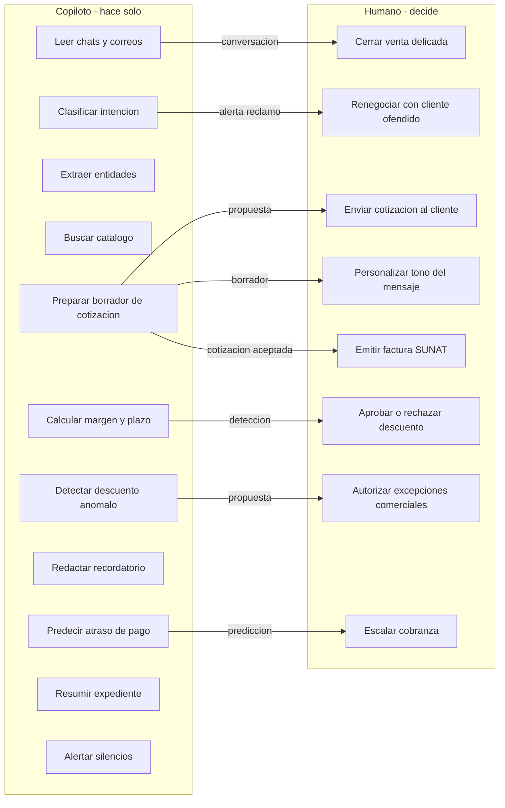

**Tres invariantes arquitectónicas:**

1. **Toda acción con consecuencia externa pasa por una cola de aprobación humana.** En código: `RequiresApproval` como decorador explícito. Auditable.
2. **Toda sugerencia del copiloto incluye su cadena de razonamiento.** En código: cada output de IA registra el prompt, los chunks retrieved, el modelo usado, el score. Auditable.
3. **El usuario puede corregir cualquier propuesta.** La corrección alimenta las reglas por tenant. No se reentrenan modelos globales; se ajusta el brain del cliente.

### 3.3 El producto en 6 líneas (refinado)

Pepethefrog es una sola aplicación web que:

1. **Escucha** la conversación comercial real (WhatsApp y correo) y la estructura sin pedirle al vendedor que "use otro sistema".
2. **Entiende** cada mensaje: clasifica intención, extrae producto, cantidad, urgencia, historial, contexto del cliente.
3. **Prepara** cotizaciones en segundos usando catálogo, reglas e historial del tenant — kit, precio, plazo, margen, nota técnica.
4. **Protege** el margen con el Guardián de Margen: descuento fuera de umbral pide aprobación humana; descuento anómalo propone alternativa.
5. **Factura** vía PSE SUNAT desde el flujo aceptado, sin re-digitación.
6. **Cobra** con Radar predictivo, alertas y borradores de recordatorio listos para revisión.

Todo en una sola base de datos, un solo modelo de dominio, una sola narrativa para el gerente comercial.

---

## 4. Qué se conserva, qué se afila, qué se descarta

Tabla maestra de decisiones sobre el material previo, **alineada 100% a la nueva visión**.

| Tema | Posición previa | Decisión | Razón |
|---|---|---|---|
| Categoría pública | "Quote-to-Cash conversacional" (v1) / "Sistema Operativo Comercial" (propuesta) | **Afuera: "copiloto comercial con IA para distribuidoras B2B técnicas"**. Q2C se usa hacia analistas/inversionistas | "Copiloto" es la palabra que el gerente entiende en 2 segundos. Q2C queda como ancla de mercado |
| Nombre del producto | Pepethefrog | **Conservar: Pepethefrog sin sufijos** | La marca es el producto |
| ADN de marca | "Simplicidad radical" | **Extender: simplicidad + comodidad + automatización responsable + contrato de autonomía** | Alineación 100% con nueva visión |
| Cuña | "Sube tu catálogo + últimas 100 cotizaciones → cotizar por chat en <3 min la primera semana" | **Conservar** | Imposible de cumplir para los competidores genéricos |
| MVP | 4 capacidades | **Conservar, pero cada una explícita en su nivel de autonomía** (§12) | Contrato de autonomía como parte del MVP |
| Contrato de autonomía | No existía como artefacto | **AGREGAR**: matriz explícita en §3.2, §8 | Diferenciador conceptual y producto |
| Arquitectura | Monolito + IA separada | **Conservar, profundizar con bounded contexts detallados, entidades, eventos, sagas y estados** (§7) | Profundidad del core era la zona débil |
| Stack backend | Laravel 8.2+ | **Conservar** | Afín al equipo; framework maduro |
| Stack IA | FastAPI + Python | **Conservar y elevar como servicio separado desde día 1** | Ciclos de despliegue distintos; aislamiento de costo |
| Multi-tenant | Schema-per-tenant temprano → tenant_id a escala | **Conservar** | Aislamiento real por defecto |
| Pricing | Per-seat + consumo IA (49/89/149) | **Conservar** con mínimos de usuarios y add-ons targeted | Híbrido alineado a benchmarks 2026 |
| Cumplimiento fiscal | SUNAT embebido | **Conservar como "FiscalAdapter" enchufable desde día 1** | Sin esto no hay LatAm |
| IA imprescindible | 4 funciones core | **Conservar + matriz de autonomía por función** | Cada función con su "copiloto hace / humano decide" |
| IA prohibida | "Agente autónomo cierra ventas" | **Conservar descarte + agregar "auto-envío de mensajes sin aprobación"** | Rompe el contrato |
| Roadmap | F0–F7, 60 meses | **Conservar, anclado a entregables** | Fechas sin indicador = falsa seguridad |
| Anti-alcance | Firmado | **Conservar. Firmar como anexo legal** | Anti-alcance no firmado = inútil |
| Bitrix24 vence mayo 2026 | Export crítico | **Conservar como tarea bloqueante F0** | Semilla del brain cliente-cero |
| Acuerdo legal | Crítico | **Conservar como bloqueante absoluto** | Sin firma no hay código vendible |
| Estructura del core | Siete contextos mencionados | **PROFUNDIZAR**: entidades, eventos, relaciones, estados, sagas (§7) | Era el vacío más grande |
| Diagramas | Uno de arquitectura alto nivel | **AGREGAR**: C4 context, C4 container, contextos, entidades, multi-tenant, sagas, máquinas de estado, pipeline IA, RAG, despliegue, evolución | Facilita entendimiento 100% |
| Portal del cliente final | F5+ | **Conservar diferido** | Prioridad: vendedor y gerente primero |
| App móvil nativa | Fuera de MVP | **Conservar fuera. Web responsive hasta demanda pagante** | Cada superficie nueva cancela otra |

---

## 5. Modelo de producto

### 5.1 Siete preguntas operativas

El modelo responde siete preguntas. Cada respuesta se honra desde la primera línea de código.

| # | Pregunta | Respuesta firme |
|---|---|---|
| 1 | ¿Multi-tenant? | **Schema-per-tenant en PostgreSQL** para los primeros ~50 tenants. `tenant_id` por fila solo en tablas de alto volumen (mensajes, eventos). Salto total a tenant_id cuando se cruce >100 tenants |
| 2 | ¿Extensibilidad sin forks? | **Configuración declarativa por tenant**: campos custom, etapas de pipeline, tipos de documento, reglas de aprobación, plantillas. Sin código por cliente |
| 3 | ¿Personalización por cliente? | Tres niveles: configuración de producto (todos) / personalización asistida en onboarding (tenant) / **custom code prohibido en v1-v2** |
| 4 | ¿Cumplimiento fiscal? | **FiscalAdapter** enchufable desde día 1. SUNAT (Perú), SII (Chile), DIAN (Colombia), SAT (México) como implementaciones |
| 5 | ¿Integraciones? | Tres tipos: canal (WhatsApp BSP multi-proveedor), terceros core (PSE, LLM multi-proveedor), ecosistema (Siigo/Alegra bajo demanda) |
| 6 | ¿Datos del tenant? | **Aislados por defecto**. El brain no cruza tenants salvo opt-in explícito y anonimización |
| 7 | ¿Cómo no volverse inmanejable? | Tres reglas: una feature cancela una; configuración se documenta como contrato; todo custom se templatiza o se retira a los 90 días |

### 5.2 Lo que Pepethefrog NO es (y nunca será)

- No es un ERP completo. No hace contabilidad general, planilla, producción, activos fijos.
- No es un CRM genérico. No vende marketing automation, ni email blast, ni landing builder.
- No es un marketplace ni una tienda.
- No es un chatbot que reemplaza al vendedor. Lo asiste.
- No es un agente autónomo que cierra ventas. El humano firma.
- No es una app móvil nativa en v1. Es web responsive.
- No es software a medida. Es producto con bordes.

Esta lista se firma como anexo del contrato con el cliente.

### 5.3 Tres apuestas implícitas

[APUESTA 1] La conversación comercial real **no volverá al CRM**. Vivirá para siempre en WhatsApp. El que absorba ese canal con estructura gana.

[APUESTA 2] La economía del B2B técnico LatAm **no soporta** implementaciones enterprise. Un producto que se adopta en una tarde gana por atrición a uno que se adopta en tres meses.

[APUESTA 3] La IA generativa **comodizará** la extracción y redacción, pero **no comodizará** el dominio de cotización técnica con kits, compatibilidades y márgenes + la disciplina del contrato de autonomía. Ahí está la zanja.

---

## 6. Arquitectura general del sistema

Este capítulo da la vista panorámica. El detalle del core vive en §7.

### 6.1 Principios arquitectónicos no negociables

1. **Monolito modular con bounded contexts estrictos.** Un solo despliegue para el core. Fronteras de código y esquema por contexto.
2. **Servicio IA separado desde día 1** (FastAPI + Python). Comunicación asíncrona por cola; síncrona solo cuando la UX lo exija.
3. **Multi-tenant desde la primera línea.** Sin excepciones.
4. **Cumplimiento fiscal como adapter enchufable.** El core no sabe de países.
5. **Auditoría embebida.** Toda decisión del copiloto y toda aprobación humana deja rastro en `audit_log` append-only por tenant.
6. **Observabilidad desde cliente uno** (trazas, métricas, logs con correlación y tenant_id).
7. **Todo tercero detrás de una abstracción.** WhatsApp, LLM, PSE, search, storage. Cero acoplamiento al proveedor.
8. **Contrato de autonomía como tipo de dato.** `AutonomyLevel` y `RequiresApproval` son parte del dominio, no metadata suelta.
9. **UI con una pregunta visible por pantalla.** La arquitectura de UX es parte del contrato.

### 6.2 Diagrama C4 — Nivel 1: Contexto

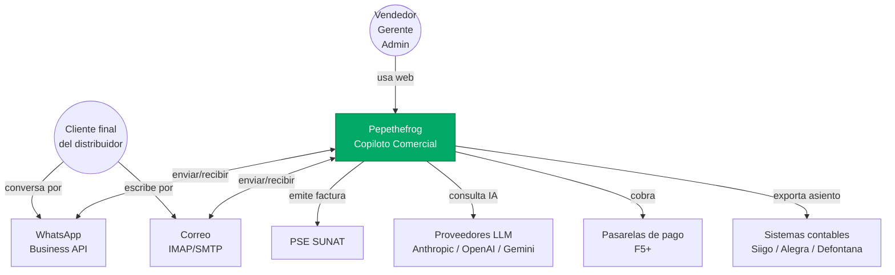

### 6.3 Diagrama C4 — Nivel 2: Contenedores

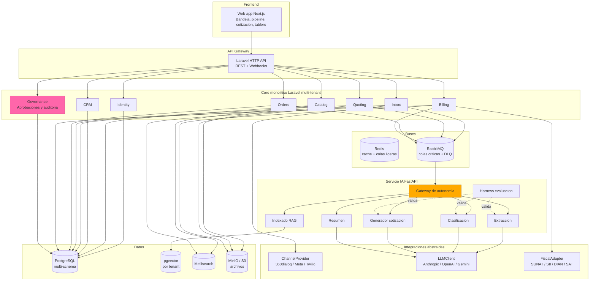

### 6.4 Evolución arquitectónica por horizonte

- **F0–F3 (meses 0–15):** Monolito Laravel + servicio IA FastAPI. Un deploy por ambiente. Sin K8s.
- **F4–F5 (meses 15–27):** Extracción *solo si duele*. Candidatos naturales: reportería pesada, ingesta de catálogos a gran escala, integraciones fiscales por país.
- **F6+ (mes 27+):** Decisión de microservicios sobre métricas reales. Nunca por moda.

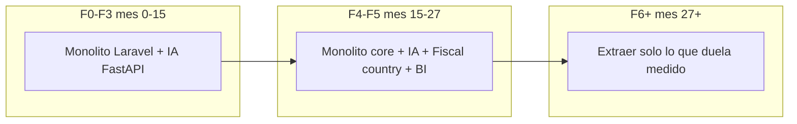

### 6.5 Decisiones de base (stack)

| Decisión | Posición | Razón |
|---|---|---|
| Backend core | **Laravel 8.2+** | Afín al equipo; ciclo corto |
| Servicio IA | **Python 3.11+ + FastAPI** | Ecosistema LLM |
| Base de datos | **PostgreSQL 16 + pgvector** | Transaccional + vectorial en uno |
| Cache/colas ligeras | **Redis** | Simple, rápido |
| Colas críticas | **RabbitMQ** | DLQ, reintentos, prioridades |
| Búsqueda | **Meilisearch** | Suficiente para catálogos técnicos |
| Object storage | **MinIO (self-host) → S3/R2** | S3-compatible; migración cero |
| Auth | **Keycloak OSS** | RBAC, scopes, SSO cuando llegue |
| Frontend | **Next.js + React + Tailwind + shadcn/ui** | UI profesional rápido |
| Feature flags | **Flagsmith self-host** | Toggles por tenant desde día 1 |
| Eventos de dominio | **Outbox + worker** | Sin event store pesado |
| Orquestación | **Laravel Pipelines** → evaluar **Temporal** en F3 | No bloquear F0 |

### 6.6 Tensiones técnicas cerradas

- **Temporal vs. colas nativas:** colas Laravel/Redis/RabbitMQ en F0-F2. Evaluación técnica corta en F1 para decidir Temporal.
- **pgvector vs. Qdrant/Weaviate:** pgvector desde día 1. Migrar solo si latencia o volumen lo exigen (>1M embeddings con k-NN >50 rps).
- **Kubernetes desde día 1:** **no**. Docker + Compose (o ECS Fargate) hasta >10 clientes concurrentes con necesidad real de rolling deploys multi-nodo.
- **OpenRouter:** opcional, detrás de `LLMClient`. No en el path crítico en F0-F2.
- **n8n:** capa de integración de borde a partir de F4. **Nunca motor de producto core.**

---

## 7. Estructura del core (deep dive)

Esta sección es el capítulo nuevo que la versión 1.0 del plan no tenía. Es lo que pide la nueva visión: un core bien trazado para que nadie improvise en el camino.

### 7.1 Mapa de bounded contexts

Siete contextos, fronteras explícitas en código (módulo Laravel por contexto) y en esquema (sub-schema Postgres por contexto dentro del schema del tenant).

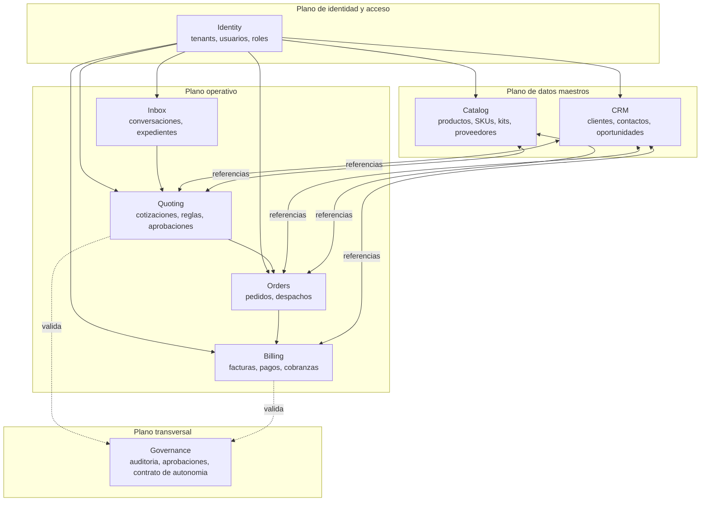

**Regla de oro de contextos:** nadie accede a tablas de otro contexto directamente. Toda comunicación pasa por **servicios de aplicación** o por **eventos de dominio**. Si el ingeniero tiene que hacer un `JOIN` cross-contexto, primero justifica el porqué en un ADR.

### 7.2 Tabla de responsabilidades y entidades

| Contexto | Responsabilidad | Entidades principales | Reglas clave del dominio |
|---|---|---|---|
| **Identity** | Organizaciones (tenants), usuarios, roles, permisos, sesiones, impersonation | `tenant`, `user`, `role`, `permission`, `api_key`, `session`, `impersonation_log` | Un usuario puede estar en varios tenants; roles se definen por tenant; impersonation se audita obligatoriamente |
| **Catalog** | Productos, variantes, SKUs, kits, compatibilidades, precios base, imágenes, proveedores, enlaces proveedor-SKU | `product`, `sku`, `variant`, `kit`, `kit_item`, `supplier`, `supplier_sku_link`, `price_list`, `attribute`, `media_asset` | SKU único por tenant; kit se define como árbol; precio puede tener vigencia y moneda |
| **CRM** | Clientes, contactos, empresas, oportunidades, pipeline, segmentación | `customer`, `contact`, `company`, `opportunity`, `pipeline_stage`, `lead_source`, `segment_tag` | Un customer puede ser persona o empresa; oportunidades migran entre etapas con auditoría |
| **Inbox** | Conversaciones multi-canal, mensajes, clasificación, expedientes, adjuntos | `conversation`, `message`, `channel_binding`, `expediente`, `intent_label`, `extraction_output`, `attachment` | Cada mensaje preserva su versión cruda; la estructura se enriquece, no reemplaza |
| **Quoting** | Cotizaciones, líneas, kits en cotización, reglas de margen, aprobaciones, plantillas, versiones | `quote`, `quote_line`, `quote_version`, `margin_rule`, `discount_rule`, `approval_request`, `template`, `quote_pdf` | Cada cambio de cotización crea una versión; margen por línea y total auditable |
| **Orders** | Pedidos (de cotización aceptada), despachos ligeros, estado de entrega | `sales_order`, `order_line`, `shipment`, `delivery_event`, `stock_snapshot` | Orden nace de quote aceptado; no se edita la orden, se emite una nueva versión |
| **Billing** | Facturas electrónicas, notas de crédito/débito, pagos, cobranzas, recordatorios | `invoice`, `invoice_line`, `credit_note`, `debit_note`, `payment`, `dunning_event`, `receivable`, `fiscal_receipt` | Factura es inmutable una vez emitida; notas ajustan; recibo fiscal es artefacto del adapter |
| **Governance** | Auditoría transversal, contrato de autonomía, aprobaciones inter-contexto, políticas por tenant | `audit_log`, `autonomy_policy`, `approval_workflow`, `approval_event`, `policy_violation`, `ai_decision_trace` | Append-only; cada decisión del copiloto y cada aprobación humana se registra aquí |

### 7.3 Modelo de datos — relaciones clave

Diagrama simplificado (omitiendo campos secundarios) del corazón del dominio:

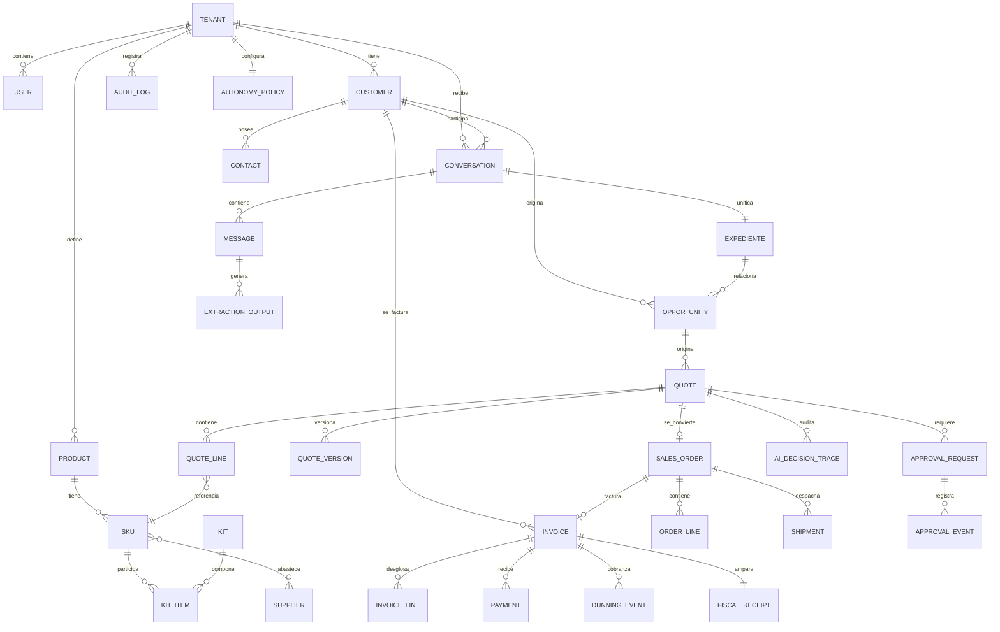

### 7.4 El expediente: la "historia única" del negocio

El **expediente** es la pieza más importante del dominio y la razón por la que la visión habla de "una sola historia de datos".

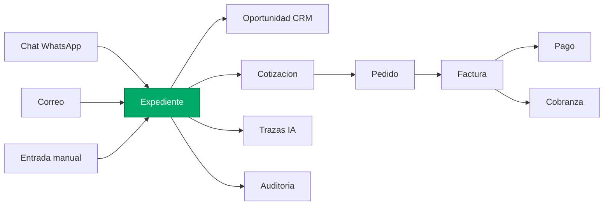

**Propiedades del expediente:**

- **Una sola URL** desde la conversación inicial hasta la cobranza cerrada.
- **Línea de tiempo consolidada** con eventos de todos los contextos (mensajes, cotizaciones, aprobaciones, facturas, pagos, recordatorios) intercalados cronológicamente.
- **Referencias cruzadas** preservadas: desde el expediente se navega a la oportunidad, la cotización, el pedido y la factura sin salir del contexto.
- **Trazas del copiloto** visibles: qué datos usó para sugerir qué.

Esta es la implementación del "no hay saltos entre herramientas" que la visión promete.

### 7.5 Máquina de estados: cotización

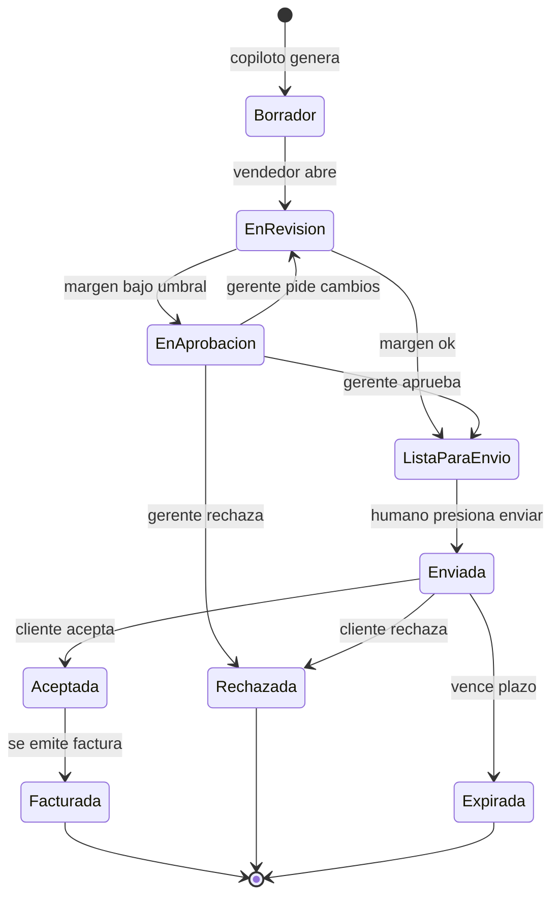

**Invariantes:**

- `Borrador → Enviada` **requiere aprobación humana explícita**. El copiloto nunca envía.
- `EnAprobacion` se dispara automáticamente si alguna regla del Guardián de Margen se viola. El umbral se configura por tenant.
- Cada transición genera un `AI_DECISION_TRACE` (si la propuso el copiloto) y un `APPROVAL_EVENT` (si hubo humano).

### 7.6 Máquina de estados: factura

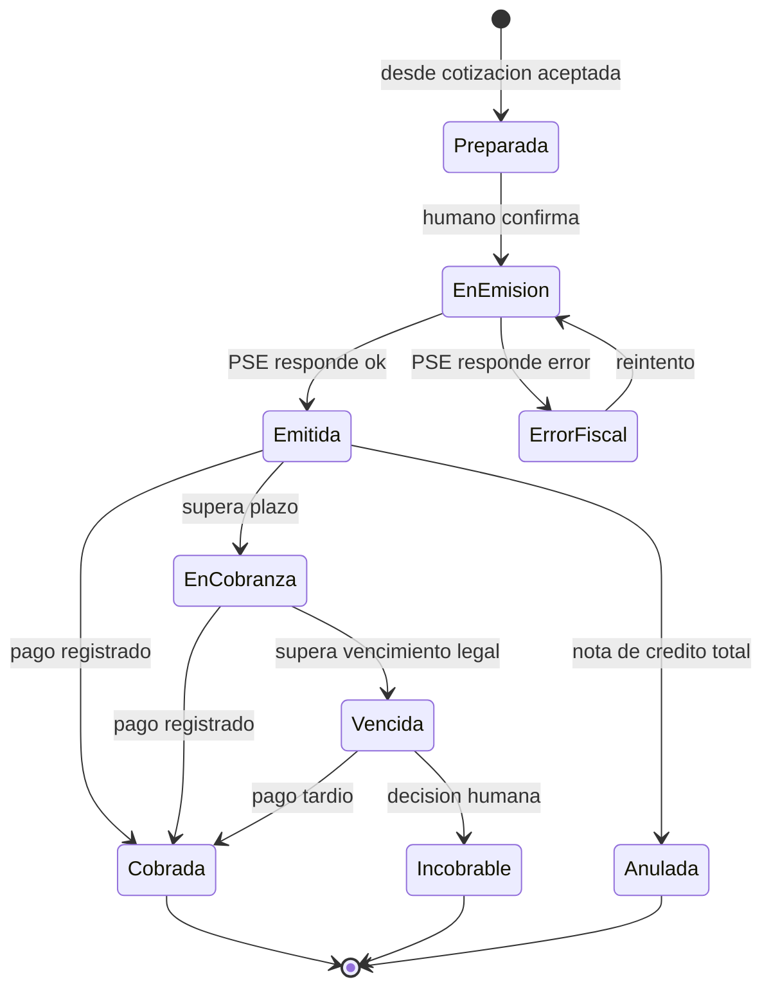

### 7.7 Saga Quote-to-Cash

La saga orquesta la secuencia `conversación → cotización → pedido → factura → pago` con compensación explícita ante fallos.

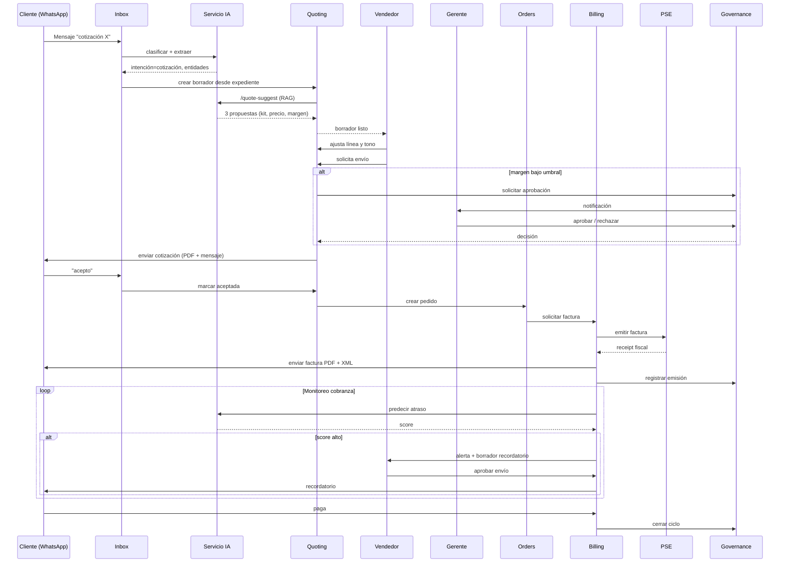

**Compensaciones:**

- Si `PSE` falla: se deja la factura en estado `ErrorFiscal`, se notifica al admin, se reintenta con backoff exponencial. El pedido NO se cancela automáticamente.
- Si `cliente rechaza`: la cotización queda en estado `Rechazada`, el pedido NO se crea. No hay compensación necesaria.
- Si el vendedor retira una cotización ya enviada: nota de ajuste en el expediente; si hay factura emitida, se emite **nota de crédito** (no se borra la factura).

### 7.8 Eventos de dominio

El core se comunica internamente por eventos. Los más importantes:

| Evento | Emisor | Consumidores | Datos clave |
|---|---|---|---|
| `MessageReceived` | Inbox | AI Service, Governance | tenant, conversation, content, channel |
| `IntentClassified` | AI Service | Inbox, CRM | conversation, intent, score |
| `EntitiesExtracted` | AI Service | Quoting, CRM | conversation, entities |
| `ExpedienteOpened` | Inbox | CRM, Quoting | tenant, customer, expediente |
| `QuoteDraftCreated` | Quoting | Inbox, AI Service, Governance | quote, expediente, proposals |
| `QuoteReviewed` | Quoting | Governance | quote, human_user, changes |
| `QuoteApprovalRequested` | Quoting | Governance | quote, rule_triggered |
| `QuoteApproved` / `QuoteRejected` | Governance | Quoting | quote, approver, reason |
| `QuoteSent` | Quoting | Inbox, CRM | quote, customer, send_channel |
| `QuoteAccepted` / `QuoteRejected` | Inbox (lee respuesta cliente) | Quoting, Orders | quote, customer_reply |
| `OrderCreated` | Orders | Billing, Catalog | order, quote |
| `InvoiceRequested` | Orders | Billing | order |
| `InvoiceEmitted` / `InvoiceFailed` | Billing | Governance, Inbox | invoice, fiscal_receipt |
| `PaymentRegistered` | Billing | Governance, CRM | invoice, payment |
| `DunningPredicted` | AI Service | Billing, Governance | invoice, delay_score |
| `DunningActionProposed` | Billing | Governance | invoice, draft_message |
| `DunningActionApproved` | Human | Billing | invoice, approver |

**Publicación garantizada**: patrón **Outbox** dentro de la transacción del contexto emisor. Un worker periódico relee el outbox y publica al bus.

### 7.9 Interfaces entre contextos

Cada contexto expone una API interna estable. Ejemplo resumido:

```text
Quoting::createDraftFromExpediente(tenant, expediente, proposals) → quote_id
Quoting::submitForApproval(tenant, quote_id) → approval_request_id
Quoting::markApproved(tenant, quote_id, approver_id) → void
Quoting::markSent(tenant, quote_id, channel) → void

Governance::evaluateAutonomy(tenant, context, action, payload) → AutonomyDecision
Governance::registerApproval(tenant, request, approver, decision) → void
Governance::logAIDecision(tenant, trace) → void

Billing::emitInvoiceFromOrder(tenant, order_id, humanConfirmation) → invoice_id
Billing::schedulePayment(tenant, invoice_id, schedule) → void

Catalog::resolveKit(tenant, kit_id, context) → ResolvedKit
Catalog::pricingForSku(tenant, sku, customer, qty) → PriceQuote
```

Estas interfaces son el contrato. Cambiarlas requiere ADR y migración coordinada.

### 7.10 Multi-tenant: esquema físico

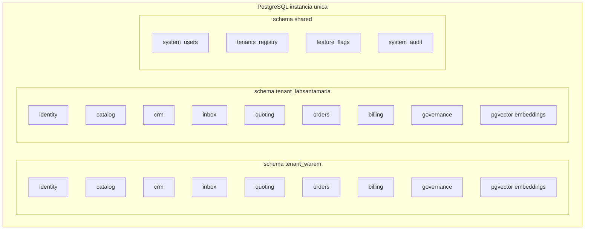

**Invariantes:**

- Toda conexión de un request resuelve el `search_path` al schema del tenant al autenticar.
- El schema `shared` solo contiene metadatos de sistema y no datos de negocio.
- Migraciones se aplican por tenant con tooling que las ejecuta en paralelo con locking explícito.
- Tests de aislamiento (cross-tenant read) corren en CI antes de cada deploy.

### 7.11 El Brain Comercial por tenant (arquitectura funcional)

El "brain" es la materialización del moat. Arquitecturalmente es un conjunto de stores vivos por tenant.

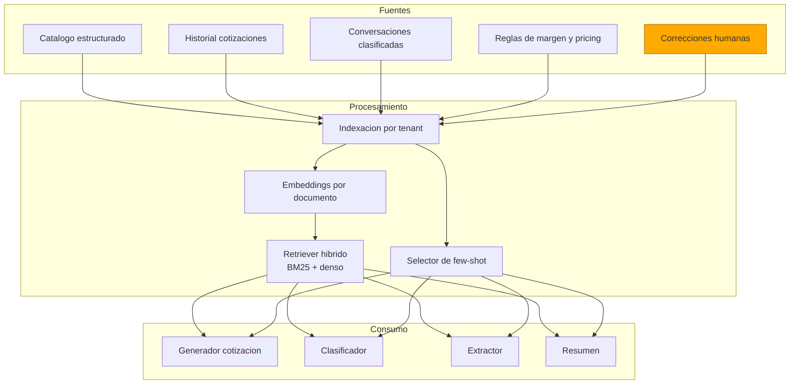

**La correción humana es la flecha que vuelve.** Cada vez que un vendedor edita un borrador del copiloto, esa edición se registra y alimenta el selector de few-shot para ese tenant. Así el brain aprende sin reentrenar modelos.

### 7.12 Auditoría y contrato de autonomía embebidos

Cada decisión del copiloto produce un `ai_decision_trace` con:

- `tenant_id`
- `context` (quoting, inbox, billing, etc.)
- `input_hash` (para poder reproducir sin guardar PII)
- `prompt_version` (prompts como código, versionados)
- `model_used` + `provider`
- `retrieved_chunks` (referencias, no contenido)
- `output_summary`
- `autonomy_level` (auto / propose / require_approval)
- `human_decision` (si aplica, con user_id y timestamp)

Esto es la base del "por qué" que el usuario puede consultar sobre cualquier sugerencia, y es también la base de la auditoría externa cuando un cliente enterprise la pida.

---

## 8. Capa de IA y contrato de autonomía operativa

### 8.1 Arquitectura del servicio IA

Un único servicio FastAPI que expone cinco endpoints y un pipeline interno.

```mermaid
flowchart LR
    IN[Mensaje entrante] --> NORM[Normalizacion]
    NORM --> CLS[/classify]
    CLS -->|ruido| DROP[Descartar con log]
    CLS -->|no ruido| EXT[/extract]
    EXT --> EXPED[Actualizar expediente]
    EXPED -->|intencion cotizacion| QS[/quote-suggest]
    QS --> RAG[RAG por tenant]
    RAG --> GEN[Generacion LLM]
    GEN --> TRACE[AI decision trace]
    GEN --> DRAFT[Borrador en cola humana]
    EXPED -->|otra intencion| TASK[Tarea o alerta]
    DRAFT --> SUM[/summarize opcional]
```

### 8.2 Matriz de autonomía por función IA

Esta matriz es la traducción técnica del contrato de autonomía de §3.2.

| Función IA | Clase | Autonomía default | Qué dispara aprobación humana | Quién aprueba |
|---|---|---|---|---|
| `catálogo-que-se-lee-solo` | Imprescindible | Auto hasta umbral de confianza; humano revisa <80% | Atributo sin certeza; producto nuevo | Admin del tenant |
| `clasificador-de-chats` | Imprescindible | Auto total para etiquetas; escalamiento si score <0.7 | Ambigüedad de intención | Vendedor |
| `cotizador-por-chat` | Imprescindible | **Nunca envía**. Siempre prepara borrador | Siempre que se quiera enviar | Vendedor |
| `guardián-de-margen` | Imprescindible | Bloquea automáticamente si margen bajo umbral | Cualquier cotización bajo umbral del tenant | Gerente |
| `radar-de-cobranza` | Útil | Auto predicción; nunca auto-envío | Envío de recordatorio al cliente | Admin o gerente |
| `redactor-de-seguimientos` | Útil | Redacta borrador; nunca envía | Siempre que se envíe | Vendedor |
| `deduplicación-clientes` | Útil | Fusión automática si score >0.95; borrador si 0.85-0.95 | Score en zona gris | Admin |
| `resumen-de-expediente` | Útil | Auto total; es lectura | Nunca (no tiene acción externa) | N/A |
| `upsell-cross-sell` | Vendible | Sugiere; humano decide ofrecer | Oferta al cliente | Vendedor |
| `licitaciones-OECE` | Vendible | Analiza; humano decide participar | Decisión de participar | Gerente |
| `voice-to-cotización` | Vendible | Transcribe; humano revisa | Uso en cotización | Vendedor |

**Cambiar el nivel de autonomía** de una función requiere:
1. Decisión del sponsor ejecutivo del tenant.
2. Configuración explícita en `autonomy_policy` del tenant.
3. Auditoría registrada en `audit_log`.

### 8.3 Estrategia de modelos (routing por tarea)

| Tarea | Modelo inicial | Alternativa | Criterio de cambio |
|---|---|---|---|
| Extracción de entidades | Claude Haiku o GPT-4o-mini | Gemini Flash | Costo + latencia; sensible a alucinación |
| Clasificación de intención | Embeddings + clasificador + fallback LLM | LLM pequeño | ≥80% resuelto sin LLM grande |
| Generación de cotización | Claude Sonnet o GPT-4o | Claude Opus para casos complejos | Coste por cotización + tasa de reescritura humana |
| Resúmenes | Modelo pequeño | Fine-tune ligero si hay señal | Latencia <3s |
| Embeddings | text-embedding-3-small o gte-large | OSS self-host | Costo >10M tokens/mes |

### 8.4 RAG por tenant

Colecciones vectoriales (pgvector) por tenant, cada una con `collection_name` explícito:

- `catalog_chunks` — chunks de fichas técnicas, especificaciones, compatibilidades.
- `quote_history` — cotizaciones pasadas con resultado (ganada/perdida, margen, cliente).
- `conversation_patterns` — patrones de conversación etiquetados (respuestas modelo a preguntas frecuentes).
- `correction_examples` — correcciones humanas como ejemplos de few-shot.

**Retrieval híbrido**:

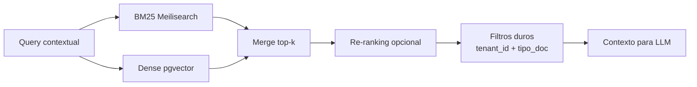

**Invariantes:**

- Filtro duro por `tenant_id` en TODA query. Test automático en CI.
- Ningún chunk de un tenant entra como contexto de otro. Jamás.
- Todo retrieval se loguea con tenant, query, chunks retornados, score.

### 8.5 Control de costo IA

Objetivo: costo IA total ≤ **15% del MRR** a régimen.

Palancas:

1. **Routing por complejidad** (mensajes cortos → modelo pequeño).
2. **Caching semántico** de respuestas a queries cuasi-idénticas.
3. **Batching de embeddings** en lotes nocturnos.
4. **Límites por tenant** (cuotas por plan + top-up explícito).
5. **Observabilidad de costo** (`ai_cost_usd_per_tenant_per_day` en Grafana).
6. **OSS local para tareas acotadas** en v2 si el costo se vuelve dominante.

### 8.6 Harness de evaluación (vinculante desde F1)

- **Datasets dorados** por tarea: 50–200 casos etiquetados, ampliados mensualmente.
- **Métricas duras**: precision/recall/F1 para clasificación/extracción; accuracy de line items y pricing para generación; tasa de aceptación humana.
- **Regresión automática**: cambio de prompt o modelo corre el harness antes de merge.
- **Eval online**: muestreo semanal de cotizaciones generadas, revisión humana, retro-alimentación.

Sin esto, cada cambio de prompt es ruleta rusa.

### 8.7 Migración histórica en tres capas (heredado del plan v1, ratificado)

**Capa A — Datos estructurados (SIA, Bitrix, ERPs del cliente): ETL determinista, cero LLM.**
Mapeo explícito en YAML; scripts idempotentes; validación de integridad obligatoria; sampling manual del 5%; staging → revisión → cutover.

**Capa B — Datos semi-estructurados (PDFs, Excels no estándar): parser determinista + LLM fallback + humano en el bucle.**

**Capa C — Datos no estructurados (chats, correos, notas): LLM como enriquecimiento, no como autoridad.** El crudo se preserva inmutable.

**Postura pública**: *"migramos con disciplina de base de datos, no con un agente probando suerte."*

### 8.8 IA prohibida (reforzado por la nueva visión)

- Agente autónomo que cierra ventas.
- Chatbot que reemplaza al vendedor.
- **Auto-envío de mensajes al cliente sin aprobación humana explícita.** Rompe el contrato.
- IA "predictiva" con dashboards sin acción.
- Modelos propios entrenados desde cero.
- Generación de imágenes de producto.

---

## 9. Cumplimiento fiscal enchufable

### 9.1 El patrón FiscalAdapter

```text
interface FiscalAdapter {
  emitInvoice(invoice: InvoiceDraft, tenant: TenantConfig): Promise<FiscalReceipt>
  validateDocId(docId: string): Promise<DocIdValidation>
  getTaxRates(context: TaxContext): Promise<TaxRate[]>
  voidInvoice(invoiceId: string, reason: string): Promise<void>
  emitCreditNote(ref: InvoiceRef, draft: CreditNoteDraft): Promise<FiscalReceipt>
}
```

Implementaciones:

| País | Adapter | PSE / Entidad | Disponibilidad |
|---|---|---|---|
| Perú | `SunatAdapter` | Nubefact o Efact | F3 (MVP) |
| Chile | `SiiAdapter` | Acepta / Nubox | F6 |
| Colombia | `DianAdapter` | Facture / Siigo API | F6 |
| México | `SatAdapter` | por definir | F7 |

El core nunca importa `NubefactClient` directamente. Cambiar PSE = cambiar adapter.

### 9.2 Flujo de emisión

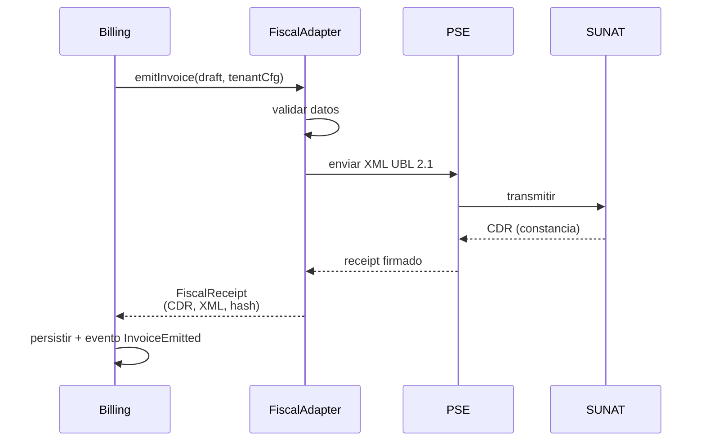

### 9.3 Escenarios de error y reintentos

- **PSE inalcanzable**: cola RabbitMQ con reintento exponencial (1m, 5m, 15m, 60m). Alerta al admin tras 3 fallos.
- **SUNAT rechaza por datos**: estado `ErrorFiscal` con mensaje; humano corrige; reemisión.
- **Timeout ambiguo**: no duplicar. Consulta idempotente al PSE por `externalId` antes de reintentar.

---

## 10. Multi-tenant, datos y brain comercial

### 10.1 Estrategia de aislamiento

Ya detallada en §7.10. Puntos clave:

- Schema-per-tenant hasta 50 tenants.
- `search_path` resuelto al autenticar.
- Shared schema solo para metadatos.
- Tests de aislamiento obligatorios en CI.

### 10.2 Ciclo de vida del brain por tenant

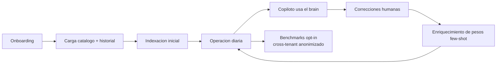

**Nunca** cruza tenants salvo opt-in explícito.

### 10.3 Exportación y portabilidad

El cliente puede exportar:

- Catálogo estructurado (CSV / JSON).
- Historial de cotizaciones (CSV).
- Facturas (PDFs + XMLs).
- Audit log (CSV).

Lo que NO se exporta de forma útil: el índice RAG, los few-shot pesos, las políticas de autonomía afinadas. Eso es el moat.

### 10.4 Retención y borrado

- Datos transaccionales: retención mínima 10 años (exigencia SUNAT).
- Conversaciones y embeddings: configurable por tenant (default 3 años).
- Borrado por solicitud: tombstone + purga diferida (30 días) para permitir rollback.

---

## 11. Infraestructura, operación y seguridad

### 11.1 Topología de ambientes

| Ambiente | Propósito | Host | Escala |
|---|---|---|---|
| Dev (local) | Ingeniería diaria | Docker Compose laptop | N/A |
| CI | Pipelines | GitHub Actions | On-demand |
| Staging | QA, demos, integración | 1 VPS mediano | 1 nodo |
| Prod | Clientes reales | Cloud LatAm con contenedores | 1-2 nodos F0-F2; autoscaling F3+ |

**Cloud inicial**: DigitalOcean, Hetzner o Linode (LatAm preferido) para F0-F2.

### 11.2 Despliegue

- Contenedores desde día 1 (Docker). Registry privado.
- Docker Compose → Nomad / ECS Fargate → K8s solo cuando haya >10 clientes Y SRE dedicado.
- CI/CD: GitHub Actions → build → tests → push → staging → prod (manual gate hasta F3; canary a partir de F4).

### 11.3 Diagrama de despliegue F0-F3

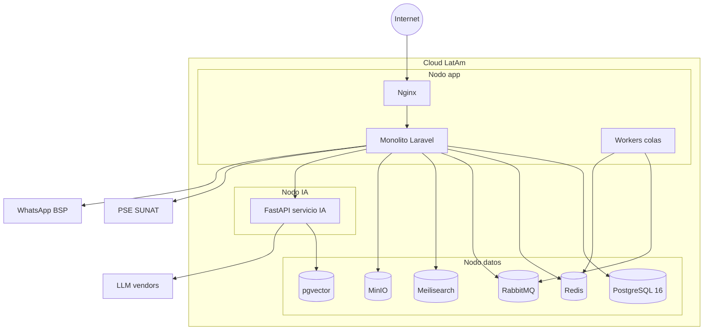

### 11.4 Observabilidad

- **Logs** centralizados (Loki o SaaS bajo costo).
- **Métricas** (Prometheus + Grafana).
- **Trazas distribuidas** (OpenTelemetry). Crítico por salto monolito ↔ IA.
- **Dashboards por tenant**: latencia, errores, costo IA, cotizaciones generadas, tasa de aceptación, tiempo medio de cotización.
- **Alertas**: SLO por pantalla crítica.

SLOs F2+:

| Pantalla/flujo | Latencia p95 | Disponibilidad |
|---|---|---|
| Bandeja de mensajes | <500ms | 99.5% |
| Cotización (sync) | <3s | 99.0% |
| Cotización IA (async) | <30s | 99.0% |
| Emisión SUNAT | <5s | 99.5% (PSE puede degradar) |

### 11.5 Seguridad (disciplina mínima desde día 1)

- HTTPS en todos lados; certificados automatizados.
- Secrets management (Vault / Doppler / env rotados).
- RBAC por módulo y scope vía Keycloak.
- **Audit log append-only por tenant**, retención ≥1 año.
- Backups diarios; restore probado mensualmente.
- Aislamiento por tenant validado con tests.
- **Data residency LatAm** (GCP São Paulo, AWS Santiago, o regional).
- Plan de respuesta a incidentes escrito.

Diferido:

- SOC 2 / ISO 27001 → hasta demanda real enterprise (mes 24+).
- SSO obligatorio → feature enterprise.

### 11.6 Búsqueda, storage, colas

- Meilisearch para full-text y facetado.
- pgvector para embeddings.
- MinIO → S3/R2 para archivos.
- Redis para cache y colas ligeras.
- RabbitMQ para colas críticas con DLQ.

### 11.7 WhatsApp (ChannelProvider)

Abstracción desde día 1. Arranque con **360dialog** o **Meta Cloud API directa**. Twilio como plan B listo para 48h de switch.

---

## 12. Diseño del MVP real

### 12.1 Definición exacta

El MVP es **una sola aplicación**, con **una sola base de datos**, con **cuatro capacidades encadenadas**, que permite a un vendedor de una distribuidora técnica **trabajar un día completo sin salir de Pepethefrog**. Cada capacidad lleva su contrato de autonomía.

| # | Capacidad | Qué hace | IA asociada | Autonomía | Criterio de "terminado" |
|---|---|---|---|---|---|
| 1 | **Bandeja conversacional unificada** | Captura WhatsApp + correo, crea expediente, clasifica intención | Clasificador | Auto clasifica; humano responde | 90%+ de mensajes procesados sin error; vendedor trabaja todo el día desde la bandeja |
| 2 | **Cotización técnica asistida** | Mensaje → PDF con kit, precio, plazo, margen | Cotizador + RAG | **Prepara**; humano envía | Cotización lista para enviar en <3 min en 80% de los casos |
| 3 | **Pipeline B2B ligero + aprobaciones** | Oportunidades, etapas, reglas de margen, aprobación rápida | Guardián de margen | Detecta y bloquea; humano aprueba/rechaza | Gerente aprueba/rechaza desde web o WhatsApp en <1 min |
| 4 | **Emisión SUNAT desde flujo** | De cotización aceptada a factura electrónica sin re-digitación | (adapter, no IA) | Prepara; humano confirma emisión | Factura en <5s, aceptada por SUNAT, PDF y XML archivados |

Transversales:

- Onboarding asistido ≤2 semanas.
- Multi-tenant real (schema-per-tenant, datos aislados, auditoría).
- Configurabilidad mínima por tenant.
- Observabilidad con dashboard por tenant (5 métricas clave).
- **Contrato de autonomía visible** en la UI: cada sugerencia del copiloto muestra el "por qué".

### 12.2 Qué NO es el MVP

- **Catálogo que se lee completamente solo** (autoservicio total es v2; el MVP incluye asistencia humana en onboarding).
- Radar de cobranza (F4).
- Resumen ejecutivo con IA (F4).
- Portal cliente final (F5+).
- App móvil (F6+ o nunca).

### 12.3 Criterio de salida (ticket de paso a piloto externo)

El MVP está terminado cuando WAREM (cliente-cero) cumple las cuatro pruebas:

1. Un vendedor de WAREM trabaja un día completo sin Bitrix24, Excel ni SIA.
2. Tiempo medio de cotización cae ≥70% vs. baseline.
3. >500 cotizaciones reales generadas por IA, ≥80% aprobadas sin reescritura sustantiva.
4. ≥50 facturas SUNAT emitidas desde el flujo sin incidentes críticos.

Si a los 6 meses no se cumplen las cuatro, el MVP se reformula.

### 12.4 Bitrix24 caduca mayo 2026 (bloqueante F0)

[HECHO] Vence a mediados de mayo 2026. En F0 hay que **exportar toda la data histórica** (oportunidades, contactos, empresas, actividades, archivos). Este export es:

- Semilla del brain comercial del cliente-cero.
- Dataset para few-shot y prompts.
- Ground truth para evaluación IA.

Si se pierde este export, el MVP arranca sin historia y la demo pierde potencia.

---

## 13. Roadmap por fases con compuertas

### 13.1 Fases ancladas a entregables, no a fechas

| Fase | Ventana indicativa | Foco | Entregables duros | Compuerta GO/NO-GO |
|---|---|---|---|---|
| **F0** — Alineamiento | Mes 0–2 | Cerrar lo que bloquea | Acuerdo legal firmado; anti-alcance firmado; NDA; export Bitrix24; catálogo WAREM cargado; 5-10 candidatos a piloto identificados; **autonomy_policy default redactada** | **GO solo con acuerdo legal firmado** |
| **F1** — Fundación técnica | Mes 2–5 | Esqueleto monolito + servicio IA + pipeline de datos | Laravel multi-tenant operativo; FastAPI con /extract y /classify; harness de evaluación; CI/CD; staging; primer flujo mensaje → expediente | Deploy de feature nueva en <30 min; tests sobre muestras reales pasan |
| **F2** — Prototipo vertical | Mes 5–9 | Flujo mínimo end-to-end real | WhatsApp WAREM conectado; 1 vendedor usa bandeja; cotización IA genera borradores con catálogo real; SUNAT emite facturas de prueba; **contrato de autonomía visible en UI** | Pepethefrog opera un día entero con WAREM (primera vez) |
| **F3** — MVP en producción | Mes 9–15 | Las 4 capacidades con WAREM dentro | Bandeja + Cotización + Pipeline + SUNAT operando para 3+ vendedores WAREM con datos reales; >500 cotizaciones IA; 4 pruebas cumplidas | **GO/NO-GO formal**: ¿Pepethefrog trabaja con WAREM sin fricción? Si NO: volver a F2 |
| **F4** — Piloto externo | Mes 15–21 | 3–5 clientes externos pagantes | 3 pilotos onboardeados en ≤2 semanas; NPS >40; al menos 1 renueva sin descuento; ARR USD 30K–60K | ¿Al menos 1 renovó? ¿Onboarding estándar? |
| **F5** — GTM abierto | Mes 21–27 | 10–20 clientes, pricing público | Pricing en web; funnel inbound con CAC medido; caso público WAREM; ARR USD 120K–240K; NRR ≥100% | ¿Churn <15%? ¿NRR ≥100%? ¿Margen bruto ≥55%? |
| **F6** — Escala Perú + 2ª vertical | Mes 27–36 | 50–80 clientes, preparación regional | ARR USD 900K–1.5M; NRR ≥115%; margen bruto ≥65%; adapter SII Chile listo técnicamente | ¿Economía por cliente validada? ¿Equipo sin cuello fundadores? |
| **F7** — Regional | Mes 36–60 | Chile + Colombia, categoría reconocible | 3 países operando; ARR USD 3–8M; equipo 25–50 | Otra etapa de empresa |

### 13.2 Compuertas GO/NO-GO

Cada compuerta evalúa tres señales (producto, comercial, equipo). Si dos de tres están en rojo, la compuerta es NO-GO y se ajusta. Si las tres están en verde, se pasa.

### 13.3 Diagrama temporal

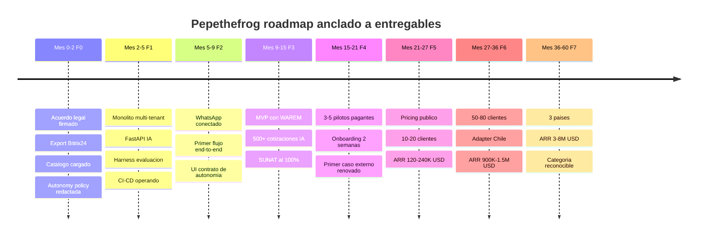

### 13.4 Lo que NO va en ninguna fase inicial

- No hay rescripting del core a otro lenguaje.
- No hay fork blanco para un cliente grande.
- No hay entrada a verticales adyacentes hasta F6.
- No hay ronda de inversión antes de F5 (y con caso pagante).

---

## 14. Modelo comercial y pricing

### 14.1 Pricing firme

| Plan | ICP | Precio | Mínimo | Cuota IA | Notas |
|---|---|---|---|---|---|
| **Starter** | Pyme chica (<6 vendedores) validando | **USD 49/user/mes** | 2 users | 100 cotizaciones IA/mes | Bandeja, expediente, pipeline, cotización básica |
| **Growth** | ICP principal (6–20 vendedores) | **USD 89/user/mes** | 4 users | 500 cotizaciones IA/mes | + CPQ completo + SUNAT + aprobaciones |
| **Scale** | Mediana (20–50 vendedores) | **USD 149/user/mes** | 15 users | Ilimitado fair use | + multi-sucursal + API + SLA básico |
| **Enterprise** | >50 vendedores o vertical expandido | A cotizar | — | Por contrato | SSO, on-prem opcional, integraciones custom |

**Top-ups y add-ons:**

- Pack extra 100 cotizaciones IA: USD 29.
- Implementación asistida: USD 1.500–5.000 one-time.
- Conector fiscal adicional país: USD 99/mes.
- Integración custom a ERP del cliente: USD 3.000–8.000 one-time.

### 14.2 Economía por cliente

[SUPUESTO] Hipótesis disciplinadas año 1-3:

| Métrica | Año 1 | Año 2 | Año 3 |
|---|---|---|---|
| Ticket promedio mensual | USD 600 | USD 850 | USD 1.100 |
| ACV | USD 7.200 | USD 10.200 | USD 13.200 |
| CAC | USD 2.000 | USD 1.600 | USD 1.300 |
| Payback (meses) | 12–14 | 9–11 | 7–9 |
| Margen bruto | 55–60% | 65–70% | 70–75% |
| Churn anual (logo) | 20–25% | 12–15% | 8–10% |
| NRR | 100–105% | 110–115% | 118–125% |

### 14.3 GTM

Orden por CAC creciente: WAREM cliente-cero público → referidos ecosistema → contenido vertical → outbound ligero → partners → paid ads (solo desde cliente 20).

### 14.4 Modularidad real vs. feature-gating

Tres movimientos conservados:

1. **Disciplina de producto**: cero bloat. Cada feature pasa el filtro del ICP.
2. **Bundles por momento de empresa**: Starter/Growth/Scale/Enterprise. Sin feature-gating artificial dentro de cada plan.
3. **Modularidad honesta**: consumo IA + add-ons targeted + Enterprise custom.

Feature flags son mecanismo **interno** de release y operación; nunca se exponen al cliente como "elige tus features".

---

## 15. Equipo y gobernanza técnica

### 15.1 Estado actual

Equipo técnico: 3 devs (José, Isaías, Kenneth). Sin DevOps, sin diseñador, sin vendedor dedicado. Gianella en análisis/planificación.

### 15.2 Plan de hiring

| Fase | Roles | Prioridad |
|---|---|---|
| F0 | Responsable legal/comercial | Alta |
| F1 | 1 dev fullstack (Laravel + Next.js) | Alta |
| F2 | 1 ingeniero IA (Python + LLM + evaluación) | Alta |
| F3 | 1 DevOps/SRE part-time; 1 diseñador producto part-time | Alta/Media |
| F4 | 1 customer success; 1 vendedor B2B (comisión + fijo bajo) | Alta |
| F5 | +1 dev fullstack; +1 dev IA; 1 marketero contenido B2B | Media |
| F6 | CFO/controller fraccional; +2 devs; +1 CS | Alta/Media |

**Regla de oro**: ningún rol nuevo entra sin entregable que lo justifique.

### 15.3 Composición objetivo mes 30

~12 personas: 6 ingeniería (2 IA, 1 DevOps), 1 diseño, 2 comercial/CS, 1 marketing, 1 CEO, 1 COO/producto.

### 15.4 Gobernanza técnica

- **Tech lead con veto** en decisiones cross-cutting (Isaías por perfil técnico).
- **ADRs firmados** para cada decisión no negociable.
- **Revisión de simplicidad mensual**: cada UI pasa "¿se lee en 15 minutos sin ayuda?". El diseñador es guardián.
- **Revisión de autonomía trimestral**: cada función IA pasa "¿respeta el contrato?". El tech lead es guardián.
- **Revisión de costo IA mensual**: ¿se mantiene <15% MRR?

---

## 16. Riesgos y mitigaciones

| # | Riesgo | P | Impacto | Mitigación |
|---|---|---|---|---|
| R1 | **Sin acuerdo legal** | Alta | Catastrófico | Firma en 30 días; sin ella, no se escribe código vendible |
| R2 | **Indisciplina de alcance** | Alta | Alto | Anti-alcance firmado; comité de producto con veto |
| R3 | **Equipo no crece a tiempo** | Alta | Alto | Hiring plan con presupuesto pre-aprobado; triggers por fase |
| R4 | **Competidor regional** (Kommo+SUNAT, Defontana+WhatsApp) | Media | Medio | Vertical profunda; velocidad; monitoreo trimestral |
| R5 | **Dependencia LLMs** sube costos | Media | Medio | Multi-vendor día 1; métricas por tenant; OSS en v2 |
| R6 | **Vertical más pequeña** | Media | Medio | Plan B: suministros industriales/repuestos/material construcción |
| R7 | **"Catálogo se lee solo" falla** | Alta | Alto | MVP con asistencia humana; automatizar progresivamente; dataset dorado |
| R8 | **Simplicidad se erosiona** | Alta | Alto | Revisión mensual; regla feature cancela feature; veto diseño |
| R9 | **Meta cambia reglas WhatsApp** | Media | Alto | Multi-BSP; contrato con BSP secundario en reserva |
| R10 | **Primer piloto externo falla** | Alta | Alto | Pilotos pre-calificados; máx 3 simultáneos en F4 |
| R11 | **WAREM cliente-cero se vuelve cliente-jefe** | Media | Alto | Sponsor ejecutivo con autoridad; pedidos WAREM pasan mismo comité |
| R12 | **Costo IA come margen** | Media | Medio | Caching, routing, pricing con consumo, OSS en v2 |
| R13 | **IA cierra venta mal o envía mensaje sin aprobación** | Media | Alto | Contrato de autonomía inviolable; tests que verifican autonomy_level en CI |
| R14 | **Cross-tenant leak por bug de query** | Baja | Catastrófico | Schema-per-tenant; tests automáticos de aislamiento; code review obligatorio |

[APUESTA] R1, R2, R8 y R13 son los que más probablemente maten el proyecto silenciosamente. Son de disciplina, no de ingeniería. La disciplina es lo que el buen código no puede comprar.

---

## 17. Principios no negociables

1. **La simplicidad es criterio de decisión**, no nota al margen. Cada release pasa revisión de simplicidad como pasa revisión de seguridad.
2. **El contrato de autonomía es ley**. Nada irreversible sin humano. Nada evitable con humano.
3. **El MVP son cuatro capacidades**, no cinco. Quinta = cancelar una.
4. **Multi-tenant desde línea uno**. Sin excepciones.
5. **Cumplimiento fiscal es adapter**. El core no sabe de países.
6. **Cada tercero detrás de una abstracción**. Cero acoplamiento.
7. **IA tiene harness de evaluación desde F1**. Ningún cambio de prompt sin regresión.
8. **Anti-alcance firmado**. Todo lo de la lista queda fuera de v1.
9. **Implementación ≤2 semanas**. Si un cliente necesita más, no es ICP.
10. **Datos aislados por tenant**. Cross-tenant con opt-in explícito documentado.
11. **Observabilidad por tenant** desde el primer cliente.
12. **WAREM cliente-cero, no cliente-jefe**. Pedidos de WAREM pasan el mismo comité.
13. **Categoría pública: "copiloto comercial con IA para distribuidoras B2B técnicas"**. "Sistema Operativo Comercial" no se usa hacia afuera.
14. **El formulario vacío es falla de diseño**. El sistema alimenta al usuario.
15. **Cada decisión del copiloto explica su "por qué"**. Auditoría por diseño.

---

## 18. Decisiones inmediatas (30–60 días)

1. **Firmar acuerdo de sociedad con WAREM**: IP, reparto, derechos de comercialización, NDA, cláusula de salida.
2. **Firmar anti-alcance como anexo del acuerdo**.
3. **Confirmar que WAREM es cliente-cero con sponsor ejecutivo real** (persona con autoridad sobre alcance, datos y proceso).
4. **Export completo de Bitrix24** antes de mayo 2026.
5. **Catálogo real de Pepethefrog** cargado en formato crudo en dev.
6. **100–200 cotizaciones reales anonimizadas** como dataset dorado.
7. **5–10 candidatos a piloto** pre-cualificados.
8. **Decisión de BSP WhatsApp** primario y secundario.
9. **Decisión de PSE SUNAT** y sandbox operando con RUC de prueba.
10. **Presupuesto pre-aprobado** para hiring F1–F2.
11. **Redactar `autonomy_policy` default** del tenant WAREM. Documento público interno; base del contrato.
12. **Publicar el contrato de autonomía** en la página institucional una vez firmado legalmente.

---

## 19. Anexos

### 19.1 Reconciliación de inconsistencias entre documentos fuente

| Tema | Contradicción previa | Resolución en este plan |
|---|---|---|
| Categoría pública | "Sistema Operativo Comercial" vs "Quote-to-Cash" vs "copiloto" | **Copiloto comercial con IA** afuera; Q2C como ancla técnica |
| ADN | "Simplicidad" vs "simplicidad + automatización responsable" | **Simplicidad + comodidad + automatización responsable + contrato de autonomía** |
| Nombre | Ambiguo | **Pepethefrog** sin sufijos |
| Pricing | Plano (99/299/799) vs per-seat (49/89/149) | Per-seat + consumo IA con mínimos |
| Roadmap | F0-F7 vs 5 horizontes 60 meses | F0-F7 anclado a entregables |
| MVP | "4 capacidades" vs "4 funciones IA" | 4 capacidades cada una con su IA + nivel de autonomía |
| Arquitectura IA | Separada pero sin detalle | Detallada en §7.11 y §8 |
| Multi-tenant | Schema-per-tenant sin evolución | Schema-per-tenant hasta 50, luego tenant_id |
| Bitrix24 caducidad | Mencionada, no tarea | Tarea bloqueante F0 |
| Brain comercial | Invocado sin detalle | Operacionalizado en §7.11 |
| Estructura del core | Siete contextos mencionados | Profundizada en §7 |
| Contrato de autonomía | No existía | **Agregado** como pilar transversal |

### 19.2 Fuentes

**Internas:**

- `WAREM_Vision_Copiloto_Comercial.md` — visión maestra (v2.0).
- `WAREM_Vision_Refinada_Simplicidad.md` — base v1.0.
- `WAREM_Plan_Software_Refinado.md` — plan v1.0 consolidado aquí.
- `PROPUESTA_EJECUTIVA_WAREM.pdf` — base de arquitectura y F0-F7.
- `PLANIFICACION_ESTRATEGICA_WAREM.pdf` — análisis estratégico previo (47 pp.).

**Externas verificadas** (selección; fuentes completas en la visión):

- PRODUCE/OGEIEE — MIPYME Perú 2024.
- SUNAT — cronograma facturación electrónica 2026.
- Aurora Inbox — WhatsApp Business LatAm 2026 (USD 18.200M, 35% YoY).
- Research and Markets — CPQ Market Outlook (USD 11.300M, CAGR 13-16%).
- McKinsey — B2B pricing next phase of AI (250 bp uplift margen, caso distribuidor).
- Monetizely — Economics of AI-First B2B SaaS 2026 (híbrido seat+consumo).
- Growthspree — B2B SaaS CAC Payback benchmarks 2026 (payback SMB 6-9m).
- SaaS Hero — LTV:CAC benchmarks (3:1 mínimo, 4:1 escala).
- Gartner Peer Insights — CPQ Applications 2026.
- Qubit Capital — Vertical SaaS 2026 (LatAm SaaS 21→45B).

---

## Cierre

Este plan convierte la visión "copiloto comercial inteligente" en contratos operativos: **cómo se construye el core** (§7), **cómo se reparte la autonomía entre máquina y humano** (§3 y §8), **cómo se factura y se cobra sin re-digitar** (§7.7 y §9), **cómo se protege el margen** (§8.2), **cómo se aísla cada cliente** (§7.10 y §10), y **cómo se opera todo sin quemar al equipo** (§11 y §15).

La ingeniería está resuelta en papel. Lo que queda es política y ejecución:

> **El próximo paso operativo no es escribir código. Es firmar el acuerdo de sociedad con WAREM y ratificar el contrato de autonomía como artefacto público.**

Si se firma, este plan arranca el mes 1. Si no, el equipo separa caminos con respeto.

No hay tercera opción estable.

---

*Fin del documento.*
*Plan sólido, MVP definido, core profundizado, contrato de autonomía en el centro, arquitectura aterrizada.*
