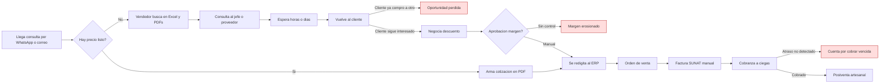
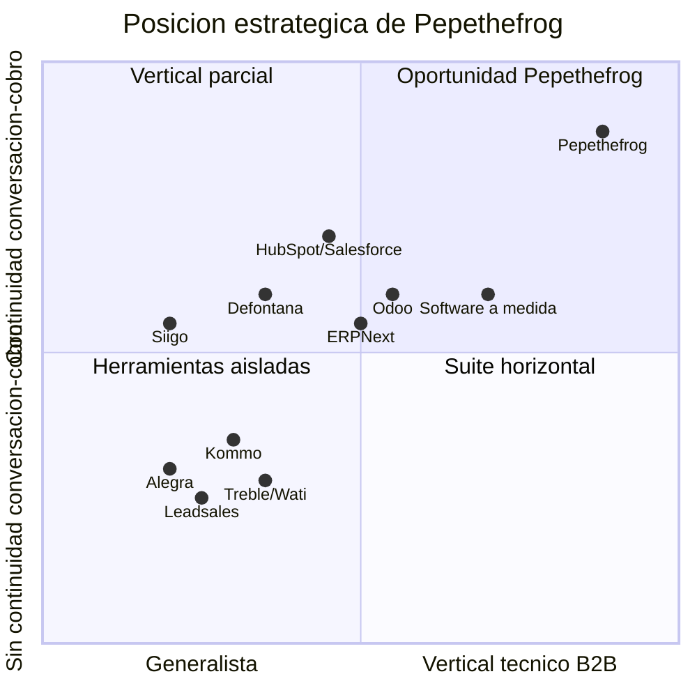
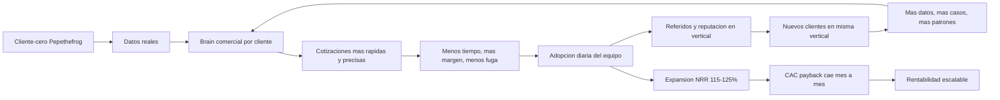
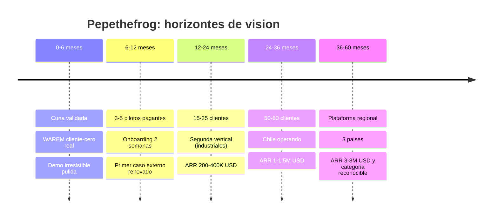

# Pepethefrog: copiloto comercial inteligente

> Visión refinada. Mismo motor, misma profundidad, misma evidencia. Un ADN más claro: **Pepethefrog no es un ERP más; es el copiloto que trabaja por el equipo comercial y deja al humano solo las decisiones que importan.**
>
> Fuentes base: `PLANIFICACION_ESTRATEGICA_WAREM.pdf`, `PROPUESTA_EJECUTIVA_WAREM.pdf`, `VISION_ESTRATEGICA_WAREM_FUSIONADA.md`, `WAREM_Vision_Maestra_2026.md`, `WAREM_Vision_Independiente_Claude_Opus_4_7.md`, `WAREM_Vision_Refinada_Simplicidad.md`.
> Validación externa: PRODUCE/OGEIEE, SUNAT, WhatsApp Business, Gartner CPQ, McKinsey B2B pricing, benchmarks SaaS LatAm 2026.
> Autor: Claude Opus 4.7, en rol de estratega fundador, para Gianella.

---

## Regla de marca (superior a todo)

> **Pepethefrog gana porque vuelve simple lo caótico, cómodo lo tedioso y automático lo repetitivo — sin sacar al humano de donde su criterio suma.**

Esa frase ordena todo: producto, precio, marketing, arquitectura, contratación. Cuando haya duda entre *sofisticado* y *claro*, gana lo claro. Cuando haya duda entre *manual* y *automático*, gana lo automático, **siempre que el humano siga en control de la decisión comercial que importa**.

Si al leer este documento una sola línea suena a consultoría, falló. Si una sola pantalla del producto intimida a un vendedor, falló. Si en algún punto Pepethefrog le pide al usuario "que alimente el sistema", falló dos veces.

---

## 0. Qué es Pepethefrog, en una oración

**Pepethefrog es un copiloto comercial que convierte cada conversación de WhatsApp en cotización precisa, factura electrónica y cobranza seguida — trabajando por el vendedor, no contra él.**

Detrás hay tecnología seria (Quote-to-Cash con IA, SUNAT embebido, brain por cliente). Arriba, para quien lo usa, se siente como un asistente que lee, cotiza, organiza, recuerda y alerta — y le pasa al humano solo lo que requiere criterio: aprobar un descuento, cerrar un precio, mirar a los ojos al cliente.

---

## 1. Veredicto ejecutivo

[RECOMENDACIÓN] La visión previa ya apunta al lugar correcto. Lo que faltaba era colocar un ADN que un gerente, un cliente piloto y un inversionista entiendan en 15 segundos. Ese ADN es **copiloto**. No suite, no plataforma, no sistema operativo. Copiloto.

Tres correcciones que hereda esta versión:

1. "Sistema Operativo Comercial" suena a pizarra. Intimida a la pyme. **Se reemplaza por "copiloto comercial con IA para distribuidoras B2B técnicas"**, con anclaje técnico a la categoría Quote-to-Cash (USD 11.300M, 13% CAGR) cuando hable con analistas.
2. La cuña "conecta tu WhatsApp y descubre oportunidades perdidas" la venden diez competidores. **Se reemplaza por una cuña que solo Pepethefrog puede cumplir**: *"sube tu catálogo y tu historial; tu WhatsApp responde cotizaciones técnicas precisas en menos de 3 minutos esta semana."*
3. El moat no es "tenemos IA". Es que cada cliente entrena sin esfuerzo su propio **brain comercial privado**, que cotiza mejor cada mes y que migrar duele.

[APUESTA] La apuesta concreta: **ser el camino más simple para que una distribuidora técnica de LatAm convierta cada chat en venta cobrada, con un copiloto que hace el 80% del trabajo y le deja al humano el 20% donde su criterio decide la venta.**

Vertical inicial: distribuidoras médicas, científicas, de laboratorio e industriales de 20–80 personas en Perú. Defensa: el brain por cliente, el flujo completo en una sola historia de datos, y una simplicidad que los rivales no pueden copiar sin canibalizar su propio producto.

---

## 2. Contrato de autonomía: qué hace el copiloto, qué decide el humano

Esta sección es nueva y es el corazón del documento. Todo lo demás se subordina a ella.

Pepethefrog automatiza lo repetitivo, lo operativo y lo predecible. **No automatiza decisiones que requieren criterio humano.** La frontera se escribe a propósito, no por omisión.

| Lo que Pepethefrog hace por el usuario (automático) | Lo que el usuario revisa, aprueba o decide |
|---|---|
| Leer cada WhatsApp y correo entrante y clasificarlo (cotización, reclamo, seguimiento, ruido) | Qué hacer con un cliente complejo, ofendido o estratégico |
| Extraer producto, cantidad, especificación, plazo y contexto del mensaje | Si ese cliente merece una excepción comercial |
| Armar la cotización — kit, precio, plazo por proveedor, margen — con el catálogo y el histórico | Enviarla, ajustar el tono, personalizar una línea |
| Detectar si la cotización cae bajo el margen mínimo y pedir aprobación | Aprobar, rechazar o contrapropor el descuento |
| Emitir la factura SUNAT del flujo ya aceptado, sin re-digitar | Validar que el pedido se despachó y cerrar el ciclo |
| Predecir qué facturas se atrasarán y redactar el recordatorio | Llamar al cliente, renegociar, decidir cortar crédito |
| Detectar cotizaciones que llevan demasiadas horas sin respuesta y alertar | Responder, delegar o archivar |
| Resumir el estado de cualquier cliente en 3 párrafos y en 1 clic | Leer el resumen y actuar |
| Recordar qué se ofreció, a qué precio, con qué plazo, a cada cliente | Usar ese contexto en la próxima conversación humana |

**Dos principios operativos:**

1. **Nada irreversible sin humano.** El copiloto nunca envía una cotización, emite una factura, aplica un descuento ni cierra una venta sin aprobación humana explícita. La IA prepara; el humano firma.
2. **Nada evitable con humano.** El copiloto no obliga al vendedor a digitar, buscar, copiar, re-capturar ni recordar nada que la máquina pueda saber. Formulario vacío = falla de diseño.

[APUESTA] La combinación de estos dos principios es la ventaja injusta. Los competidores caen en uno de dos extremos: o venden chatbots que prometen cerrar ventas autónomas (y entregan mala experiencia), o venden CRMs que exigen que el vendedor alimente el sistema (y entregan baja adopción). Pepethefrog no cae en ninguno: **autonomía sobre lo repetitivo, humano sobre lo importante.**

---

## 3. Lo que rescato, reformulo y descarto

| Idea de los documentos previos | Decisión | Razón breve |
|---|---|---|
| "El problema real es la fragmentación comercial-operativa" | **Conservar** | Permite pensar en producto |
| "WAREM como cliente-cero" | **Conservar y elevar** | Dolor real + reglas reales + permiso para experimentar |
| "Expediente único de negocio" | **Reformular** | Afuera, hablar de "toda la cadena en una sola historia" |
| "Sistema Operativo Comercial" | **Descartar** como categoría | Intimida. Reemplazar por "copiloto comercial B2B" |
| "Cuña: conecta WhatsApp y ve oportunidades perdidas" | **Reformular** | Nueva cuña: "sube tu catálogo, tu WhatsApp cotiza en 3 min" |
| "IA contextual como valor agregado" | **Reformular** | Cuatro funciones claras con ROI medible; cortar lo demás |
| "Núcleo propio + borde híbrido" | **Conservar** | Decisión de producto, no moda arquitectónica |
| "Vertical inicial: distribuidoras técnicas" | **Conservar y afilar** | Médicas / laboratorio / industriales con cotización consultiva |
| "Empresa fragmentada como enemigo" | **Reformular** | Enemigo concreto: *"la cotización que se perdió porque nadie la atendió a tiempo"* |
| "Expansión regional después de dominar Perú" | **Reformular** | Arquitectura fiscal enchufable desde día uno |
| "ERP universal", "Odoo con logo", "microservicios por modernidad" | **[DESCARTAR]** | Sin debate |
| "Pricing Starter/Business/Scale" | **Reformular** | Híbrido: per-seat + consumo IA, alineado a benchmarks 2026 |
| "IA imprescindible" sin separar qué IA | **Reformular** | Matriz: imprescindible / útil / vendible / humo / prohibido |
| "Roadmap 0-6-12-24-36-60 meses" | **Conservar y cuantificar** | Metas por horizonte |
| Nombre del producto | **Fijar** | **Pepethefrog**. Sin sufijos. El nombre es la marca |
| Frontera entre IA y humano | **AGREGAR** | Contrato de autonomía explícito (Sección 2). Nuevo |

---

## 4. Investigación de realidad

Evidencia, no intuición. Cuando falta dato firme, lo marco como [SUPUESTO].

### 4.1 Mercado peruano y latinoamericano

[HECHO] Al cierre de 2024, Perú tenía más de **2,34 millones de empresas formales**, **99,5% Mipyme**. El **85,2% opera en comercio y servicios** (PRODUCE/OGEIEE). Proyección 2026: ~**3,3 millones** de unidades formales.

[HECHO] El SaaS en LatAm pasa de **USD 21.400M (2024) a USD 45.100M (2030)** (Qubit Capital). Región con mayor crecimiento relativo en SaaS vertical.

[INFERENCIA] Pymes B2B peruanas con cotización consultiva (distribución técnica) filtrando por RUC activo, venta B2B, catálogo técnico, WhatsApp Business y facturación electrónica: **50.000 a 100.000 empresas** [SUPUESTO razonable].

### 4.2 SUNAT y cumplimiento electrónico

[HECHO] El cronograma SUNAT cierra la **obligatoriedad de comprobantes electrónicos** en el primer semestre de 2026. SUNAT distingue **PSE** (emisor/gestor) y **OSE** (operador validador).

[INFERENCIA] No se puede vender Quote-to-Cash en Perú sin SUNAT. Pero *la integración es commodity* — hay decenas de PSE. El diferencial es que la factura **nazca automáticamente del flujo conversacional ya aprobado**, sin que nadie la re-digite.

[RECOMENDACIÓN] Tratar el cumplimiento fiscal como **enchufe**, no como rama condicional. Así, expandir a Chile/Colombia/México no requiere reescribir.

### 4.3 WhatsApp y comercio conversacional B2B

[HECHO] **Comercio conversacional LatAm 2026**: **USD 18.200M**, crecimiento **35% anual**. Adopción: Brasil 78%, Colombia 74%, México 71%. **72% de consumidores** ya compraron por mensajería; **75% de quienes escriben a una empresa terminan comprando**.

[HECHO] **60% de empresas con WhatsApp Business API** implementarán algún nivel de IA en 2026. Casos documentados: +340% capacidad de atención, +67% ventas al combinar WhatsApp API + agentes IA.

[INFERENCIA] La pregunta del gerente ya no es "¿debo vender por WhatsApp?". Es **"¿quién me resuelve todo el ciclo encima del WhatsApp?"**. Esa es la grieta donde Pepethefrog se para.

### 4.4 Competencia y sustitutos

| Player | Qué hace | Fortaleza | Debilidad que Pepethefrog explota |
|---|---|---|---|
| **Odoo** (desde $24.90/user/mes) | Suite ERP+CRM modular | Amplitud, comunidad | Genérico. No nace en conversación. Cotización técnica = proyecto |
| **ERPNext** ($0–100/user/mes) | ERP open source | Cero lock-in | Implementación artesanal. Nada para pyme sin TI |
| **Siigo Perú** | Contabilidad + facturación | Adopción local, SUNAT nativo | Se queda en lo contable |
| **Defontana** | ERP con IA + CRM | 23 años en Perú | ERP clásico. No captura lo conversacional |
| **Kommo** ($15–45/user/mes) | CRM multicanal con Salesbot | WhatsApp nativo, precio razonable | No cotiza técnico. No factura. No cobra |
| **Leadsales** ($133–247/mes) | CRM WhatsApp-first | UX "WhatsApp mejorado" para micro | Funcionalidad limitada |
| **Treble / Wati / Respond.io** | BSPs + inbox WhatsApp | Escalables para atención | Son buzones, no revenue |
| **Alegra** | Facturación + contabilidad LatAm | UX limpia, costo bajo | Micro y servicios, no distribución técnica |
| **HubSpot / Salesforce** | CRM + Revenue Cloud | Marca y ecosistema | Prohibitivo para pyme peruana; implementación larga |
| **Bitrix24** | Suite CRM+colaboración | Precio bajo | Configurable en exceso; se vuelve proyecto |
| **Software a medida** | Adaptado cliente por cliente | Encaje perfecto | No escala. Bus factor. Deuda técnica garantizada |

[INFERENCIA] **Ninguno combina las cuatro piezas al mismo tiempo**: (a) entrada conversacional nativa por WhatsApp, (b) CPQ técnico con kits y márgenes, (c) SUNAT embebido al flujo, (d) copiloto entrenado con el catálogo e historial del cliente. Ese hueco es real.

### 4.5 IA en ventas B2B (evidencia dura)

[HECHO] McKinsey 2025: distribuidor B2B de **USD 15.000M** implementó copiloto de pricing. En **10 semanas** identificó **50 puntos base** de oportunidad; equipó a **1.000+ consultores**; uplift total **250 puntos base** de margen. IA en Quote-to-Cash genera ROI medible y auditable.

[HECHO] Benchmarks 2026 (Monetizely): pricing híbrido **seat + consumo** supera al per-seat puro en productos con componente generativo.

[INFERENCIA] La IA de Pepethefrog no puede ser "feature transversal" ni "chatbot decorativo". Debe ser **trabajo medible**: cotizaciones por minuto, margen protegido, tiempo de respuesta, cobranzas alertadas.

### 4.6 Economía SaaS B2B pyme

[HECHO] Benchmarks 2026:

- SMB SaaS (ACV USD 5K–15K): payback 6–9 meses, LTV:CAC ≥ 3:1 sostenible, ≥ 4:1 para escalar.
- CPL LatAm: USD 60–90 (vs. USD 200–250 Norteamérica).
- Mediana B2B SaaS global: payback 8,6 meses, LTV:CAC 3,8x.

[INFERENCIA] Modelo Pepethefrog viable: ACV inicial **USD 4.000–9.000** (USD 340–750/mes); CAC **USD 1.500–2.500**; payback **8–12 meses** primeros 20 clientes, <9 meses desde el 30; LTV:CAC **4:1** al año 3.

[SUPUESTO] Hipótesis disciplinadas. Se validan con clientes reales, no en slides.

### 4.7 Vertical SaaS 2026

[HECHO] **89% de ejecutivos** ven al vertical SaaS como "el futuro". Verticales muestran **retención 3x mayor** que horizontales. Moats emergentes: flujos compuestos, regulación integrada, servicios embebidos.

[APUESTA] Si Pepethefrog acierta vertical y construye el flujo de punta a punta, el techo no es una pyme peruana: es un vertical SaaS andino exportable.

---

## 5. El problema real que vale dinero

Lo que una distribuidora técnica paga sin dudar no es "un ERP moderno". Los gerentes no aprueban presupuesto para "modernizar sistemas". Aprueban presupuesto para **recuperar dinero** o **vender más con la misma gente**.

El dolor real, en una distribuidora de 20–60 personas:

| Dolor medible | Cuánto duele | Cómo se ve hoy |
|---|---|---|
| **Cotizaciones que tardan días** | 30–50% de consultas no convierten | El vendedor pregunta al jefe, revisa Excel, consulta al proveedor, vuelve horas después |
| **Cotizaciones con margen equivocado** | 5–15% de pérdida | Aprobaciones "de palabra", sin sistema |
| **Cotizaciones olvidadas** | 20–40% del pipeline muere | WhatsApp sin radar, correos perdidos |
| **Re-digitación entre herramientas** | 1–3 horas/día por vendedor | La misma cotización se tipea tres veces |
| **Cobranza ciega** | 15–30% de CxC con atraso evitable | Sin alertas, todo a mano |
| **Conocimiento concentrado** | 1–2 personas "saben cotizar bien" | Onboarding lento, vacaciones imposibles |
| **Reportería tardía** | La verdad del mes se sabe el 10 del siguiente | Excel armado a contrarreloj |

[INFERENCIA] Una distribuidora de **USD 2–5M/año** pierde del orden de **USD 150.000–400.000 anuales** entre cotizaciones perdidas, margen mal calibrado y tiempo desperdiciado. Un copiloto que cuesta USD 500–1.000/mes y ataca un tercio de ese dolor devuelve **5x a 10x ROI**. Esa es la economía que compra.

Ese flujo roto, repetido en decenas de miles de pymes, es el negocio.

---

## 6. Categoría, promesa y enemigo

### 6.1 Dos capas, un mismo producto

- **Capa técnica / analistas / inversionistas**: *Quote-to-Cash conversacional con IA para B2B técnico*. Anclaje a Gartner, Forrester, benchmarks.
- **Capa humana / clientes**: *"un copiloto que te responde los WhatsApps, te cotiza y te factura."*

Ambas son ciertas. La diferencia es quién escucha. Un fondo pide la primera. Un gerente comercial pide la segunda. Pepethefrog no elige una: **la simple arriba, la técnica debajo**.

### 6.2 La categoría pública

**Copiloto comercial con IA para distribuidoras B2B técnicas.**

No "plataforma", no "suite", no "sistema operativo". **Copiloto.** Una palabra que cualquier gerente entiende en dos segundos y asocia con "alguien que trabaja conmigo, no otra herramienta que me da trabajo".

### 6.3 El nombre del producto

El producto se llama **Pepethefrog**. Sin sufijos (nada de Pepethefrog ONE, Hilo, Pro, Copilot). La marca es el producto. El dominio verbal es humano: *"lo puse en Pepethefrog"*, *"Pepethefrog ya cotizó eso"*, *"me lo recordó Pepethefrog"*. Los sufijos rompen ese lenguaje.

### 6.4 La promesa central

> **Cada WhatsApp se vuelve cotización precisa, aprobada, facturada y cobrada — con un copiloto que trabaja por ti, no contra ti. Mientras más vendes, más inteligente se vuelve.**

Tres propiedades:

1. **Medible**: "cotización precisa en segundos".
2. **Diferencial**: "sin tipear dos veces" = un solo flujo, una sola historia.
3. **Aspiracional pero verificable**: "más inteligente con el tiempo" = brain que aprende.

### 6.5 El enemigo

> **"La cotización que se perdió porque nadie la atendió a tiempo."**

Cada gerente la reconoce. Cada vendedor tiene un recuerdo reciente.

Y un enemigo de segundo orden, igual de importante:

> **"El software que promete resolverlo, pero pide tres meses de implementación, cinco capacitaciones y que el vendedor alimente formularios."**

Contra ese segundo enemigo pelea la **simplicidad** y la **automatización responsable**. Son armas, no frases de marketing.

### 6.6 Paradigma viejo vs. nuevo

| Paradigma viejo | Paradigma Pepethefrog |
|---|---|
| El vendedor alimenta el CRM | El chat alimenta el sistema; el sistema alimenta al vendedor |
| Cotizar es trabajo manual experto | Cotizar es revisar lo que el copiloto preparó |
| La factura es un trámite | La factura nace del flujo ya aceptado |
| El conocimiento vive en cabezas | El conocimiento vive en el brain del cliente |
| El margen se pierde por desorden | El margen se protege por diseño |
| Adoptar software = proyecto | Adoptar Pepethefrog = tarde de trabajo |
| El software te exige disciplina | El copiloto te descarga trabajo |

### 6.7 Por qué es defendible

Cuatro piezas combinadas, y **ninguna se siente compleja al cliente**:

1. Inbox conversacional con lectura IA fiable (algunos la tienen).
2. Motor de cotización con kits, compatibilidades y márgenes (casi nadie en LatAm).
3. SUNAT/PSE dentro del flujo, no al lado (pocos).
4. Brain por cliente, entrenado con su catálogo e historial (casi nadie).

Kommo puede sumar 1. Odoo puede sumar 2. Siigo domina 3. Ninguno tiene 4. **Y nadie combina las cuatro con la sensación de alivio que exige la Regla de marca.** Esa combinación es la categoría.

---

## 7. Visión fundacional

> **Manifiesto**
>
> La venta técnica latinoamericana está atrapada en un error de época: se conversa por chat, se cotiza en Excel, se aprueba por verbo, se factura en otro sistema y se explica en PowerPoint. Cada salto entre herramientas es una fuga — de tiempo, de margen, de confianza.
>
> **Pepethefrog existe para cerrar esa fuga con un copiloto que trabaja por el equipo comercial.**
>
> No como otro ERP que pide una migración dolorosa antes de entregar valor. No como otro CRM que exige disciplina a un vendedor ya presionado. Y sobre todo, no como un software que el vendedor esquiva. Pepethefrog es la primera plataforma que transforma cada chat de WhatsApp en negocio ejecutado — cotizado, aprobado, facturado, cobrado — con un solo flujo, lenguaje humano y una regla clara: **la máquina hace lo repetitivo, el humano decide lo importante.**
>
> Lo que construimos es un **copiloto comercial con memoria propia**, alimentado por el catálogo, el historial y las conversaciones de cada empresa. Un sistema que cotiza mejor cada mes. Que protege el margen sin que nadie lo recuerde. Que alerta riesgos antes de que duelan. Que convierte el conocimiento de las personas en ventaja institucional. Y que nunca cierra una venta delicada sin que un humano firme.
>
> Empezamos por distribuidoras médicas, científicas, de laboratorio e industriales en Perú — ahí el dolor es denso, el flujo es rico y el cliente-cero (WAREM mismo) ya está adentro. Desde ahí expandimos a más verticales técnicas, a Chile, Colombia y México, siempre con el mismo principio: primero atajar el chat, después orquestar la cadena completa, siempre con el humano en control.
>
> No vendemos software. Vendemos cotizaciones que no se pierden, márgenes que no se erosionan y tiempo que se recupera. En dos años queremos ser la plataforma en la que cualquier distribuidora técnica de LatAm piense primero cuando contrata a un vendedor nuevo. En cinco, queremos haber creado una categoría — y que al decir *"lo puse en Pepethefrog"* todos sepan qué significa.

### 7.1 Principio de simplicidad (ADN de marca)

La simplicidad no es tono de web. Es un principio de diseño con reglas:

1. **Prueba de los 15 minutos.** Un vendedor nuevo debe poder usar Pepethefrog productivamente en 15 minutos sin capacitación.
2. **Prueba del alivio.** En la primera sesión, el usuario debe sentir alivio, no esfuerzo.
3. **Menos pantallas, menos clics, menos decisiones.** Cada funcionalidad nueva debe cancelar otra, no sumarse.
4. **Sin vocabulario nuevo.** Si una función requiere glosario, se renombra o se elimina.
5. **El vendedor no alimenta el sistema; el sistema alimenta al vendedor.** Formulario vacío = fracaso.
6. **Onboarding sin consultor.** Si el cliente necesita un integrador para empezar, rompimos el modelo.
7. **Una sola pregunta visible por pantalla.** Ni tres dashboards, ni cinco menús anidados.
8. **Los nombres de las funciones son humanos.** "Catálogo que se lee solo", "Guardián de margen", "Radar de cobranza". No "módulo de ingesta" ni "engine".

### 7.2 Principio de automatización responsable (ADN operativo)

Tan vinculante como la simplicidad:

1. **Automatizar todo lo repetitivo, operativo y predecible.** Si un humano hace hoy una tarea más de 10 veces al mes y la respuesta no requiere criterio, Pepethefrog la hace.
2. **Nunca automatizar lo irreversible sin humano.** Enviar una cotización, emitir una factura, aplicar un descuento, cerrar una venta: siempre con aprobación explícita.
3. **El copiloto explica lo que propone.** Cada sugerencia viene con el "por qué" (qué datos usó, qué regla aplicó). Auditoría por diseño.
4. **El usuario puede corregir y el copiloto aprende.** No "reentrena un modelo global"; refina las reglas de ese cliente, en ese tenant, para la próxima vez.
5. **Cuando la IA no está segura, pide ayuda, no improvisa.** Umbrales de confianza explícitos.
6. **Control total del humano sobre la voz.** Ningún mensaje sale al cliente sin aprobación, salvo auto-respuestas opt-in que el gerente firmó.

Estas reglas son vinculantes para producto, diseño, ingeniería, marketing y soporte. Parte del contrato con el cliente, aunque no aparezcan en la orden de compra.

---

## 8. Producto imaginado

El producto no se describe por módulos. Se describe por momentos — cada momento muestra qué hace el copiloto y qué decide el humano.

### 8.1 El lunes del vendedor

Son las 8:47am. El vendedor abre Pepethefrog. En una sola pantalla:

- **12 mensajes de WhatsApp desde el viernes**, clasificados por el copiloto: 4 cotizaciones, 2 reclamos, 3 seguimientos, 3 ruido.
- **3 cotizaciones preparadas en borrador**, cada una con kit sugerido, precio, margen y nota ("cliente pidió entrega en 15 días → proveedor A tiene stock, proveedor B no").
- **1 alerta**: *"Cotización #2847 a Lab Santa María lleva 72h sin respuesta. Suele responder en 24. ¿Le escribo?"*

El vendedor revisa las tres, ajusta una línea personal en una, aprueba las tres. **Tardó 4 minutos.** Sin Pepethefrog, 2 a 4 horas.

*Copiloto: leyó, clasificó, cotizó, alertó. Humano: revisó y firmó.*

### 8.2 La tarde del gerente comercial

Abre el tablero. Sin preguntarle a nadie:

- Pipeline del mes: **USD 340K**. Mes pasado a la misma fecha: USD 280K.
- Tasa de cotización-a-cierre por vendedor, con diferencia respecto al promedio.
- Cotizaciones con margen bajo el umbral (ve 4, aprueba 2, rechaza 2 en 3 clics).
- Cobranzas en riesgo: 3 facturas que el modelo predice atraso >15 días. Sugerencia: una llamada hoy.

Siente control, no vigilancia. **Claridad.**

*Copiloto: agregó, predijo, sugirió. Humano: aprobó, rechazó, llamó.*

### 8.3 La conversación con un cliente

Llega: *"Hola, necesito cotización para 4 microscopios ópticos binoculares 400X con iluminación LED, uso universitario, entrega en Lima"*.

Sin que nadie toque nada, Pepethefrog:

1. Crea el expediente, clasifica intención, extrae producto, cantidad y ubicación.
2. Busca en el catálogo del cliente productos compatibles. Encuentra 3 referencias de 2 proveedores. Cruza con cotizaciones históricas para estimar margen.
3. Prepara 3 propuestas (económica, óptima, premium) con kit, precio, plazo por proveedor y nota técnica.

El vendedor revisa, elige "óptima", agrega una línea personal (*"Prof. García, le enviamos la opción que mejor encaja con su presupuesto habitual"*) y aprueba. El cliente recibe un PDF profesional **90 segundos después del mensaje**.

*Copiloto: entendió, buscó, cotizó, escribió. Humano: eligió la opción, personalizó el tono, firmó.*

### 8.4 El primer día del vendedor nuevo

Lunes. Recién contratado. Su jefe: *"Entra a Pepethefrog con tu correo. Responde los WhatsApps como si fueras tú, que el resto lo arma el sistema."*

A las 11:30 envió 6 cotizaciones correctas. No leyó manual, no fue a capacitación. El brain ya tiene las reglas de la empresa; las cotizaciones vienen con el tono que el gerente aprobaría.

*Esa es la prueba de los 15 minutos, hecha de verdad.*

### 8.5 La cobranza del viernes

El administrador abre el Radar de cobranza. Pepethefrog ya llamó la atención sobre 5 facturas:

- 2 con predicción de atraso >15 días (cliente con patrón reciente de demora).
- 1 con mensaje del cliente pendiente de respuesta (el copiloto redactó recordatorio, esperando aprobación).
- 1 con discrepancia entre guía y factura (la IA la detectó; pide revisión humana).
- 1 con ciclo normal, solo recordatorio estándar.

El administrador aprueba 4 mensajes en 2 clics, escala 1 al gerente. **Cierra cobranza del viernes en 15 minutos.** Antes le tomaba media tarde.

*Copiloto: predijo, redactó, detectó. Humano: aprobó y escaló.*

### 8.6 Lo que NO debe sentirse

- No debe sentirse como un CRM que pide formularios.
- No debe sentirse como un chatbot que contesta mal.
- No debe sentirse como una suite con 40 pantallas.
- No debe sentirse como un proyecto que tarda meses.
- No debe sentirse como "otro software" que el vendedor evita.
- No debe sentirse como una IA que decide sin preguntar.

La secuencia emocional buscada:

> **captura → claridad → velocidad → control → confianza → alivio.**

---

## 9. Cuña inicial

### 9.1 La cuña

[RECOMENDACIÓN] La cuña se cuenta en una oración y se demuestra en 10 minutos:

> **"Sube tu catálogo y tus últimas 100 cotizaciones. En la misma semana, tu WhatsApp responde cotizaciones técnicas — con kit, precio y margen correctos — en menos de 3 minutos cada una."**

Esa demo es imposible para Kommo/Leadsales/Treble (no tienen cotización técnica). Imposible para Odoo/Siigo (no tienen conversación). Imposible para HubSpot/Salesforce sin USD 50K de implementación.

Entrada al mercado **sin migración**. Esa es la promesa física: *no te pedimos cambiar tu mundo; solo que nos subas tu catálogo*.

### 9.2 Quién compra

- **Gerente comercial** o **director general** de distribuidora técnica de 20–80 personas, facturación USD 2–10M/año.
- Ya usa WhatsApp Business. Ya factura electrónicamente. Ya tiene catálogo en Excel o PDF. Ya perdió sueño por cotizaciones que se fueron por la tangente.
- Paga rápido si ve la demo funcionar **con sus propios datos**.

### 9.3 Quién usa a diario

- **Vendedor comercial** (3–15 por empresa). Pasa 60–70% del tiempo respondiendo WhatsApps, buscando precios, armando PDFs.
- Debe percibir el copiloto como **alivio**, no vigilancia. Si lo siente como control, sabotea.

### 9.4 Cuánto duele hoy

Una distribuidora típica pierde **2–5 cotizaciones por demora cada semana**, cada una por USD 500–5.000. Al año: **100–250 cotizaciones perdidas**, entre **USD 50K y 1M en revenue potencial**. El gerente lo intuye, aunque no lo mida.

### 9.5 Demo de 10 minutos (guion)

1. Cliente sube catálogo en Excel + PDF del proveedor + sus últimas 20 cotizaciones (5 min de upload en vivo).
2. Pepethefrog ingiere y estructura en pantalla. Ve la extracción en tiempo real.
3. Cliente pega un mensaje real de un cliente actual (*"Necesito 2 balanzas analíticas..."*).
4. Pepethefrog prepara en vivo 3 cotizaciones PDF con margen y plazo. Total: **<90 segundos**.
5. El cliente compara con su cotización anterior para el mismo producto. Tiempos (horas vs. segundos). Margen (Pepethefrog detectó un descuento que no debió darse).

La demo vende sola. No requiere pitch largo.

### 9.6 Primer resultado medible (30 días)

- **Tiempo medio de cotización**, antes vs. después → meta: reducción ≥70%.
- **Cotizaciones por vendedor por día** → meta: ≥3x.
- **Cotizaciones con margen fuera de umbral** capturadas → meta: ≥5 en el primer mes.

Si esos tres no se mueven en 30 días, Pepethefrog tiene problema de producto, no de venta.

### 9.7 Por qué paga

Recuperar **una sola cotización al mes** que se habría perdido paga el servicio **10 veces**. Esa es la conversación con el gerente. No hay que convencerlo de más.

---

## 10. Modelo de negocio y camino a rentabilidad

### 10.1 Pricing

Estructura híbrida *seat + consumo*, alineada a benchmarks 2026:

| Plan | Para quién | Precio/mes (USD) | Qué incluye | Qué gana el cliente |
|---|---|---|---|---|
| **Starter** | Micro (1–5 vendedores) | **49 /user** (mín. 2) | Inbox conversacional, expediente, pipeline, 100 cotizaciones IA/mes | Empezar sin pensarlo. Dejar de perder cotizaciones obvias |
| **Growth** | ICP principal (6–20 vendedores) | **89 /user** | Lo anterior + CPQ completo, SUNAT PSE, 500 cotizaciones IA/mes, aprobaciones | Un solo flujo chat→factura. Margen protegido |
| **Scale** | Mediana (20–50 vendedores), multi-sede | **149 /user** | Lo anterior + multi-sucursal, analytics, API, onboarding asistido, cotizaciones IA ilimitadas | Control gerencial en vivo. Expansión sin dolor |
| **Enterprise** | >50 vendedores o verticales adyacentes | A cotizar | SLA, on-prem opcional, SSO, integraciones custom | Tranquilidad regulatoria y operativa |

**Complementos**: pack de cotizaciones IA adicionales (pico estacional); módulo de postventa (garantías, renovaciones); conector fiscal Chile/Colombia/México; implementación asistida opcional (USD 2.000–8.000, one-time).

### 10.2 Economía por cliente

[SUPUESTO] Hipótesis disciplinadas:

| Métrica | Año 1 | Año 2 | Año 3 |
|---|---|---|---|
| Ticket promedio mensual | USD 600 | USD 800 | USD 1.100 |
| ACV | USD 7.200 | USD 9.600 | USD 13.200 |
| CAC | USD 2.000 | USD 1.600 | USD 1.300 |
| Payback | 14 meses | 10 meses | 8 meses |
| Margen bruto | 62% | 68% | 73% |
| Churn anual (logo) | 25% | 15% | 10% |
| NRR | 100% | 115% | 125% |

Año 3 empieza a verse como vertical SaaS LatAm sano: NRR 120%+, margen bruto 70%+, payback <9 meses, LTV:CAC ≥ 4:1.

### 10.3 Cómo llegan los clientes

- **WAREM como cliente-cero** — caso reproducible, con video, datos publicados con permiso.
- **Contenido vertical** en blog y YouTube: *"cómo cotizar 5x más rápido"*, *"cuánto pierdes por cotizaciones lentas"*.
- **Referidos desde proveedores comunes** (fabricantes de equipos médicos, laboratorio, industriales) con revshare.
- **Partners locales** (consultores de digitalización, gremios sectoriales).
- **Outbound ligero** vía LinkedIn + WhatsApp a gerentes del ICP.
- **Presencia comunitaria** (ferias, cámaras de comercio).
- No paid ads masivos hasta el cliente 20.

### 10.4 Condiciones para rentabilidad

- Retención ≥80% a 12 meses en los primeros 20 clientes.
- Implementación estándar ≤2 semanas. Si tarda más, se rompe el modelo.
- Margen bruto ≥60% desde el cliente 10 (controlar costo LLM y PSE).
- ARR USD 1M con equipo ≤12 personas al mes 30 → cash-flow positivo hacia mes 36.

---

## 11. IA supervisada: el motor del copiloto

Regla: cada función de IA se justifica por impacto medible, y se ubica en la matriz de autonomía. Nada decorativo. Nada que cierre ventas sin humano.

### 11.1 IA imprescindible (va en el MVP)

1. **Catálogo que se lee solo.** Sube PDFs y Excels desordenados; salen SKUs, especificaciones, imágenes y compatibilidades estructuradas. Vuelve viable el onboarding rápido.
   - *Autonomía*: alta. Revisión humana solo en baja confianza.
2. **Cotizador por chat.** De un mensaje → PDF de cotización en <90 segundos, con kit, precio, plazo y margen. Usa catálogo, historial y reglas del cliente.
   - *Autonomía*: prepara siempre; nunca envía sin aprobación.
3. **Guardián de margen.** Cada cotización pasa por chequeo: si cae bajo umbral, pide aprobación; si detecta descuento anómalo, propone alternativa.
   - *Autonomía*: bloquea; humano aprueba o rechaza.
4. **Clasificador de chats.** Cada mensaje entrante se etiqueta (cotización / reclamo / seguimiento / ruido) con score. Decide si crea oportunidad, alerta o ignora.
   - *Autonomía*: alta en clasificación; humano decide qué responder.

Cada función tiene un nombre humano. Ninguna pide al usuario aprender jerga.

### 11.2 IA útil (meses 6–12)

5. **Radar de cobranza.** Predice qué facturas se van a atrasar y sugiere acción. *Autonomía*: redacta borrador; humano envía.
6. **Redactor de seguimientos.** Borrador de recordatorio contextualizado, listo para revisar. *Autonomía*: redacta; humano envía.
7. **Deduplicación de clientes y contactos.** Fusiona duplicados con embeddings + reglas. *Autonomía*: fusiona con alta confianza; pregunta en baja.
8. **Resumen de expediente.** "Cuéntame qué pasó con este cliente en los últimos 3 meses" → 1 clic, 3 párrafos. *Autonomía*: total; es lectura, no acción.

### 11.3 IA vendible pero no urgente (mes 12+)

9. Sugerencia de upsell/cross-sell por historial. *Autonomía*: sugiere; humano propone.
10. Lector de licitaciones OECE: parsea bases, estima viabilidad, calcula margen. *Autonomía*: analiza; humano decide participación.
11. Generador de informes ejecutivos. *Autonomía*: total; es lectura.
12. Voice-to-cotización (dictar por audio en WhatsApp). *Autonomía*: transcribe; humano revisa.

### 11.4 IA humo o peligrosa (NO construir)

- **Agente autónomo que cierra ventas sin humano.** En B2B consultivo, destruye confianza y margen. **Prohibido por diseño.**
- **Chatbot que reemplaza al vendedor.** Mala experiencia; no es lo que el ICP quiere.
- **IA "predictiva" con dashboards sin acción clara.** Data viz disfrazada.
- **Generación de imágenes de productos.** No es el dolor.
- **Modelos propios entrenados desde cero.** Costo inmanejable, sin diferencial. Usamos LLMs de frontera con fine-tuning ligero donde aporte.
- **Auto-envío de mensajes al cliente sin aprobación humana explícita.** Rompe el contrato de autonomía.

### 11.5 El moat IA no es un modelo; es un activo por cliente

El verdadero moat IA no es un modelo propio: es un **activo de datos curado por cliente**. Cada distribuidora entrena, sin esfuerzo, un "brain comercial" privado — catálogo + historial + conversaciones + correcciones humanas. Ese brain:

- No se puede llevar afuera.
- Crece con el uso.
- Hace que migrar a otro sistema duela más cada mes.

Es lock-in por **valor**, no por contrato. Esa es la defensa real.

---

## 12. Diferenciación y competencia

### 12.1 Mapa de posición

### 12.2 Tabla comparativa directa

| Capacidad | Kommo | Leadsales | Odoo | Siigo/Defontana | HubSpot/SF | **Pepethefrog** |
|---|---|---|---|---|---|---|
| Inbox WhatsApp con lectura IA | ✅ | ✅ básico | ❌ nativo | ❌ | ⚠️ caro | **✅** |
| Cotización técnica con kits y márgenes | ❌ | ❌ | ⚠️ configurable | ❌ | ✅ alto costo | **✅ nativo** |
| SUNAT PSE dentro del flujo | ❌ | ❌ | ⚠️ plugin | ✅ | ❌ | **✅** |
| IA entrenada con catálogo del cliente | ❌ | ❌ | ❌ | ⚠️ genérica | ⚠️ caro | **✅ core** |
| Copiloto que prepara y humano aprueba | ❌ | ❌ | ❌ | ❌ | ⚠️ parcial | **✅ diseño** |
| Cobranza inteligente | ❌ | ❌ | ⚠️ | ✅ básica | ✅ caro | **✅** |
| Precio pyme (<USD 200/user) | ✅ | ✅ | ✅ | ✅ | ❌ | **✅** |
| Implementación <2 semanas | ✅ limitada | ✅ | ❌ | ⚠️ | ❌ | **✅ meta** |
| Vertical distribución técnica | ❌ | ❌ | ❌ | ❌ | ❌ | **✅** |

[INFERENCIA] El único jugador que podría comoditizar esto es HubSpot o Salesforce con vertical específica. Su pricing y complejidad de implementación los descalifican estructuralmente del ICP pyme LatAm por 3–5 años.

### 12.3 Dónde no competimos (y por qué)

- **No competimos con Siigo/Defontana en contabilidad general.** Nos integramos.
- **No competimos con Odoo como ERP horizontal.** Pelea perdida y sin sentido.
- **No competimos con Salesforce en Fortune 500.** No es el ICP.

Competimos solo en: **continuidad chat → cotización → factura → cobranza, con copiloto, para distribuidoras B2B técnicas LatAm.** Foco = fuerza.

---

## 13. Arquitectura como habilitadora de la visión

No describimos diseño técnico detallado. Solo principios no negociables.

### 13.1 Principios no negociables

1. **Multi-tenant desde la primera línea**, aunque el primer cliente sea WAREM.
2. **Cumplimiento fiscal enchufable** (SUNAT, SII, DIAN, SAT). El core no sabe de países.
3. **Monolito modular moderno** para el núcleo transaccional; servicio de IA separado (cotización, extracción, retrieval). Sin microservicios románticos.
4. **Auditoría embebida** en aprobaciones, precios, márgenes y facturas. Cada decisión del copiloto deja rastro de "qué datos usó y qué regla aplicó". Base de confianza.
5. **Observabilidad desde cliente uno** (tracing, métricas, logs). No es lujo.
6. **Integraciones como capa intercambiable**: WhatsApp BSP (3 opciones), PSE (3 opciones), LLM (2–3 proveedores). El dominio nunca se acopla a un solo proveedor.
7. **Datos del cliente aislados por tenant.** El brain de un cliente no cruza a otro, salvo opt-in explícito para benchmarks anónimos.
8. **Una pregunta visible por pantalla.** La UI es parte del contrato.
9. **El sistema alimenta al usuario, no al revés.** Principio arquitectónico, no estético: los formularios manuales se tratan como deuda técnica.

### 13.2 Qué construir y qué adoptar

- **Construir**: motor CPQ, orquestador de expediente, pipeline B2B, reglas de aprobación, brain comercial por tenant, SUNAT integrado al flujo, UX conversacional, contrato de autonomía.
- **Adoptar**: WhatsApp BSP, LLMs (OpenAI/Anthropic/Gemini), PSE, almacenamiento S3-compatible, búsqueda semántica, observabilidad (OpenTelemetry/Grafana), auth (Keycloak/Auth0).

### 13.3 Evolución arquitectónica

- **Meses 0–12**: monolito modular. Velocidad > elegancia.
- **Meses 12–24**: extraer solo lo que duela (IA como servicio, integraciones por país, quizá BI).
- **Mes 24+**: decidir en base a dolor real, no a teoría.

---

## 14. Flywheel de crecimiento

### 14.1 Por qué baja el CAC

- Cada cliente feliz produce 1–2 referidos cualificados al año (dato informal del sector; validar).
- Contenido vertical específico atrae inbound con CPL <USD 70 (rango LatAm).
- El caso Pepethefrog es asset reutilizable.

### 14.2 Por qué sube la retención

- El brain crece con el uso; migrar duele más cada mes.
- SUNAT embebido: no se puede "quitar Pepethefrog" sin reemplazar emisor.
- La historia operativa vive en el expediente; saltar implica re-ingresarla.

### 14.3 Cómo se arma el moat

- **Años 1–2**: moat débil, valor funcional puro.
- **Año 2+**: moat medio por data lock-in + marca en vertical.
- **Año 3+**: moat fuerte por flujo completo + referencias sectoriales + expansión geográfica.

---

## 15. Roadmap por horizontes

### 15.1 Metas por horizonte

| Horizonte | Foco | Meta cuantitativa | Señal de éxito |
|---|---|---|---|
| **0–6 meses** | Cuña + WAREM cliente-cero | Catálogo cargado, 3 vendedores de WAREM usando a diario, >500 cotizaciones IA generadas | Un vendedor de WAREM prefiere WAREM a Excel |
| **6–12 meses** | 3–5 pilotos pagantes externos | ARR USD 30K–60K, onboarding 2 semanas, churn piloto ≤20% | 1 piloto renueva sin descuento y acepta ser caso público |
| **12–24 meses** | 15–25 clientes, segunda vertical | ARR USD 200K–400K, NRR ≥100%, margen bruto ≥55% | Un cliente externo genera >USD 20K/año y trae referidos |
| **24–36 meses** | 50–80 clientes, expansión Chile | ARR USD 900K–1,5M, NRR ≥115%, payback <10 meses | Pepethefrog entra al top-3 "software para distribuidoras" LatAm |
| **36–60 meses** | Plataforma regional | ARR USD 3M–8M, 3 países, equipo 25–50 | "Copiloto comercial B2B" es categoría reconocida; Pepethefrog es el referente LatAm |

### 15.2 Diagrama

### 15.3 Puertas GO / NO-GO

- **Mes 6**: ¿Pepethefrog usa el producto a diario sin ayuda del equipo técnico? Si NO → volver al MVP.
- **Mes 12**: ¿≥3 clientes externos pagan y ≥1 renovó? Si NO → repensar cuña o vertical.
- **Mes 24**: ¿NRR ≥100%, margen bruto ≥55%, churn ≤20%? Si NO → no levantar ronda, corregir.
- **Mes 36**: ¿Expansión Chile muestra primeros clientes? Si NO → quedarse en Perú y profundizar.

---

## 16. Moats, riesgos y condiciones de éxito

### 16.1 Moats reales (ya existentes)

- **Cliente-cero Pepethefrog** con dolor real, reglas reales, permiso para experimentar.
- **Dominio acumulado** de cotización técnica con kits, proveedores y aprobaciones.
- **Relación con proveedores y clientes del sector técnico** (red de referidos natural).

### 16.2 Moats por construir (los relevantes)

- **Brain comercial por cliente**: cuanto más se usa, más duele migrar.
- **SUNAT dentro del flujo**, no como módulo externo.
- **Reputación en vertical médica/científica/industrial** LatAm.
- **Flujo completo** chat → cotización → factura → cobranza en una sola historia de datos.
- **Catálogo semántico multi-proveedor** (activo reutilizable entre clientes con consentimiento).
- **Contrato de autonomía** como producto: los clientes confían porque entienden qué decide la IA y qué decide el humano.

### 16.3 Moats falsos que no perseguimos

- "Stack moderno" — nadie lo compra.
- Microservicios como diferencial.
- "Tenemos IA" genérico.
- Marca premium prematura.

### 16.4 Riesgos mortales

| Riesgo | Probabilidad | Impacto | Mitigación |
|---|---|---|---|
| [RIESGO] Sin acuerdo legal de propiedad intelectual entre WAREM y socios | Alta | Catastrófico | Firmar instrumento legal **antes** de escribir producto vendible |
| [RIESGO] Equipo construye amplitud antes de validar cuña | Media | Alto | Anti-alcance firmado; gobernanza estricta en v1 |
| [RIESGO] Salesforce/HubSpot lanzan vertical + WhatsApp + IA en LatAm | Media en 3 años | Medio | Velocidad + vertical profunda + precio accesible |
| [RIESGO] Meta cambia reglas de WhatsApp Business API | Media | Alto | Multi-BSP; sin dependencia de uno solo |
| [RIESGO] Privacidad endurece uso de LLMs sobre datos de clientes | Media | Medio | On-prem/regional opcional; consentimiento explícito |
| [RIESGO] El costo de LLMs sube y come margen | Media | Medio | Caching, modelos pequeños para tareas simples, pricing con consumo |
| [RIESGO] Primer piloto externo falla por mala implementación | Alta | Alto | Pilotos pre-calificados; máximo 3 al inicio |
| [RIESGO] Equipo fundador se fragmenta por tensiones previas | Media | Catastrófico | Facilitación externa y roles claros antes de escalar |
| [RIESGO] Producto se convierte en servicio a medida permanente | Media | Alto | Disciplina de producto; templates verticales; rechazar forks |
| [RIESGO] La simplicidad se pierde al crecer (scope creep) | Alta | Alto | Regla: cada feature nueva debe cancelar una vieja; revisión UI mensual |
| [RIESGO] La IA cierra una venta mal y erosiona confianza del cliente | Media | Alto | Contrato de autonomía inviolable: nada irreversible sin humano |

### 16.5 Condiciones no negociables

1. Pepethefrog es **cliente-cero real**, no solo sponsor.
2. Instrumento legal de propiedad intelectual, gobernanza y salida firmado **antes** del MVP.
3. Anti-alcance respetado: v1 **NO** incluye contabilidad general, manufactura, marketplace, app móvil nativa, multi-idioma, multi-moneda.
4. Implementación estándar ≤2 semanas.
5. Cliente externo pagando **antes** de levantar ronda o marketing agresivo.
6. Multi-tenant y auditoría desde la línea 1 de código.
7. Sponsor ejecutivo con poder real sobre alcance, datos y proceso.
8. Cumplimiento fiscal (SUNAT) sale de arquitectura *enchufable*, no hardcoded.
9. **La simplicidad es criterio de decisión**, no nota al margen. Cada release pasa revisión de simplicidad igual que una revisión de seguridad.
10. **El contrato de autonomía es inviolable.** Ninguna función ingeniería puede cruzar la línea "nada irreversible sin humano" sin aprobación explícita del sponsor ejecutivo.

---

## 17. Narrativa comercial

### 17.1 Tagline

**"Tu copiloto comercial: del chat a la cobranza, sin tipear dos veces."**

### 17.2 Frase de portada

**Pepethefrog. El copiloto que convierte cada WhatsApp en venta cobrada.**

### 17.3 Pitch de 10 segundos

*Cada semana pierdes cotizaciones porque nadie las contesta a tiempo. Pepethefrog las prepara por ti — con tu catálogo, tu historial y tu margen. Tú las revisas y apruebas. En una tarde estás andando.*

### 17.4 Pitch de 30 segundos

Las distribuidoras técnicas pierden una de cada tres cotizaciones por demora y desorden. Pepethefrog es un copiloto comercial: conecta tu WhatsApp con tu catálogo y tu historial, y prepara cotizaciones técnicas precisas en menos de tres minutos. Tú decides qué se envía. El mismo flujo continúa hasta factura SUNAT y cobranza. Empezamos en distribuidoras médicas, científicas e industriales del Perú. No pedimos migración; pedimos tu catálogo.

### 17.5 Pitch de 2 minutos

Imagina una distribuidora técnica de veinte vendedores que factura cinco millones al año. Cada semana pierde dos o tres cotizaciones por demora. Cada mes pierde cinco puntos de margen por descuentos aprobados al paso. Cada trimestre la gerencia reconstruye el negocio en Excel. Y cada vez que renuncia un vendedor, el conocimiento se va con él.

Pepethefrog ataca exactamente eso con un principio: **la máquina hace lo repetitivo; el humano decide lo importante**. Nuestro copiloto lee cada WhatsApp, clasifica, prepara la cotización con el catálogo y el histórico de la empresa, chequea el margen, y se la deja al vendedor lista para revisar y aprobar. Cuando la venta cierra, la factura SUNAT nace del mismo flujo, sin re-digitar. La cobranza se alerta antes de atrasarse. Y la gerencia ve la verdad del negocio en vivo.

No somos otro ERP. No somos otro CRM. Somos un copiloto con memoria propia que entrena un "brain" privado para cada empresa. Cuanto más se usa, mejor cotiza. Un vendedor nuevo cotiza como veterano en dos semanas.

Entramos sin migración: subes tu catálogo y tus últimas cotizaciones, y en días estamos respondiendo WhatsApps. Nuestro cliente-cero es WAREM, una distribuidora real con todo el dolor. A cinco años, queremos ser el primer nombre que piensa una distribuidora técnica de LatAm cuando quiere vender más, perder menos y dormir mejor.

### 17.6 Pitch para inversionista

Construimos la primera plataforma Quote-to-Cash conversacional con IA para distribuidoras B2B técnicas de LatAm. Mercado global Quote-to-Cash: USD 11.000M, +13% anual. Comercio conversacional LatAm: USD 18.000M, +35% anual. La intersección — CPQ + WhatsApp + cumplimiento local + copiloto entrenado por cliente — **no la resuelve hoy ningún player regional**.

Tres ventajas injustas: cliente-cero real con dolor denso, dominio profundo de cotización técnica ya modelado, y vertical (médica/científica/industrial) donde el problema es rico pero los competidores genéricos no encajan.

ACV objetivo USD 7.000–13.000, payback 8–12 meses, NRR objetivo 115% al año tres. Vertical primero, Perú primero, LatAm después. No levantamos ronda hasta tener cliente externo pagando y caso renovado.

Y una pista de marca: **ganamos porque somos el copiloto que entiende, el software que se usa solo y la automatización que respeta al humano.**

### 17.7 Pitch para primer cliente piloto

No te vendo software. Te vendo esto: la próxima cotización que hoy se te habría perdido, no se te pierde. Conectamos tu WhatsApp, subimos tu catálogo, procesamos tus últimas cien cotizaciones, y nuestro copiloto empieza a prepararte cotizaciones técnicas en menos de tres minutos. Tú decides qué se envía. Dos semanas de puesta en marcha. Sin migración. Si a los treinta días no ves diferencia en tiempo de cotización, te devolvemos el primer mes. No te pido confianza. Te pido tu catálogo.

### 17.8 Pitch para socio WAREM

Hay dos formas de mirar este proyecto. La primera: "modernicemos el sistema interno y ahorremos en licencias". La segunda: "convirtamos el dolor de Pepethefrog en la base de una empresa de producto latinoamericana".

La primera pinta un techo de ahorro anual. La segunda pinta un techo de categoría. No hay tercera opción estable: si este equipo construye un sistema interno bonito, tarde o temprano pierde foco — el incentivo del software de producto es distinto al del software interno. La decisión no es técnica. Es estratégica. Conviene tomarla ahora, no dentro de un año.

---

## 18. Decisiones fundacionales inmediatas

Las diez decisiones que deben cerrarse **antes** de construir agresivamente.

1. **¿WAREM es cliente-cero de un producto comercial, o solo comprador de software interno?** Sin esta respuesta, todo lo demás es teoría.
2. **Instrumento legal**: propiedad intelectual, derechos de comercialización, equity, gobernanza, salida. Firmado. [RIESGO] Sin esto, la visión muere por política.
3. **Ratificar vertical inicial estrecha**: distribuidoras médicas/científicas/laboratorio/industriales de 20–80 colaboradores en Lima y capitales regionales del Perú.
4. **Ratificar la cuña oficial**: *"sube catálogo + historial, tu WhatsApp cotiza en 3 minutos"*. No "WhatsApp + oportunidades perdidas".
5. **Ratificar el anti-alcance v1**: fuera contabilidad general, manufactura, marketplace, app móvil nativa, multi-idioma, multi-moneda, payroll.
6. **Ratificar el contrato de autonomía** (Sección 2) como artefacto público, visible en el sitio y en el contrato.
7. **Decidir stack de cumplimiento fiscal enchufable desde día uno**, aunque Pepethefrog solo necesite SUNAT.
8. **Elegir modelo de precios y piloto comercial** (Sección 10); validar con 3 compradores reales antes de publicar.
9. **Plan de datos para el MVP**: catálogo real, últimas 100–200 cotizaciones anonimizadas, 30–60 días de WhatsApp comercial, historia de cobranza reciente.
10. **Calendario de puertas GO / NO-GO** mensuales en meses 3, 6, 9, 12 con criterios objetivos (uso, velocidad, margen protegido, ARR).

---

## 19. One-page final

| Elemento | Definición |
|---|---|
| **Categoría** | Copiloto comercial con IA para distribuidoras B2B técnicas (Quote-to-Cash conversacional) |
| **Producto** | **Pepethefrog** (sin sufijos) |
| **Promesa pública** | El copiloto que convierte cada WhatsApp en venta cobrada |
| **Promesa técnica** | Cada chat se vuelve cotización precisa, facturada SUNAT y cobrada — con copiloto que prepara y humano que aprueba |
| **Cliente ideal** | Distribuidoras médicas/científicas/laboratorio/industriales de 20–80 personas en Perú, con WhatsApp Business, catálogo complejo y facturación electrónica |
| **Dolor que paga** | Cotizaciones perdidas por demora, margen erosionado, re-digitación masiva, cobranza ciega, gerencia a ciegas |
| **Cuña** | Subir catálogo + últimas 100 cotizaciones → cotizar por chat en <3 min la primera semana |
| **Diferencial** | Flujo completo chat→cotización→factura→cobranza + copiloto entrenado por cliente + SUNAT embebido + vertical profunda + **simplicidad radical + automatización responsable** |
| **Moat real** | Brain comercial por cliente (data lock-in por valor) + SUNAT integrado + reputación vertical + contrato de autonomía como producto |
| **Modelo** | SaaS per-seat USD 49/89/149 + consumo IA + implementación opcional one-time |
| **ADN de marca** | **Pepethefrog gana porque vuelve simple lo caótico, cómodo lo tedioso y automático lo repetitivo — sin sacar al humano de donde su criterio suma.** |
| **Regla de autonomía** | La máquina hace lo repetitivo. El humano decide lo importante. Nada irreversible sin humano. Nada evitable con humano. |
| **Meta año 3** | USD 1–1,5M ARR, 50–80 clientes, NRR 115%, expansión Chile |
| **Meta año 5** | USD 3–8M ARR, 3 países, categoría reconocible |
| **Riesgo principal** | Diluir la visión en ERP genérico, servicio a medida, o IA que cierra ventas sin humano |
| **Anti-visión** | Ser "otro ERP", "otro CRM", "Odoo con logo", consultoría disfrazada, chatbot autónomo, suite intimidante |
| **Próxima decisión** | Cerrar instrumento legal y definir si WAREM es cliente-cero de producto |

---

## 20. Apéndice de fuentes

### Documentos internos base

- `PLANIFICACION_ESTRATEGICA_WAREM.pdf` — análisis estratégico previo (47 páginas).
- `PROPUESTA_EJECUTIVA_WAREM.pdf` — propuesta ejecutiva de 15 páginas (abril 2026).
- `VISION_ESTRATEGICA_WAREM_FUSIONADA.md` — visión fusionada.
- `WAREM_Vision_Maestra_2026.md` — visión maestra previa.
- `WAREM_Vision_Independiente_Claude_Opus_4_7.md` — visión independiente previa.
- `WAREM_Vision_Refinada_Simplicidad.md` — versión previa con regla de simplicidad. Esta versión la extiende con el ADN de copiloto y el contrato de autonomía.

### Fuentes externas verificadas

| Tema | Fuente | Aporte |
|---|---|---|
| Mipyme Perú 2024 | [PRODUCE/OGEIEE – Las MIPYME en cifras 2024](https://www.producempresarial.pe/wp-content/uploads/2025/11/La-Mipyme-en-Cifras-2024_.pdf) | 2,34M empresas formales, 99,5% Mipyme, distribución sectorial |
| Digitalización pymes Perú 2026 | [Infobae – Reto de digitalización 2026](https://www.infobae.com/peru/2025/12/20/las-empresas-peruanas-enfrentan-el-reto-de-la-digitalizacion-para-2026/) | 3,3M empresas formales proyectadas |
| Facturación electrónica 2026 | [SUNAT CPE – Cronograma 2026](https://cpe.sunat.gob.pe/cronograma-2026) | Cronograma oficial |
| Facturación electrónica Perú | [The Factory HKA – cambios y sanciones 2026](https://www.thefactoryhka.com.pe/publicacion-facturacion-electronica-en-peru-2026-cambios-y-sanciones) | Cambios normativos |
| OSE vs PSE | [NubeFact – Diferencias OSE/PSE](https://www.nubefact.com/blog/facturacion-electronica/diferencias-entre-ose-y-pse-cual-elegir-para-tu-negocio) | Diferencias operativas |
| Comercio conversacional LatAm | [Aurora Inbox – WhatsApp Business LatAm 2026](https://www.aurorainbox.com/en/2026/03/05/whatsapp-business-latam-adoption/) | USD 18.200M, 35% YoY |
| WhatsApp Ecommerce 2026 | [Aurora Inbox – Estadísticas Ecommerce WhatsApp](https://www.aurorainbox.com/en/2026/03/04/estadisticas-ecommerce-whatsapp-latam/) | 72% compraron por mensajería, 75% conversión |
| WhatsApp Business stats | [Aurora Inbox – Estadísticas WhatsApp Business 2026](https://www.aurorainbox.com/en/2026/03/01/whatsapp-business-2025-statistics/) | 60% implementará IA en 2026 |
| WhatsApp Business economy | [Invent – $45B WhatsApp Business Economy 2026](https://www.useinvent.com/blog/the-usd45b-whatsapp-business-economy-how-to-capture-your-share-2026-guide) | Tamaño mercado |
| B2B pricing + IA | [McKinsey – B2B pricing: next phase of AI](https://www.mckinsey.com/capabilities/growth-marketing-and-sales/our-insights/b2b-pricing-navigating-the-next-phase-of-the-ai-revolution) | 250 bp uplift margen en 10 semanas |
| Economics SaaS AI-first | [Monetizely – Economics of AI-First B2B SaaS 2026](https://www.getmonetizely.com/blogs/the-economics-of-ai-first-b2b-saas-in-2026) | Modelo híbrido seat + consumo |
| CPQ 2026 | [Research and Markets – CPQ Market Outlook](https://www.researchandmarkets.com/reports/6183683/configure-price-quote-cpq-software-market) | USD 11.300M, CAGR 13–16% |
| Gartner CPQ | [Gartner Peer Insights – CPQ Applications 2026](https://www.gartner.com/reviews/market/configure-price-quote-applications) | Landscape competitivo |
| Vertical SaaS 2026 | [Qubit Capital – Rise of vertical SaaS](https://qubit.capital/blog/rise-vertical-saas-sector-specific-opportunities) | SaaS LatAm 21→45B |
| Retención vertical SaaS | [Tech-insider – Vertical SaaS 3x retention](https://tech-insider.org/the-rise-of-vertical-saas-why-industry-specific-software-is-winning/) | Retención 3x vs horizontales |
| Moats workflow | [Vendep – Workflow is your fortress](https://www.vendep.com/post/forget-the-data-moat-the-workflow-is-your-fortress-in-vertical-saas) | Flujo compuesto como moat |
| CAC payback benchmarks | [Growthspree – B2B SaaS CAC Payback 2026](https://www.growthspreeofficial.com/blogs/b2b-saas-cac-payback-benchmarks-2026-acv-stage-channel) | Payback SMB 6–9m |
| LTV:CAC benchmarks | [SaaS Hero – LTV/CAC Benchmarks 2026](https://www.saashero.net/strategy/b2b-saas-ltv-cac-benchmarks/) | 3:1 mínimo, 4:1 escala |
| Kommo pricing | [Kommo – Pricing Plans 2026](https://www.kommo.com/blog/kommo-pricing/) | USD 15/25/45 user/mes |
| Leadsales vs Kommo | [Elige tu CRM – Leadsales vs Kommo](https://www.eligetucrm.com/blog/leadsales-vs-kommo) | Comparativa funcional |
| Odoo vs ERPNext | [ERP Research – ERPNext vs Odoo 2026](https://www.erpresearch.com/compare/erpnext-vs-odoo) | Pricing y posicionamiento |
| Odoo stats 2026 | [Glorium Tech – Odoo Statistics 2026](https://gloriumtech.com/odoo-statistics/) | Market share ERP |
| Defontana | [Capterra – Defontana ERP](https://www.capterra.com/p/196372/Defontana-ERP/) | Posicionamiento IA + ERP Perú |
| OECE (ex OSCE) | [OSCE – portal institucional](https://www.osce.gob.pe/) | Regulación licitaciones |
| WhatsApp Business Platform | [WhatsApp Business](https://business.whatsapp.com/) | API empresarial y BSPs |

### Nota metodológica

Toda cifra sin cita está marcada como [SUPUESTO] y debe validarse con clientes reales antes de decisiones irrevocables. Compromiso del documento: la evidencia externa gana siempre frente a la fidelidad con visiones previas.

Y por encima de todo, la regla que sostiene el documento:

> **Pepethefrog gana porque vuelve simple lo caótico, cómodo lo tedioso y automático lo repetitivo — sin sacar al humano de donde su criterio suma.**

---

*Fin del documento refinado.*
*Mismo motor. Misma profundidad. Nuevo ADN: copiloto comercial inteligente, con automatización responsable y simplicidad como contrato.*